# Developer notes

How the Godot project is laid out, how to run the tests, and the technical
choices made while building v1, with their reasons. Business behaviour is in
`specs/`; this document only covers the technical side.

## Requirements

- Godot 4.7.2 on the `PATH` as `godot`. `tools/test.sh` uses another binary
  if you set `GODOT`, for example `GODOT=/opt/godot/godot tools/test.sh`.
- Android builds only: the Android SDK and JDK 21, see "How to build,
  install and run (chunk 20)".

## Running the tests

```sh
tools/test.sh
```

This runs the whole suite headless and exits with code 0 when every test
passes, and non-zero when any test fails or the suite couldn't run. Extra
arguments go to GUT:

```sh
tools/test.sh -gselect=test_smoke        # scripts whose name contains it
tools/test.sh -gunit_test_name=runner    # tests whose name contains it
tools/test.sh -gdisable_colors           # plain output, for logs
```

The end-to-end suite also runs inside an exported Linux debug build:
`tools/linux/e2e.sh` exports it and runs `tests/e2e/` in it (`--no-export`
reuses the last build). See "On the Linux build (DoD 31)" under
[Chunk 21: end-to-end suite](#chunk-21-end-to-end-suite).

The tests can also be run from the GUT panel in the editor (the plugin is
enabled in `project.godot`).

Writing a test: add a `test_*.gd` script under `tests/unit/` (or
`tests/e2e/`) that `extends GutTest`, with `test_*` methods. See the
[GUT documentation](https://gut.readthedocs.io).

Running the project headless: `godot --headless` starts the main scene,
`src/main.tscn`, the game root. It runs the simulation at its fixed step. A
debug build also loads the test level's greybox (see "Levels and
components"); run it in a window with `godot --path . src/main.tscn`.

## Layout

| Path | What it holds |
|---|---|
| `src/main.tscn` | The main scene, the game root: owns the simulation and drives its fixed step |
| `src/sim/` | The simulation core: pure logic, with no scene dependencies, so it can be unit tested |
| `src/test_mode_guard.gd` | The one check that keeps test mode out of release builds |
| `src/test_mode/` | Test mode: scripted input, time control, fixtures and saves to start from, the on-screen marker |
| `src/debug/` | The debug overlay, debug builds only: speed, reset, slime labels, the kill tool, the fps, the woken/available counter, the slime counts (see "Debug overlay"); the perf log (`PerfLog`, see "Measuring on the phone"); the largest awake cluster (`DebugCounts.largest_cluster()`, see "Chunk 22d: debug counters and the largest awake cluster"); the save wipe (`SaveWipe`, `--wipe-save`, see "Chunk 19w: the save wipe") |
| `src/save/` | The save files (`SaveStore`: one per level, never wiped), autosave timing (`Autosave`), the real clocks sessions count on (`SessionClock`) and the app's parent code (`ParentStore`, see "Parent gate and settings (chunk 18)"); the save format itself is `src/sim/save_data.gd` (see "Saves and fixtures") |
| `src/parent/` | The parent layer: the parent buttons, the code prompt, settings and setup (`ParentGate` and its surfaces), their strings (`ParentText`) and sizes (`ParentLayout`) (see "Parent gate and settings (chunk 18)") |
| `src/session/` | The session's screen effects (`SessionScreen`: the dusk tint, keeping the screen on); the session logic itself is `src/sim/session.gd` (see "Sessions (chunk 17)") |
| `src/frontier/` | Frontier set drawing (`FrontierView`: doors, arrows, the basket's outlines, the celebration); the logic itself is `src/sim/frontier_sets.gd` (see "Frontier sets (chunk 14)") |
| `src/taps/` | Tap feedback drawing (`TapFeedback`: the ripples and the slimes' eye dots); the tap logic itself is in `src/sim/` (see "Taps and the call") |
| `src/slimes/` | Slime drawing (`SlimeRenderer` and its shaders), the terrain hand-off to the simulation (`SlimeWorld`) and the slime demo scene |
| `src/draw/` | Scene-layer drawing helpers: `ShapeInstances`, many copies of one shape in one instanced draw (see "Chunk 22b: drawing") |
| `src/components/` | Reusable level components, configured in the editor (see "Levels and components") |
| `levels/<id>/` | One folder per level: `level.tscn` and `fixtures/`, found by ID (`src/level_catalog.gd`, see [level-tooling.md](level-tooling.md)). `levels/test/level.tscn` is the test level |
| `levels/<id>/fixtures/` | A level's fixtures: saves test mode starts from by name (see "Saves and fixtures") |
| `tests/unit/` | Unit tests, mostly on `src/sim/` |
| `tests/e2e/` | End-to-end tests: boot the game scene headless and drive it through test mode |
| `tests/e2e/scripts/` | Test-mode run files (JSON) used by the end-to-end tests |
| `tests/e2e/levels/` | Each level's generated test script, `test_level_<id>.gd` (written by `tools/new_level.gd`; not for the test level) |
| `tests/gut_post_run.gd` | The GUT hook that makes a broken suite fail (see below) |
| `tools/test.sh` | The one entry point for the test suite |
| `tools/level.sh` | Runs a level-design tool (`check`, `report`, `new`, `fixture`, `bench`, `rest`): imports first, no Godot banner (see [level-tooling.md](level-tooling.md)) |
| `tools/greybox_test_level.gd` | Generates the test level's greybox scene (see "Levels and components") |
| `tools/bench_slimes.gd` | Times the slime tick (see "Slimes") |
| `tools/bench_offscreen.gd` | Times the off-screen fallbacks (see "Off-screen simulation (chunk 15)") |
| `tools/bench_level.gd`, `tools/bench_level/` | Times a whole level: the test level with its 200 slimes (see "Off-screen simulation (chunk 15)"), or any level with `--level` (chunk LD3); `stress-still` from its pile's rest (see "Chunk 22: performance") |
| `tools/bench_rest.gd`, `tools/bench_rest/` | The resting-pile rule measured on the test level (`tools/level.sh rest`, see "Resting piles (D107)") |
| `tools/perf_slow.sh` | A windowed perf-log run of a fixture on the desktop, slowed or at full speed, and its summary (see "Chunk 22b: drawing", "How to measure the parts"; the counts and the largest awake cluster: "Chunk 22d: debug counters and the largest awake cluster") |
| `tools/thru.gd` | The train's throughput over a long run (10,000 ticks by default) of a test-level fixture, headless: stalls, stuck moves, hops and the bowl's count per 600 ticks (see "How to measure the parts") |
| `tools/compare_frames.py` | Compares two sets of movie frames pixel by pixel (see "Chunk 22b: drawing", "The look") |
| `tools/make_fixture.gd` | Writes a level's fixtures (see "Saves and fixtures") |
| `tools/check_level.gd`, `tools/level_check/` | The level-rules checker, rules 1 to 22, on any level (see [level-tooling.md](level-tooling.md)) |
| `tools/new_level.gd` | The new-level scaffolder (see [level-tooling.md](level-tooling.md)) |
| `tools/level_report.gd` | A level's population, frontier sets, framing zones, reach and progress, for designers (see [level-tooling.md](level-tooling.md)) |
| `tools/level_builder/` | Helpers that write a level scene from the components by script (the test level's generator and the scaffolder use them) |
| `docs/dev/img/` | Screenshots used by these notes (`docs/.gdignore` keeps Godot from importing anything under `docs/`) |
| `docs/level-design/` | The tutorial for building a level, one task per page (see "Level-design tutorial and skills (chunk LD2)") |
| `.claude/skills/` | Project skills for Claude: `new-level`, `level-content`, `level-review` (same section) |
| `spikes/` | Throwaway prototypes. Nothing else depends on them |
| `export_presets.cfg` | The Android export presets (see "Android export (debug)"); `build/` (gitignored) receives the APKs |
| `src/platform/` | The phone: `PhonePlatform` (the plugin's wrapper, a desktop stub otherwise), screen pinning, the safe area, the tilt sensor (see "Chunk 20: Android") |
| `native/android_plugin/` | The SlimePlatform Android plugin's Java and its Gradle project (see "How to build, install and run (chunk 20)") |
| `addons/slime_platform/` | The editor plugin that adds the SlimePlatform AAR (`bin/`, gitignored) to Gradle exports |
| `tools/android/` | `build_plugin.sh`, `export.sh` (debug or release APK), `check_emulator.sh`, `perf.sh` (a perf session on a device) and `perf_summary.py` (its summary, from the log), see "Measuring on the phone" |
| `android/build/` | Godot's Android build template, installed by `tools/android/export.sh` (gitignored) |
| `addons/gut/` | The GUT test framework, vendored |

Dependencies go one way: levels use components, components use the
simulation core, and the core uses nothing but plain GDScript. Levels sit at
the root rather than in `src/` because they are content, not code (D6).

## Simulation and test mode

### The fixed step

The simulation (`src/sim/simulation.gd`, class `Simulation`) runs at a fixed
**60 ticks per second** (`Simulation.TICK_RATE`). One `step()` is one tick.
The game root (`src/main.gd`) turns frame time into whole ticks with
`FixedStep` (`src/sim/fixed_step.gd`) in `_process`, so the game advances by
elapsed time, never by frame count: 30, 60 or 144 frames per second give the
same ticks. A frame runs at most `MAX_TICKS_PER_FRAME` ticks (2, proposed
in chunk 22; 8 before) times the time scale rounded up
(`FixedStep.max_ticks_for`); the rest is dropped, so a frame of up to 33 ms
(30 fps) still plays at full speed, and beyond that the game plays in slow
motion instead of spiralling (see "The cap on ticks per frame" under
[Chunk 22: performance](#chunk-22-performance)). A debug run can set
another cap for a measurement with `--max-ticks-per-frame=N`.

Durations in `specs/tuning.md` become tick counts at 60 per second (3 s of
contact is 180 ticks). The fixed step is our own accumulator in `_process`,
not Godot's physics tick: the slimes are our own code, and this keeps time
scaling and skipping in one place.

### State

`Simulation` holds the whole game state: the tick, the master `Rng`, the
slimes (`SlimeBodies`), the train (`Train`: each train slime's progress
along the loop, see "Train"), the level's split zones, the free slimes and
the last call (`FreeSlimes`), the view, the ripples, the last 16 taps, the
slimes' facings (see "Taps and the call"), and a record of the input
received (the fingers down, the finger whose touch counts, the last tilt,
the last 64 input events), which placed slimes each slime is made of
(`identities`) and the objects' and gates' state by stable ID (empty until
chunk 14). Each later chunk adds
its state there and **must add it to `dump()`**, or the state hash won't see
it.

### Input

Real touches (and the left mouse button on desktop) and test-mode input all
become the same simulation input events: `Simulation.touch_down(finger,
at)`, `touch_up(finger, at)` and `tilt(degrees)`. They are queued with
`push_input()` and consumed at the start of the next `step()`. Positions are
in viewport pixels. **Rule for later chunks:** game logic (tap dispatch, the
call, edge buttons, tilt) reads input only from these events, never from
Godot's `InputEvent` directly; `src/main.gd` is the one place that
translates. Otherwise scripted input would bypass it. Touches are turned
into taps inside the simulation (see "Taps and the call"). The parent layer
and the debug overlay, UI outside the simulation, see Godot's events first
and take their own presses; the parent's wake early reaches the simulation
as an input event too, `Simulation.wake_early()` (see "Parent gate and
settings (chunk 18)").

### Randomness

All gameplay randomness comes from one seeded generator: `Rng`
(`src/sim/rng.gd`), a wrapper around `RandomNumberGenerator`. The simulation
owns the master `Rng` (`simulation.rng`). **Code under `src/` never calls
Godot's global `randi()`, `randf()`, `randi_range()`, `randf_range()`,
`randfn()`, `randomize()` or `seed()`, nor `Array.shuffle()` or
`Array.pick_random()`**, and doesn't create its own `RandomNumberGenerator`:
those can't be seeded per run. `tests/unit/test_no_global_random.gd` fails
the suite if one appears.

- `rng.derive("slime:12")` gives an independent stream whose seed depends
  only on the master seed and the name (SHA-256 of `"<seed>/<name>"`), not on
  how many numbers were drawn before or in which order streams were made.
  Use one per slime (or per system) so that adding a draw in one place
  doesn't shift every other random number.
- `rng.state` is the position in the sequence; save it and set it back to
  resume. A stream a later chunk keeps must have its state in `dump()`.
- Normal play starts from `Rng.random_seed()`; test mode sets the seed.

### State dump and hash

`simulation.dump()` returns the state as plain data; `StateHash`
(`src/sim/state_hash.gd`) turns it into canonical JSON (keys sorted at every
level, no whitespace, floats at full precision, vectors as `[x, y]`) and
`simulation.state_hash()` is its SHA-256. Equal hashes mean equal states.
64-bit values (the seed, the generator state) are strings in the dump so
they survive a JSON round trip (see "Saves and fixtures"). Hashes are compared on one
platform: floating-point results may differ between x86 and ARM.

### Test mode

Test mode runs the game from a script: it sets the seed, scales or skips
simulated time, feeds scripted taps, touches and tilt to the simulation on
exact ticks, and loads a named fixture. It is off unless asked for, and it
is only possible in a debug build (see "The release guard" below).

A run is one dictionary, in GDScript or in a JSON file:

```json
{
	"seed": 20260928,
	"time_scale": 1.0,
	"level": "test",
	"fixture": "fresh",
	"block_real_input": true,
	"steps": [
		{"tick": 10, "do": "tap", "at": [400, 300]},
		{"tick": 30, "do": "touch_down", "at": [200, 200]},
		{"tick": 31, "do": "touch_down", "at": [900, 500], "finger": 1},
		{"tick": 40, "do": "touch_up", "finger": 1},
		{"tick": 45, "do": "touch_up", "at": [210, 205]},
		{"tick": 60, "do": "tilt", "degrees": 20}
	]
}
```

- `seed` (required): the master seed. Each test sets its own.
- `time_scale` (0 to 64, default 1): simulated seconds per real second for
  the frame clock. `0` holds the clock, so only `run_ticks()` advances the
  simulation; end-to-end tests use that.
- `level` (default `"test"`, chunk LD1): the level the run plays, by ID:
  `levels/<id>/level.tscn` (`LevelCatalog`, see
  [level-tooling.md](level-tooling.md)). When it isn't the loaded level,
  the game loads it first; an unknown ID or a level with load errors is an
  error naming what is missing, and the running game is left as it was.
- `fixture`: a fixture name (for the test level, from
  `specs/levels/test/README.md`): the run starts from
  `levels/<level>/fixtures/<name>.json` (see "Saves and fixtures"). An
  unknown name is an error naming the missing sidecar.
- `at` (chunk LD1): where the camera starts, on its rails nearest a stable
  ID of the level (a loop segment or a route back: its first point) or a
  level point `[x, y]`. It wins over the fixture's camera.
- `load`: a save file (`user://...` or a file path) to start from instead;
  not both `fixture` and `load`. A save's own seed wins over `seed`; a
  hand-made save without one plays on `seed`.
- `sessions` (default false): sessions on, as in normal play: the run
  opens in screensaver mode and a tap that reaches the world starts a
  session (see "Sessions (chunk 17)"). Off, the run plays untimed, as in an
  endless session; a fixture or save with a session or bedtime running
  counts down either way.
- `clock` (`{"away": seconds, "restarted": bool}`, default `{}`): what
  happened to the real clocks before the run starts: `away` seconds passed,
  and `restarted` (the app was killed or the phone restarted: a new
  monotonic epoch). Only meaningful with a save or fixture.
- `autosave` (default false): autosave during the run. Off, a run never
  writes a save; `game.save_now()` saves on demand either way (to the
  game's `save_store`, which a test sets before adding the game).
- `block_real_input` (default true): ignore the real mouse and touches
  (the parent layer's too; turning it on closes any open parent surface,
  such as first launch's setup).
- `screen_size` (`[width, height]`, default `[1152, 648]`): the screen size
  the simulation's view uses to dispatch taps (a headless window reports a
  wrong one). The game reads it in `sync_view()`; outside test mode it uses
  the viewport's size.
- `steps`: the input script (`src/test_mode/test_mode_script.gd`). `tick` is
  the tick the step happens on: its events are consumed by the step that
  advances that tick. `do` is `tap` (down and up on the same tick),
  `touch_down`, `touch_up`, `tilt` or `skip` (`{"tick": 150, "do": "skip",
  "seconds": 900}`: that much real time passes before the tick, as if the
  app sat in the background; the simulation doesn't run meanwhile, only the
  session's clocks jump). `at` is a viewport position; `finger`
  is 0 by default, 1 for a second finger. Steps may come in any order. A typo
  in a key or a missing value is an error naming the step.

The game root takes a run with `enable_test_mode(config)`, which returns the
errors (empty when test mode is on) and starts a simulation from the seed:
fresh, or from the fixture's or `load`'s save (checked against the level
first). Then `game.test_mode.run_ticks(n)` runs n ticks at once (skipping
time) and `run_until(tick)` runs up to a tick.

From the command line (a debug build):

```sh
godot --headless -- --test-mode --test-script=res://tests/e2e/scripts/backbone.json --run-ticks=600
# prints: STATE tick=600 hash=<sha256>, then quits
```

Flags: `--test-script=PATH` (res:// or a file path), `--seed=N`,
`--time-scale=X`, `--fixture=NAME`, `--level=ID`, `--at=ID` or
`--at=X,Y` (these override the file),
`--load=PATH` (start from a save), `--run-ticks=N` (run N ticks at once,
print the hash, quit), `--print-state` (also print the state as JSON) and
`--save=PATH` (with `--run-ticks`: then save to PATH, for kill-and-reload
across processes). Test mode leaves the perf log's flags, `--perf-log` and
`--max-ticks-per-frame` (chunk 22), to the perf log, and `--wipe-save` to
the save wipe (chunk 19w; refused with `--load` or a script's `"load"`, see
"Chunk 19w: the save wipe"). A run that can't start
quits with code 1. Without `--run-ticks`, in a window, the game plays the
script in real time (scaled) with a pink "TEST MODE" banner and a ring on
every finger down. To record a debug run without a screen, use Godot's movie
maker under Xvfb:
`xvfb-run -a godot --write-movie /tmp/frames/f.png --quit-after 120 -- --test-mode --test-script=...`.

### Writing an end-to-end test

`tests/e2e/test_backbone_e2e.gd` is the pattern:

```gdscript
extends GutTest

func test_something() -> void:
	var game: Node = load("res://src/main.tscn").instantiate()
	add_child_autofree(game)
	var errors: PackedStringArray = game.enable_test_mode({
		"seed": 42,
		"time_scale": 0,
		"steps": [{"tick": 10, "do": "tap", "at": [400, 300]}],
	})
	assert_eq(errors, PackedStringArray())
	game.test_mode.run_ticks(600)
	assert_eq(game.simulation.tick, 600)
	# assert on game.simulation, or compare game.simulation.state_hash()
```

Put longer scripts in `tests/e2e/scripts/*.json` and load them with
`TestMode.load_config_file(path)`. Keep `time_scale` at 0 when the test
steps with `run_ticks`, or the frames GUT spends in `await` add ticks.
Compare hashes between runs in the same test rather than pinning a hash
value: every chunk that adds state changes the hash.

**Headless (settled here):** the real game scene, a `Node2D` with a
`CanvasLayer` and a drawing `Node2D`, runs under `godot --headless`:
`_ready`, `_process`, input queued through test mode and `_draw` all run, so
the frame clock ticks and the overlay draws (nothing is rendered). A child
Godot process started from a test also works. Caveats: headless has no real
window, so the viewport size is not the project's 1152×648 (Godot reports
1152×1152 for the visible rect and a 64×64 root). Anything that depends on
screen size (the tap zones in chunk 7, the camera) must take the size from
one place a test can set: test mode's `screen_size` (chunk 7). Nothing rendered can be checked headless; for
pixels use the movie maker under Xvfb, as above.

### The release guard

Test mode must never run in a release build. `TestModeGuard`
(`src/test_mode_guard.gd`) is the one check: it allows test mode only when
`OS.is_debug_build()` is true (the editor, the Linux build used for tests,
debug Android exports) and refuses in a release export. Test mode also has to
be asked for (`--test-mode` or `enable_test_mode()`); a debug build doesn't
start in it.

The chosen approach is **present but inert, and strippable**: the game root
names test-mode code only by path, after the guard, never by class. So in a
release export the guard refuses before anything in `src/test_mode/` loads,
and the release preset can also leave that folder out. Checked by
`tests/unit/test_test_mode_guard.gd`: the guard refuses when the build isn't
a debug build, a game with that guard refuses `enable_test_mode()` and the
command-line flags, and no script outside `src/test_mode/` names a
test-mode class.

The `Android release` preset (chunk 20, see "Android export (debug)")
excludes `src/test_mode/*`, `src/debug/*` (the debug overlay, same guard,
see "Debug overlay"), `tests/*`, `addons/gut/*`, `levels/test/*` and
`spikes/*`, plus `tools/*` and `addons/slime_platform/*`. Chunk 20 checked
it by hand on `build/slime-train-release.apk`: its `assets/` folder and the
`assets.sparsepck` index hold 177 `src/` entries and nothing under
`src/test_mode/`, `src/debug/`, `tests/`, `levels/test/`, `tools/` or
`addons/` (`src/test_mode_guard.gd` itself ships, as it should). The CI check that
should confirm it on every build is not built yet (there is no CI and no Linux release
preset). It would:

1. Export the release build.
2. List the files in its pack and check that none is under
   `src/test_mode/` or `tests/`.
3. Run the Linux release export with
   `-- --test-mode --seed=1 --run-ticks=10`: it must print "Test mode is not
   available in this build" and no `STATE` line, and carry on as normal
   play.

## Levels and components

A level is a scene built only from the components in `src/components/`,
each a small scene plus its script, configured through exported properties
in the inspector. There are no per-level scripts (D6). The components draw a
greybox placeholder (labelled boxes, coloured circles, route lines), in the
editor too since they are `@tool`, until the real art arrives.

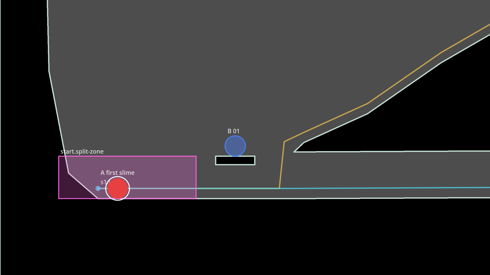

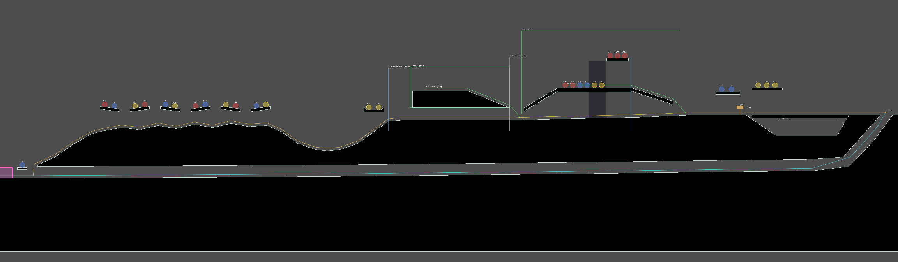

### Units and coordinates

- **1 screen = 1152 px** (`LevelData.SCREEN`), the width of the view at
  normal zoom. The design documents give x in screens; x = 0 is the level's
  left edge.
- y grows downward, as everywhere in Godot. In the test level the hilltops
  are near y = 0.
- A size-1 slime's radius is 24 px for now (`PlaceholderArt.SLIME_RADIUS`),
  a placeholder until the slime body (chunk 5). The loop and routes are
  drawn at a slime's centre height, 24 px above the ground.

### The level root and the registry

The root of a level scene is a `Node2D` with `src/components/level.gd`
(class `Level`):

- `level_id` (`"test"`, later `"01"`) and `level_version` (1 or more; bump it
  on any change to a released level, which then needs a save migration, D72).
- `rules`: extra rules held by the level itself (usually empty).

When it enters the tree, the level builds a **registry**, stable ID to node,
from every component in it (components join the `Level.THINGS_GROUP` group
in `_init`, at any depth, so they can be grouped under plain `Node2D`s). It
reports each problem with `push_error` (which fails any test that loads the
level) and keeps them in `load_errors`:

- a missing or malformed stable ID, or a **duplicated** one;
- a property that refers to a stable ID that isn't in the level (a
  component lists these in `references()`);
- a rule whose objects, event or action don't exist;
- no loop, more than one loop, or loop segments that don't join.

`level.build()` does the same without the scene tree and returns the errors.
`level.find(id)`, `level.ids()`, `level.position_of(node)` (in level
coordinates) and `level.start_position()` (the first slime) are the lookups.

**Stable IDs** follow `<place>.<kind>.<name>` (D72, `StableId.is_valid`):
lowercase, `<place>` is `start` or `s1`, `s2`…, and the name part may hold
dashes; numbered things use two digits, counted left to right
(`s1.sleeper.01`). Conventions added here: the loop is `start.loop`; a
section's outgoing loop segment is `s1.loop`, its return route `s1.slide`
(test level); a signpost is `s1.signpost`. **Terrain has no ID**: it holds
no state a save would need.

### The components

| Component | Node | Properties | Notes |
|---|---|---|---|
| `Terrain` | `Path2D` | `curve` (a closed outline), `fill_color`, `outline_color`, `outline_width`, `has_collision`, `bake_tolerance_degrees` | Baked at load into a `StaticBody2D` + `CollisionPolygon2D`, a `Polygon2D` fill and a closed `Line2D` outline, from the same points (spike 2). The outline must not cross itself. No ID |
| `Loop` | `Node2D` | `stable_id` (`start.loop`) | Its children are the `LoopSegment`s, in loop order |
| `LoopSegment` | `Path2D` | `stable_id`, `section`, `kind` (`outgoing` or `return`), `gate_id`, `show_route` | Draw it in the direction of travel. A return route names the gate whose opening retires it |
| `RouteBack` | `Path2D` | `stable_id`, `serves` (a branch ID), `show_route` | From inside the branch down to a point on the loop (D69) |
| `ExplorationBranch` | `Area2D` | `stable_id`, `size` | The box a free slime in the branch can be in |
| `SplitZone` | `Area2D` | `stable_id`, `size` | At the start of the loop (rule 4). `SplitZones` in the simulation splits every slime inside it (see "Train") |
| `FirstSlime` | `Node2D` | `stable_id` (`start.first-slime`), `species` | Where the first awake slime starts: the game wakes it there in a fresh game (see "Train") |
| `Sleeper` | `Node2D` | `stable_id`, `species` (A to F; F since chunk LD1, for v1's six species) | Always size 1 |
| `Switch` | `Area2D` | `stable_id`, `size`, `basket_id`, `trapdoor` (a box relative to the switch) | Tappable. Its trapdoor is solid while the flow goes onward, open while flipped (see "Frontier sets (chunk 14)") |
| `Basket` | `Area2D` | `stable_id`, `size`, `quota` (weight), `on_full_object`, `on_full_action`, `outlet` (`onward_route` or `point`), `outlet_before` (px), `outlet_point` | Holds its rule (below). Its box is where caught slimes rest |
| `Gate` | `Node2D` | `stable_id`, `size`, `entrance_lid` (a box relative to the gate) | Accepts the action `open`. Its box is solid while closed; its lid shuts the old slide entrance once open |
| `Signpost` | `Node2D` | `stable_id`, `switch_id` | Not interactive: the game draws its arrow the way its switch sends the flow |
| `FramingZone` | `Area2D` | `stable_id`, `size`, `zoom`, `offset` | `zoom` as `Camera2D.zoom`: below 1 shows more (0.7 is a zoom-out); `offset` in px, negative y is up |
| `Decoration` | `Path2D` | `curve` (a closed outline), `fill_color`, `in_front` | Scenery that is neither terrain nor an object (chunk LD1, O96's proposed default, D123): it never collides, has no ID and is never a tap target (a tap on it is a call), and draws behind the level unless `in_front`. The checker fails one in front that covers an object or a hint (rule 9). No ID |

`size` is a box centred on the node's position. The `Area2D`s make their
rectangle collision shape at load; the `Path2D`s draw their curve. Nodes a
component makes at load (terrain bakes, shapes) have no owner, so they are
never saved into the level scene. The split zone splits and the first
slime is woken (chunk 6, see "Train"). The camera reads the framing zones
(chunk 13, see "Camera"); the switch, the basket and the gate work through
`FrontierSets` and the signpost is drawn by `FrontierView` (chunk 14, see
"Frontier sets (chunk 14)"). The level places them, gives them IDs and
checks the references.

### The rule format

The components share one rule format (master spec §5.4), as plain data:

```json
{"when": {"object": "s1.basket", "event": "full"},
 "then": {"object": "s1.gate", "action": "open"}}
```

`Rule` (`src/components/rule.gd`, a `Resource`) holds one; `Rule.to_dict()`
and `Rule.from_dict()` convert. Objects are named by stable ID. The object
that triggers a rule holds it: a `Basket` builds its rule from
`on_full_object` / `on_full_action`. A component declares the events it
emits with `rule_events()` (`Basket`: `full`) and the actions it accepts with
`rule_actions()` (`Gate`: `open`). At load every rule is checked: both
objects exist, the "when" object emits the event and the "then" object
accepts the action. `Level.build()` copies every rule into
`LevelData.rules`; `FrontierSets` runs a basket's rules when it fires
(chunk 14).

### The loop as data

At load the level turns the loop into plain data for the simulation:
`level.data` is a `LevelData` (`src/sim/level_data.gd`): the level ID and
version, the loop (`LoopData`, `src/sim/loop_data.gd`) and the routes back,
all as polylines in level pixels, the split zones (ID to `Rect2`) and the
first slime (`{id, species, position}`). The game root hands it to the
simulation (`simulation.load_level(data)`, which builds the train and the
split zones from it); `simulation.dump()` records the level's ID and version.

`LoopData` holds the segments in order, each `{id, section, kind, gate,
points, lengths, length}`. Which segments are in use depends on the open
gates: for each section in order, its outgoing segments, then, if the
section's return route's gate is closed, that return route and nothing
further. Opening gate 1 retires slide 1 and adds section 2's segments and
slide (the loop grows, D9). A last return route with no gate, or whose gate
is open, is kept, so the loop always closes.

- `current_segments(open_gates)`, `length(open_gates)`;
- `position_at(distance, open_gates)`: distances wrap round the loop;
- `frontier(open_gates)`: the end of the outgoing part (the slide entrance)
  and the gate there;
- `closest(point, open_gates)`: the nearest point on the loop in use, and
  its segment; `gap(point)`: the distance to any segment, in use or not;
- `validate()`: every segment joins the next (within 2 px) and every return
  route ends at the start of the loop.

### The test level

`levels/test/level.tscn` holds the whole test level as a greybox that
follows `specs/levels/test/README.md`, with its 200 base slimes: section 1,
Meadow (screens 0 to 8): the start basin with the split zone and the first
slime, the hills, the fusion dip, the high step, the tree (an exploration
branch with its route back and framing zone), frontier set 1 and slide 1
back to the basin; section 2, Caves (screens 8 to 12.66, chunk 15, see
"Off-screen simulation (chunk 15)"); and section 3, Big bowl (screens 12.66
to 16.55, chunk 16, see "Test level sections 2 and 3, full population
(chunk 16)").

Chunk 6 adjusted the greybox where a train slime couldn't pass (the
tables in the generator say where):

- the start basin's lip and the loop's start (moved to 0.64 and 0.3 in
  chunk 6, with a hump in the tunnel's floor under the lip) were rebuilt in
  chunk 16e (below);
- the crust top runs on to 6.49, closing the 58 px notch over basket 1's
  pit where a slime wedged (the pit has no entrance yet: the switch chunk
  decides it);
- the high step's underside is at -210 (was -170) and the tree's climb
  starts at 4.72, -208 (was 4.62, -140): a size-2 or size-3 slime hopping
  under them wedged on their corners;
- the chute into slide 1 is wider at the top (the near wall starts at 7.5,
  was 7.56) and its far wall is upright down to y = 30, so a slime falling
  in isn't thrown back up onto the ledge.

Chunk 14 built frontier set 1 into it:

- basket 1's pit is open at the top, under switch 1's trapdoor (6.5 to
  7.29, y -100 to -75): the old crust bridge over it is gone; the basket's
  box is 0.81 screens wide, 200 px deep, centred at 6.895;
- the "Pillar" (7.66 to 8.5) replaces the bedrock's far wall of the chute:
  its top carries the loop on to gate 1 (at 8.58); gate 1's lid (7.49 to
  7.67, y -100 to -68) covers slide 1's entrance once the gate is open;
- a stub of section 2: `s2.loop` (section 2, outgoing, 7.6 to 8.58 at
  y = -124, through the gate) and `s2.slide` (its return route, no gate,
  down the shaft past 8.66 and back along slide 1's tunnel), so opening
  gate 1 has a loop to grow into. Chunk 15 replaced them with section 2.

Chunk 16e rebuilt the start basin (DoD 1, rules 1 and 2). Before, the
slides' tail ran back along the basin floor over the loop's first stretch,
so every slime coming home met the train head on and shoved it back, and
the first sleeper's ledge (80 px over the floor) let only base slimes pass
under it at pace. Now the slimes come home behind the loop's start:

- **The terrace:** the loop's first stretch runs on a terrace, the crust's
  left end, top y 460 from 0.26 to 0.6 (flat past the first sleeper's
  ledge, so no hop takes off steeply from under it), then climbs out of the
  basin at 35-38° (0.66, 410; 0.75, 330; 0.9, 200) to the hills. Its
  underside (the lane's roof) is y 500 from 0.26 to 0.6, then 470 at 0.66
  and 420 at 0.78. The old lip and its hump are gone.
- **The lane:** the slides run home under the terrace, along the bedrock's
  floor (0.78, 585; 0.64, 600; 0.28, 610), about 100 px high (94 px at the
  terrace's end: a size 3 is 79 px tall), then up a ramp to the loop's
  start at its top: 0.21, y 476 (the ramp's ground 0.28, 610; 0.255, 590;
  0.21, 500: 60° at the top, where the slide's carry still holds). The
  slides' last points are 0.78, 561; 0.64, 576; 0.28, 586; 0.255, 566;
  0.21, 476.
- **The pocket:** behind the loop's start, the basin floor y 500 from 0.05
  to 0.21, against the level's left wall (35 px thick: 0.03 to 0.04 at the
  floor). A slime coming home up the ramp at the slide's pace pops out
  there, behind the train, and hops on after it; the first slime starts
  there at 0.19, 476. From the loop's start the train hops up over the
  ramp onto the terrace (40 px up, 0.05 screens across): the loop's route
  rises from its start to 0.25, 416 (60 px up, above the ramp) and eases
  down onto the terrace (0.6, 436), so the hops clear a slime sitting in
  the ramp, and that slime, more than `OFF_ROUTE` from the loop, steers
  from the slide (the nearest route behind it) and is carried back up to
  the pocket. The pocket is wide enough for a size 3 coming home (split
  there into three) and the slimes behind it. Two earlier 16e layouts
  lost a part as stalled there: with a pocket half as wide and a ramp
  twice as long, the slimes piled up and blocked each other's hops out;
  with the route running straight from the loop's start to the terrace's
  corner, a slime in the ramp sat right at `OFF_ROUTE` from it, was held
  there as a loop slime half the time and blocked the hop out.
- **The first sleeper** (`s1.sleeper.01`, B) sits at 0.46, 311 on
  `FirstLedge` (0.42 to 0.5, top y 335, 20 px thick: 105 px over the
  terrace), 0.27 screens right of the first slime (352 px away). A called
  base slime can hop onto the ledge (its `max_rise` is about 133 px), and
  a hopping base slime passes under it with 20 px to spare. A size-2 or
  size-3 train slime couldn't pass under a ledge that low at its pace (its
  hop tops out 108 or 130 px over the ground), and a ledge high enough for
  them would be out of a called slime's reach, so:
- **The split zone** reaches past the ledge: x 0.03 to 0.54, y 370 to 560
  (the pocket, the ramp's top and the terrace), and only base slimes ever
  pass under the ledge. Nothing fuses in the basin either (a split zone
  has no fusion).

`tests/e2e/test_start_basin_e2e.gd` checks it: no slide runs within 48 px
of the loop's first 1.5 screens outside the join at its start (in every
gate state); a slime coming home doesn't shove the train slimes on the
terrace back (they moved back 0 to 15 px, against 37 to 109 px before);
a size-3 slime coming home with two base slimes behind it is split and all
five are 0.15 screens past the first sleeper within 30 s (18 s); a slime
of every size (split or whole) is past it within 10 s (6 to 7 s; before,
a size 2 or 3 never was).

#### Chunk TL1: playable from fresh

Before chunk TL1 the level couldn't be finished from a fresh game: only
`s1.sleeper.01` and one sleeper of the fusion dip's hollow were within a
called base slime's hop (133 px up, 150 px sideways), so 3 base slimes
could be awake against basket 1's quota of 6, and the progress estimate
(rule 12) warned on all three sections. Chunk TL1 moved sleepers where a
called base slime reaches them, lined up touching (centres 38 to 40 px
apart, under `LevelProgress.CHAIN_LINK`, 44 px): a woken sleeper wakes the
ones it touches, so one call wakes the whole line. Every ledge a base
slime is called up to keeps its underside at least 130 px over the loop's
ground under it (rule 22 (b)). The same stable IDs, numbered left to right
as before; x in screens, y in px:

| Where | Before | After |
|---|---|---|
| 1.3 fusion dip, near rim | nothing | `DipHollowNear` 2.58 to 2.76, floor -110 (110 px over the rim at 2.5), open toward the rim, lip at the back: `s1.sleeper.14` to `.17` (A, A, B, B) at 2.615 to 2.719, y -134 |
| 1.3 fusion dip, far rim | `DipHollow` 3.3 to 3.46, lips at both ends: `.14`, `.15` (C, C) at 3.34, 3.42 | `DipHollow` 3.26 to 3.46, open toward the rim: `.18` to `.21` (C x4) at 3.331 to 3.435, y -174 |
| 1.5 tree | lower platform: `.16` to `.21` (A, A, B, B, C, C) at 4.96 to 5.26, y -384 (285 px up, beyond any hop) | empty (moved to the dip's hollows); the bough keeps `.22` to `.24` (A x3) |
| 2.1 descent | the ground 8.6, -100 to 8.75, -65; `DescentLedge1` 8.55 to 8.72, `.01` to `.03` at 8.58 to 8.69; `DescentLedge2` 8.78 to 8.95, top -250, `.04` to `.06` at 8.81 to 8.92, y -274 | the ground steeper at its top (8.6, -100; 8.63, -70; 8.75, -45; 8.9, -28); `DescentLedge1` 8.4 to 8.57, `.01` to `.03` at 8.43 to 8.54; `DescentLedge2` 8.66 to 8.78, top -215, 20 px thick (115 px over the pillar, 92 px from it): `.04` to `.06` at 8.68 to 8.749, y -239 |
| 2.2 parade, second ledge | A, B, C, D at 9.63 to 9.78 | its A, `.11`, at 9.63 |
| 2.3 second dip, near rim | nothing | `Dip2HollowNear` 10.08 to 10.22, floor -130 (110 px over the rim at 10.0), open toward the rim: `.12` to `.14` (B, C, D) at 10.112 to 10.181, y -154 |
| 2.3 second dip, far rim | `.15`, `.16` (D, D) at 10.3, 10.38 | `.15` to `.18` (A, B, D, D) at 10.297 to 10.401, y -159 |
| 2.5 ledge by switch 2 | A, B, C, D at 10.775 to 10.904 | its C and D, `.19`, `.20`, at 10.861, 10.904 (the A and B moved to the dip) |
| 3.1, 3.3 the ramp | `RampLedge1` 12.96 to 13.18 (top -210) and `RampLedge2` 13.22 to 13.42 (top -160), 5 E each; the left first tier `ShelfL1` 13.56 to 14.18 (top -105 to -90), 15 | one `RampShelf`, top (13.31, -110), (13.7, -58), (14.18, -55), 20 px thick: 115 px over the ramp at 13.2, down into the bowl as the left first tier: its 25 (the 10 E, then the tier's 15) 39 px apart along it from 13.327 |
| 3.5 the rim | 15.05 to 16.192, top -300 to -310, 30 at 0.038 screens from 15.07 | its low part `RimLow` 14.98 to 15.54, top -232 to -240 (120 px over the plateau at 15.62): its first 17, 0.033 screens (38 px) apart from 15.0; its high part `Rim` 15.66 to 16.2, top -300 to -310: the other 13, 0.04 apart from 15.68 |

The rim's branch box is now its high part (x 15.64 to 16.22) and the left
shelves' stops above the ramp's shelf (y -520 to -160): the hollows, the
ramp's shelf and the rim's low part are in no branch, like the dip
hollows (a slime woken there hops straight for the loop). The left
shelves' route back drops onto the ramp's shelf at 14.14, y -79; the
rim's runs along its high part and down onto the plateau (15.62, -144).
Section 3's IDs are numbered left to right over all its ledges, so most of
its IDs now name other spots than before (the same 130 IDs, species
counts unchanged).

With base slimes only (the train never fusing: `LevelProgress.estimate(c,
1)`), 10 base slimes can be awake by basket 1 (quota 6), 20 by basket 2
(15) and 62 by basket 3 (60); the checker gives no warning (3 before).
`LevelProgress` also counts lines of touching sleepers (`chain()`), and
`estimate(c, 1)` never fuses (base slimes only).
`tests/e2e/test_test_level_playable_e2e.gd` plays it: from `fresh`,
calls (the camera on the spot, a tap on each line's easiest sleeper when a
train slime is at its take-off point, three passes) wake 10 base slimes,
a tap flips switch 1, basket 1 fills, fires and gate 1 opens; the same
from `gate1-open` to gate 2 and from `gate2-open` to basket 3 and the
celebration; and it checks the checker gives the level no warning. About
1.5 minutes (sections 1, 2, 3: about 11, 15 and 50 s; the checker 17 s).
Probes over seeds 1 to 6: every seed finishes all three sections; a call
misses at most twice in a row (a missed call: the called slimes fall short
into the dip or under the ledge; the next pass calls again).

The fixtures were regenerated (`tools/level.sh fixture --level=test`);
their recipes pick sleepers by place and species, so each keeps its
meaning: `bump` still takes the eight C nearest the dip (now the far
hollow's four among them), `s2-basket-offscreen` the cave's, `lost` the
parade's first D, `gate1-open` and `gate2-open` the first slime and
section 1's first 19 sleepers.

The scene is generated by `tools/greybox_test_level.gd` from tables of
points (x in screens, y in px), written since chunk LD1 on the builder
helpers of `tools/level_builder/` (the same output):

```sh
godot --headless -s res://tools/greybox_test_level.gd
```

It is still a normal scene that opens and edits in the editor, but a
re-run overwrites hand edits. Once the level is edited by hand for real,
delete the generator. `tests/e2e/test_test_level.gd` checks the scene
against the design and the level rules: every ID of sections 1 to 3, the
population (200 base slimes by species and section), sleepers off the loop,
the first sleeper near the first slime, the loop and the slides, the split
zone at the start (the start basin itself: `tests/e2e/test_start_basin_e2e.gd`), routes back that start in their branch, end on the loop
and only go down, the frontier sets, the framing zones and the terrain bake.
The level rules over the whole level are in `tests/e2e/test_level_rules.gd`
and `tests/e2e/test_level_ways_back_e2e.gd`, and DoD 1 in
`tests/e2e/test_level_dod1_e2e.gd` (chunk 16).

**Adding a section** (as sections 2 and 3 were): add its terrain; add its
outgoing `LoopSegment`s (`section = n`) after the previous section's
outgoing segments in the `Loop`, the first starting where the previous
section's loop ends (behind its gate), then its slide (`kind = return`,
with the section's own gate as `gate_id`, none for the last section)
ending at the start of the loop, joining the previous slide's tail; place
its things with `s<n>.` IDs; extend the tests' expected IDs and the
fixtures (`tools/make_fixture.gd`).

## Slimes

The slime bodies are `SlimeBodies` (`src/sim/slime_bodies.gd`), owned by the
`Simulation` (`simulation.slimes`) and advanced once per tick, after the
queued input. `SlimeRenderer` (`src/slimes/`) draws them; it only reads them.
Species and their colours are `Species` (`src/sim/species.gd`).

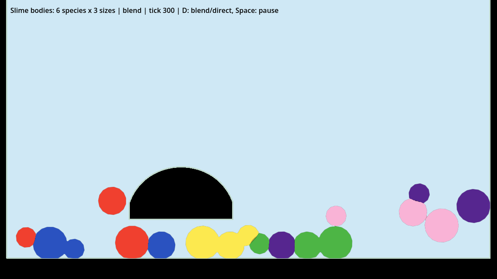

### Layout

Struct of arrays (D94). Per point: `pos`, `prev` (Verlet: velocity is
`pos - prev`) and `rest_off` (offset on the rest circle). Per slime:
`id`, `first` and `npts` (its slice of the point arrays), `size`, `species`,
`state`, `held`, `supported`, `hop_timer`, `heading`, and the ring's rest
radius, area and edge length. Rings have 12, 15 and 18 points for sizes 1, 2
and 3; the ring radius is `21 * sqrt(size)` px, and the drawn body adds
`EDGE` (3 px) all round, so a size-1 slime looks 24 px in radius.

Slimes are kept in ascending id order with their point slices back to back.
`remove`, `merge` and `split` compact every array (no holes, order kept), so
a slime's index can change but its id never does; ids are never reused.
Callers hold ids; `index_of(id)` is a binary search. `topology_version`
changes whenever the set of slimes or their point counts change (the
renderer rebuilds its index arrays then).

The interface (create, remove, tick, merge, split, hop, the accessors,
dump) is small and plain so the tick can move to a GDExtension without the
callers changing.

### Solver

Verlet with position-based constraints, 2 substeps x 1 iteration at 60 Hz
(D94). Each substep: integrate (gravity 1400 px/s², air drag 5 %/s,
internal damping), then slime-slime contacts, ring constraints, terrain
contacts. The pair list comes from a uniform grid on the slime centres,
built on the first substep only (cells at least as big as the largest pair
reach, so each slime checks its own cell and its neighbours).

- **Ring constraints:** edge springs (stiffness 0.8), area (0.6) and shape
  matching toward the rest circle (0.3). The edge springs are solved
  Jacobi-style (all corrections computed, then applied): a sequential pass
  made rings slowly rotate and drift sideways.
- **Point 0 at the bottom.** A ring with an odd point count resting on an
  edge is unstable and rolls to stand on a point; starting every ring on a
  point keeps rings mirror-symmetric and still at rest.
- **Internal damping 0.2:** each substep pulls every point's velocity 20 %
  toward its slime's mean velocity. It kills internal jiggle without slowing
  the slime; at 0.1 a size-3 slime propelled itself along the floor.
- **Air drag is per second,** not per substep like the spike's (0.996 per
  substep, about 38 %/s), so a velocity set with `set_velocity` or a hop
  carries as expected.
- **Slime-slime contacts** push points out along the other ring's radial
  profile (the spike's method), with friction (0.3) on the sliding part, so
  slimes can pile up. Two rings within `TOUCH_SKIN` (2 px) count as
  touching (`touching`, `touching_pairs`); a slime resting on another's top
  is `supported`.

### Terrain contact (O78)

The simulation never reads nodes. At level load, `SlimeWorld.terrain_from`
gathers every `Terrain` piece with collision (its baked polygon, in level
coordinates) and builds a `TerrainSegments` (`src/sim/terrain_segments.gd`):
the polygons as segment arrays with outward normals, plus a CSR grid
(32 px cells) listing, per cell, the segments within `MARGIN` (16 px) of it.
Each ring point asks its cell for the nearest segment:

- a point inside a piece is pushed out to the surface plus `terrain_skin`
  (`EDGE`, so the drawn body rests on the ground instead of overlapping it);
- a point outside but within the skin is pushed out along the direction from
  the nearest point (rounded convex corners);
- inside or outside is the side of the nearest segment's normal, except
  where the nearest point is a segment's end (a vertex): there it is the
  side of the vertex's normal, the mean of its two segments' normals
  (`seg_na`, `seg_nb`, `TerrainSegments.side_normal`; the solver inlines
  it). Before chunk 16d the segment's own normal decided there too, and at
  a sharp convex corner both segments are equally near: when the one
  listed first was the other face's, a wedge outside the corner (up to
  about 25 px out at the dip hollows' lips) counted as inside, and ring
  points passing through it were pulled onto the corner. That threw
  heading-back slimes back into the dip hollows and off the hills' bumps
  (the rule 7 breaks 16c found), and it could stick a ring round a piece;
- friction (0.4) takes from the tangential velocity and the inward normal
  velocity is zeroed;
- a surface whose normal points up by more than 0.3 marks the slime
  `supported` (it may hop).

Limits: a point deeper than `MARGIN` inside a piece is not seen, so terrain
pieces must be thicker than about 32 px, and pieces must not overlap or
share edges (a point between two could be pushed into the other). At the
speeds capped by `max_speed` (1200 px/s, 10 px per substep) points never
get that deep. The test level's floating ledges are 20 to 25 px thick (the
hills' bumps, the section 2 ledges and cave pieces, section 3's shelves,
ramp ledges and rim), under that: a point more than half their thickness
in is nearer the far face and is pushed out there, so a ring that hits a
ledge's end hard can end up split over its top and bottom faces with its
centre inside the ledge. The corner fix removed the hard hits seen so far
(chunk 16d); none of the 199 sleepers' spots strands a slime.

The terrain is baked once per level load in `main.gd` and shared by every
fresh simulation (`_new_simulation`).

### Hops

A train slime hops on its own timer: when `hop_timer` runs out and the slime
is `supported`, it hops forward along its `heading` and draws its next
interval from its own stream, `rng.derive("slime:<id>")`. Intervals are
1.5-3 s (specs/tuning.md), 15 % longer per size above 1; take-off speed is
620 px/s, 12 % faster per size, with a ±10 % random strength. A size-1 hop
rises about 114 px and covers about 224 px; a size-3 hop 176 px and 336 px.
`hop(id, dir, strength)` is the direct form (switches, taps later); it
refuses a slime that isn't supported or whose state doesn't hop.
`set_hop_held` pauses the timer (a queued slime at a gate, later).
`set_hop_aim(id, velocity)` aims the next automatic hop, if it comes this
tick: that take-off velocity instead of a plain hop along the heading (the
strength is still drawn, so the stream doesn't shift). It is cleared by
every tick, so it isn't state. `brake(id, share)` removes that share of a
slime's mean velocity and spin, keeping its squish: how the train makes a
slime grip the ground between hops.

### Merge and split

`merge(a, b)` keeps the lower id, adds the sizes (refused above
`MAX_SIZE`, or across species), and reshapes the survivor into a fresh
ring at the size-weighted centre, with the size-weighted velocity. Whether
two slimes have touched long enough to fuse is the caller's decision (a
later chunk); `touching_pairs()` is what it reads. `split(id)` reshapes the
slime into size 1 and creates size-1 slimes for the rest, 52 px apart
(size 2: side by side; size 3: a triangle), each with the same state,
heading, hold and velocity. Both bump `topology_version`.

### Renderer

`SlimeRenderer` builds one triangle mesh each frame (a fan per ring plus a
6 px skirt where the field fades to 0) and draws it through the
`RenderingServer`. Two modes:

- **Blend** (default): the spike's technique. The fields go into two
  `SubViewport`s at half the screen's resolution (`field_scale`), one
  species per colour channel (A-C, D-F); a full-screen composite thresholds
  them, so same-species slimes that touch melt into one blob and different
  species meet at a seam. The viewports follow the camera
  (`canvas_transform`) every frame.
- **Direct** (fallback): one mesh, each ring drawn on its own in its species
  colour. It is the default headless (`default_mode()`), and the demo
  toggles it with D.

It draws the last tick's state; there is no interpolation between ticks.

**Culling (chunk 22).** Only the slimes that can be seen are drawn:
`SlimeRenderer.is_seen()` leaves out parked slimes and those whose centre is
farther than their ring radius times `CULL_REACH` (2.0) plus the skirt
outside the shown rect (`SlimeRenderer.shown_rect(viewport)`, the world
rect the viewport shows through its canvas transform), so a squashed slime
across the edge is still drawn. The indices are rebuilt only when the
topology or the seen set changes, the vertices each frame for the seen
slimes only. `vertex_count()` and `drawn_count()` count what was drawn.
`TapFeedback`'s eyes and the debug labels use the same test. Details and
numbers: "The fixes" under [Chunk 22: performance](#chunk-22-performance).

### Demo and bench

```sh
godot --path . src/slimes/demo.tscn              # D: blend/direct, Space: pause
godot --path . src/slimes/demo.tscn -- --draw=direct --seed=7
godot --headless -s res://tools/bench_slimes.gd  # -- --count=200 --ticks=600
```

The bench drops 200 slimes into a 1152 px box, settles them for 180 ticks,
then times 600 ticks of `SlimeBodies.tick`, headless (same machine as the
spike: Ryzen 5 PRO 8640HS, Godot 4.7.2):

| Case | Points | Still, ms/tick | Moving, ms/tick |
|---|---|---|---|
| 200 × size 1 | 2400 | 9.99 | 9.84 (857 hops) |
| 200, 60/25/15 % sizes 1/2/3 | 2730 | 14.68 | 15.22 (806 hops) |
| Spike, GDScript, 12 points, flat floor | 2400 | 8.75 | 8.08 |
| Spike, native estimate | | ~0.35-0.41 | |

Split of a mixed still tick (per substep call): slime contacts 3.8 ms, ring
constraints 1.7 ms, pair grid 1.1 ms, integrate 0.7 ms, terrain 0.6 ms.
Heavier than the spike: terrain segments instead of a flat floor, friction,
touch tracking and a denser pile. In GDScript the tick alone is most of a
60 Hz frame at 200 slimes: fine for development and a handful of slimes,
but the full count needs the native tick (spike 1's conclusion).

The whole level's tick cost (`tools/level.sh bench`), the resting-pile
measurements (`tools/level.sh rest`), the perf log and the phone
measurements are in [Chunk 22: performance](#chunk-22-performance).

## Train

`Train` (`src/sim/train.gd`, `simulation.train`) moves the train slimes
along the loop. It reads the loop in use (`LoopData.current_segments`,
flattened into one polyline with a per-edge "slide" flag) and keeps, per
train slime, its progress: a distance along the loop and a lap count.
Each tick, `Simulation.step()` runs the input, `train.steer()` (grip, carry
and hop aim, before the bodies move), `slimes.tick()`, the split zones
(`SplitZones.apply`, whose parts `train.inherit()` their parent's
progress), then `train.follow()` (progress, laps, stalled slimes).
`train.dump()` is in the state dump.

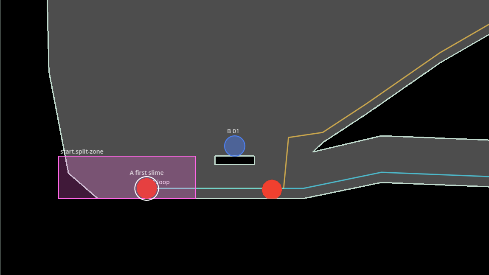

**Progress.** A slime's progress is re-derived every tick by projecting its
centre onto the loop, but only onto a window from its last progress to
`PROGRESS_WINDOW` (400 px) ahead. It never goes back (a slime bumped back
keeps its progress), and it can't snap to a part of the loop that is close
in space but far along it (the slide runs back under the outgoing route).
Past the end it wraps and counts a lap. A slime knocked more than
`OFF_ROUTE` (36 px) off the route at its progress (thrown back out of the
chute onto the ledge, fallen short of the start basin's terrace onto the
ramp) steers from the
route point nearest it within the window behind; its recorded progress
doesn't move. New train slimes (split parts, later sleepers) are adopted
where the loop passes closest (`LoopData.closest`).

**Hop targeting.** When a slime's next hop is due, the train aims it:
`Train.aim(from, to, apex, gravity, cap)` gives the take-off velocity of a
ballistic arc from the slime's centre to a point `hop_reach(size)` (150 px,
+20 % per size) ahead along the route, whose top clears the higher end by
`hop_apex(size)` (34 px, +25 % per size) plus any route point in between
that stands higher. The speed is capped at 1.15 x the size's plain hop
speed. Two cases change the target:

- a **steep rise** (a step the route crosses in the air): the slime first
  hops to its foot (`STEP_FOOT` px short of it), then from within
  `STEP_NEAR` of the foot over it, to `STEP_LANDING` px along the top;
- a **steep drop** (the chute into a slide): it aims `DROP_OVER` (40 px)
  past the top of the drop, along the way it was going, and falls in.

**Grip.** Soft bodies roll down any slope (a size-1 slime rolled 317 px in
3 s down a 30° slope). The spec lets a slime roll where its hops can't
hold it (master spec §5.2), so the train only grips where the route is at
most 45° steep: a supported slime there is braked by half each tick
(`GRIP`), so it stays put between hops.

**The slide (placeholder, O22).** On a return route a slime doesn't hop
(it is held) and, while it touches the ground, its velocity along the
route is pulled towards `SLIDE_SPEED` (360 px/s) by a fifth each tick. The
real slide comes with the level art.

**Stalled (D118, D121; chunk 23A).** A train slime is stalled when its
progress hasn't advanced `STALL_ADVANCE` (24 px) in `STALL_SECONDS` (60 s)
of the ticks it is simulated (the clock pauses while it is parked, since
chunk 22h: see "Chunk 22h"), or when its centre leaves the level's bounds (the
terrain and the loop, plus 64 px, plus 2000 px above). `train.follow()`
then moves it to the start of the loop, back on the train (`LoopStart.move`,
the move lost and stuck slimes take too), and logs the case in
`train.stalled` (`{"id", "tick", "reason"}`, `stalled` or `out_of_bounds`,
the last 64): every case, and the 60 s count starts again from the move. A
slime asleep at bedtime isn't a train slime, so it has no count and is never
moved. The whole-level DoD 1 test still fails on any logged case. "Lost" is
for free slimes only: a free slime left alone off screen is lost by
`Offscreen` (see "Off-screen simulation (chunk 15)"). `advance()` only
re-derives the progress and its mark; `stall_of()` says whether a followed
slime is stalled. See "Safety nets: stuck and stalled slimes (chunk 23A)".

**Split zones.** `SplitZones` (`src/sim/split_zones.gd`) holds the level's
split zone boxes. Every tick, every slime above size 1 whose centre is in a
zone is split (`SlimeBodies.split`) into base slimes, which keep its
species and state: train slimes stay on the train. Nothing else splits.

**Waking the first slime.** `Simulation.load_level` creates the level's
first slime (size 1, its species, a train slime) at its marker when the
state is fresh (tick 0, no slimes): a restored state keeps its own slimes.
It also puts every sleeper to sleep at its marker (chunk 9, see "Sleepers,
waking and the hint").

**Tests.** `tests/unit/test_train_progress.gd` (progress window, wrap,
laps, stalled and out of bounds, aim, targets, off-route steering),
`tests/unit/test_train_stalled.gd` (the stalled safety net) and
`tests/unit/test_split_zones.gd`; `tests/e2e/test_train_in_game.gd`
(the first slime woken, each size 1 to 3 completes a lap and comes back as
base slimes, a size 3 and a size 2 entering the split zone leave as five
base slimes on the train); `tests/e2e/test_train_session_e2e.gd` runs a
15-minute session (54 000 ticks) with no input and checks the first slime
is never lost, its progress never goes back, it makes at least 4 laps (0.7
of the ideal pace; it makes 5) and the same seed gives the same hash twice.
It takes about 2 s per run, 4-5 s for the test. Chunk 16e rebuilt the
start basin so slimes coming home no longer meet the train head on (see
"The test level").

## Safety nets: stuck and stalled slimes (chunk 23A)

Build plan items 23.3 (D100, `rule_stuck_slimes_moved_to_start`) and 23.13
(D121, `rule_stalled_train_slime_moved_to_start`). Three cases now send a
slime to the start of the loop, back on the train, each logged with its own
reason: a **lost** free slime (D10, `Offscreen.lose`, reason `lost`), a
**stuck** slime (D100, `StuckSlimes`, reason `stuck`) and a **stalled**
train slime (D121, `Train.follow`, reason `stalled` or `out_of_bounds`).
"Lost" is for free slimes only (the lexicon); none of the three counts as
another.

**One move: `LoopStart.move(bodies, train, id)`** (`src/sim/loop_start.gd`).
The lost timer's move (chunk 15), taken out of `Offscreen` so the three
share it: the slime's centre goes to the loop point lifted by its size
(`Offscreen.lift`), at rest and unsupported (a parked slime is only
translated), state train, hops no longer held, and the Train follows it
from there with a fresh record (laps and stall count start again). New:
**a free spot.** Two rings put on one centre never come apart (the stuck
case itself: a probe put a size-1 and a size-2 of different species on one
centre, and they stayed within 1.4 px for 6 s), so the move doesn't land on
a slime already there: it takes the first of `SPOTS` (8) spots one width of
the slime apart along the loop from its start (0, 48 px, 96 px, ... for a
base slime) whose room is clear of every other slime's ring, else the start
itself. On the test level the first slime waits at the start, so a slime
sent there by the debug kill tool lands one width on.

**Stuck (23.3).** `StuckSlimes` (`src/sim/stuck_slimes.gd`,
`simulation.stuck_slimes`) runs in `Simulation.step` right after
`train.follow()`. On every tick that is a multiple of `CHECK_TICKS` (30,
0.5 s) it looks at the simulated slimes (not parked; every state): a pair
whose centres (the mean of their points: `SlimeBodies.centre` is a
mid-substep estimate, several px off in a squeeze, and missed pairs) are
closer than `CLOSE_SHARE` (a quarter) of the smaller ring radius counts one
more check; any other pair loses its count. A pair about to fuse is never
counted: `SlimeBodies.can_merge` (same species, sizes up to 3) and both
awake (train or free, Fusion's rule; a same-species sleeper inside a train
slime is counted). At `CHECKS` (4) checks in a row (about 2 s; 1.5 s from
the first check that saw it) the pair is stuck: the smaller slime, on a tie
the higher id, among those of the two that are train or free slimes, goes
to the start (`LoopStart.move`) and its counts go. When neither may move
(sleepers, slimes in a basket, bedtime-asleep slimes) the pair is only
logged, once while it stays so. The log, `stuck_slimes.stuck`, keeps the
last `LOG_SIZE` (64) cases `{"id", "other", "tick", "reason": "stuck",
"moved"}`; it and the counts are in the state dump (`"stuck_slimes"`) and in
saves. The pairs come from one sweep along x (a native sort of the centres,
then only neighbours within the largest threshold): one check with 200
simulated slimes costs 0.39 ms, about 0.013 ms a tick on average. The
level bench (`tools/bench_level.gd`), run A/B interleaved on a busy machine
(A as built, B with the check's call taken out), shows nothing above the
noise: stress-moving median 36.8 and 34.4 ms (A) against 34.3 and 34.1 ms
(B), mean 37.8 and 38.4 against 36.1 and 38.4; start 1.12 to 1.24 and
stress-still 1.54 to 1.68 in both. Before the chunk, on the same machine,
stress-moving was 30.9 ms median (32.6 mean) under a lighter load.

**Stalled (23.13).** Chunk 6's stall check in `Train` only logged. It now
moves the slime (see "Train", "Stalled"). The renames: `Train.lost` is
`Train.stalled`, `LOST_STALL_SECONDS` / `LOST_STALL_ADVANCE` /
`LOST_STALLED` / `LOST_OUT_OF_BOUNDS` are `STALL_SECONDS` / `STALL_ADVANCE`
/ `STALLED` / `OUT_OF_BOUNDS`, the train record's `lost` flag is gone (it
kept a slime from being logged twice; now each case is logged and moved)
and `advance()` no longer checks: `stall_of()` does, from `follow()` only,
so a parked slime's progress (moved by `Offscreen`) is checked once a tick
like any other. The log keeps the last `STALL_LOG_SIZE` (64) cases. The
whole-level DoD 1 test still reads it (`train.stalled` with
`offscreen.lost`) and fails on any entry: the safety net is for play, not
a pass.

**`Offscreen.lose(sim, id)`** is public (it was `_lose`); the debug
overlay's kill tool (`DebugKill.send_to_start`) calls it directly, and its
"unavailable" case is gone.

**Saves.** Format 1 still, extended: an optional `"stuck_slimes"` key
(counts and log), and `train.stalled` for the train's log (the old
`train.lost` key and the train record's `lost` flag are ignored when read).
See "What a save holds".

**Values not in the spec (proposed):** the free spot (`SPOTS` 8, one width
of the slime apart), the log sizes (64 cases each), and which pairs "about
to fuse" means (both awake). The rest is D100 and D121: 30 ticks, 4
checks, a quarter of the smaller radius, 24 px in 60 s.

**Tests.** `tests/unit/test_stuck_slimes.gd` (13: two species on one
centre, the tie, a free slime, a same-species pair too big to fuse, one
that can fuse left to fuse, pairs touching normally never moved, only train
or free slimes move, a pair that can't move logged once, parked slimes
skipped, the free spot, dump, a save mid-count, same seed same hash);
`tests/unit/test_train_stalled.gd` (7: wedged, the move and the log at 60
s, wedged again moved again, out of bounds, bedtime-asleep never counted
and a fresh count from waking, a save mid-count, same seed same hash, the
log's size); `tests/unit/test_train_progress.gd` (`stall_of`);
`tests/e2e/test_safety_nets_e2e.gd` (through the game: two base slimes on
one centre on the test level, and from `wind-down` over 70 s of bedtime no
bedtime-asleep slime counted as stalled or moved).

## Taps and the call

Master spec §5.2 and §5.5. All of it is simulation logic in `src/sim/`
(`ScreenView`, `TapDispatcher`, `FreeSlimes`, driven by `Simulation`);
`src/taps/tap_feedback.gd` only draws.

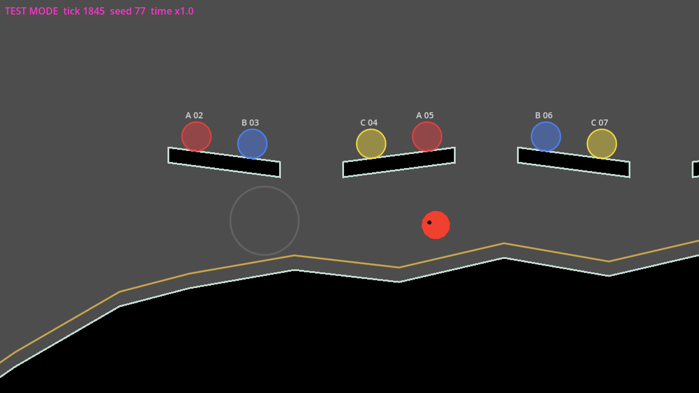

**The view.** Taps arrive in screen pixels, so the simulation holds a view,
`simulation.view` (`ScreenView`): the level point at the screen's centre,
the zoom and the screen size. `main.gd`'s `sync_view()` sets it from the
simulation's camera (`Camera.apply_to()`, see "Camera" below) before and
after every tick; the screen size is test mode's `screen_size` in test
mode, else the viewport's. `world = centre + (screen - size / 2) / zoom`.
The view is in the dump.

**Tap zones** (`TapDispatcher.dispatch`), checked in this order:

| Order | Zone | Where | Does |
|---|---|---|---|
| 1 | `parent_zone` | a band `PARENT_ZONE_MM` (7 mm) high along the top, measured on the screen: `parent_zone_height(view)` screen px (about 67 on the reference phone) | only ripples; never calls. The parent layer sees the press first and reveals the parent buttons (see "Parent gate and settings (chunk 18)") |
| 2 | `edge_button` | a strip `EDGE_STRIP_SHARE` (10%) of the screen's width against each side, from the parent zone to the bottom (`edge_button_rect(side, view)`) | moves the camera along its rails (`Camera.press`, see "Camera"); never calls, operates no object under it |
| 3 | `object` | the hit area (`hit_area(kind, box, view)`) of a tap target that answers a tap now: an object's drawing plus 5 mm a side, at least 20 × 20 mm, on the screen (chunk 23E below); a sleeper's body plus 24 screen px | a **switch** whose basket is filling flips (chunk 14); a **sleeper** calls, centred on it |
| 4 | `open_ground` | anywhere else | calls, centred on the tap |

Tap targets come from the registry: `Level.build()` adds every node with a
`tap_target()` (switch, basket, sleeper) to `LevelData.tap_targets` (ID,
kind, level box). Only those that answer a tap now reach the dispatcher
(`FrontierSets.answering()`, chunk 23E below). Where hit areas overlap, the
nearest box centre wins (ties: the smaller ID). The zones' sizes are the spec's (D99, D113;
chunk 23B below); how they are drawn is a placeholder until the ui_ux tree
settles it.

**First touch wins** (D66, O67's proposed default). A tap is dispatched
when its finger touches down, and only if no finger is down then
(`active_finger`). A touch that starts while any finger is down gets
nothing, not even a ripple, and stays ignored until it lifts, even if the
first finger lifts before it. `fingers_down` still records every finger.
One exception, a resting thumb (D110, chunk 23B below): a finger that
pressed an edge strip and has been down 5 s stops blocking other touches.

**Ripples and facing.** Every accepted tap, whatever its zone, appends a
ripple `{at, tick}` (level point) to `simulation.ripples`; it lasts
`RIPPLE_TICKS` (36, 0.6 s). The ripples are sim state and in the hash:
they are deterministic (a function of the input), and keeping them there
lets the renderer draw from the state alone. `TapFeedback` draws each as a
ring growing from 10 to 64 screen px and fading. The tap also turns every
awake slime within the call radius toward it (`simulation.facing`, a unit
vector per slime), and every hop turns its slime the way it hops;
`TapFeedback` draws the facing as an eye dot (placeholder art). The last 16
taps are logged in `simulation.taps` (zone, object, whether it called, who
answered), for tests and debugging.

**The call** (`FreeSlimes`, `simulation.free_slimes`). A call has a point
and a tick. Every awake slime (train or free) whose centre is within the
call radius, half the view's width in level px (576 at zoom 1), answers:
it becomes free (state `free`, the train drops it), is let go if it was
held on the slide, and hops within `FIRST_HOP_SECONDS` (0.35 s). A new call
replaces the point for every slime still answering, in range or not, and
restarts its 8 s. Sleepers don't answer: a free slime's touch wakes them
(see "Sleepers, waking and the hint"). A free
slime then goes through three phases, recorded per slime with the tick it
entered them:

| Phase | Hops | Ends |
|---|---|---|
| `answering` | toward the point, at 0.6× its usual hop interval; up to `Train.hop_reach` sideways; upward when the point is higher, up to `max_rise(size)` (about 133, 168, 208 px for sizes 1 to 3: bigger slimes jump higher) | within `REACHED` (56 px, plus the extra radius of bigger slimes) of the point, or after `CALL_SECONDS` (8 s): turns unsure |
| `unsure` | lazy random hops (60 px, low) near the point, at 1.3× its interval, directions from its own stream `free:<id>:<tick>`; hops back toward the point if more than 120 px away | after `UNSURE_SECONDS` (15 s): heads back |
| `heading_back` | toward the loop at its usual pace (see below) | its centre within `REJOIN_DISTANCE` (40 px, plus the extra radius) of the current loop: back to state `train`, adopted at the closest loop point |

Physics applies throughout: the bodies are the same soft bodies, and a
free slime grips ground up to 45° between hops like a train slime (rolls on
steeper ground). A free slime with no record (none yet: later chunks may
free slimes otherwise) is adopted as heading back.

**The way back (route-back selection rule).** Chosen again at every hop,
from where the slime stands:

1. If its centre is inside an exploration branch's box
   (`LevelData.branch_at`, first ID in sorted order) and that branch has a
   route back (`route_back_for`), it follows that route: it aims
   `hop_reach` ahead of its projection on the route, until it is at the
   route's end. `route_of(id)` names the route used.
2. Otherwise (no branch, a branch without a route, or past the route's
   end), it hops straight for the nearest point of the current loop,
   always at least `MIN_SIDEWAYS` (60 px) sideways. When the loop point is
   more or less right below, it hops the loop's way there, level with where
   it stands (chunk 9: aiming down at the loop, the hop came down after
   about 30 px and a slime woken on a ledge stayed stuck on its corner).

The rule was not changed for the rule 7 breaks chunk 16c found (slimes left
in the dip hollows and on the hills' bumps): those were the terrain's sharp
corners pulling ring points onto them ("Terrain contact"), and with that
fixed every sleeper's spot of the test level leads back with this rule
(`test_level_ways_back_e2e.gd`; a scratch sweep of all 199 spots on seeds
1, 2, 3 and 909 left none stuck). `tests/unit/test_heading_back.gd` keeps
the two shapes (a hollow with 20 px lips, a thin ledge's high end facing
another across 104 px) on a synthetic world.

**Tick order.** Input (taps, calls answered); `train.steer`;
`free_slimes.steer`; `slimes.tick`; `free_slimes.paced` and hop facings;
split zones (`train.inherit`, `free_slimes.inherit`: split parts keep the
phase and get a fresh stream); `free_slimes.follow` (phases, rejoining);
`train.follow`; spent ripples go.

**Tests.** `tests/unit/test_screen_view.gd` (screen to world and back,
zoom), `tests/unit/test_tap_dispatch.gd` (zone order, hit margins at zoom,
ripples in every zone, first touch wins, taps in the state) and
`tests/unit/test_call.gd` (on a synthetic world: radius just inside and
just outside, a new tap, 8 s give-up, 15 s unsure, heading back by a route
and directly, rejoining, determinism). `tests/e2e/test_call_e2e.gd` on the
test level: a call on the hills pulls the first slime off the loop, it
reaches the point and rejoins within 45 s; a call to the tree's high bough
gives up after exactly 8 s and heads back directly from the ground, or by
`s1.route-back.tree` from the tree platform; a scripted run with taps
gives the same hash twice and a different one without them.

### Chunk 23B: edge strips, the parent zone at 7 mm, a resting thumb

Build plan items 23.2 (D99), 23.6b (D113) and 23.8 (D110); master spec
§5.5.

**Millimetres on the screen.** `ScreenView.px_per_mm` is how many
viewport px make a millimetre on this screen; `view.mm_to_px(mm)` converts,
whatever the zoom. It is the one place sizes measured on the screen come
from (the parent zone now; objects' hit areas, D109, next). It defaults to
the reference phone's, `ScreenView.REFERENCE_PX_PER_MM`: the S20 FE's
about 405 ppi over its 1080 / 648 physical px per viewport px (the
project's stretch is canvas_items, aspect expand, so its 2400 × 1080
screen is `REFERENCE_PHONE_SIZE`, 1440 × 648 viewport px), about 9.57 px
per mm. `main.gd`'s `screen_px_per_mm()` sets it at every `sync_view()`: on
a phone, `ScreenView.px_per_mm_for(DisplayServer.screen_get_dpi(), window
px / viewport px)`; in test mode and on the desktop, the reference phone's
(runs match everywhere, and the desktop shows the phone's layout). A
phone reading of 0 or less is reported with `push_error` and the reference
used. Tests set `view.px_per_mm` directly; a value of 0 or less is refused
loudly. It is not in the dump nor in saves: it belongs to the display, like
the window, and what it decided is in `taps`.

**The parent zone** is `TapDispatcher.parent_zone_height(view)` =
`mm_to_px(PARENT_ZONE_MM)` (7 mm) screen px from the top, full width: about
67 px on the reference phone (64 before). Level rule 21 (objects below the
parent zone, item 23.9) measures against the same function.

**The edge strips** (`TapDispatcher.edge_button_rect(side, view)`): 10% of
the screen's width (`EDGE_STRIP_SHARE`) against each side, from the parent
zone down to the bottom: 115.2 px wide on the default 1152 × 648 screen,
144 on the reference phone's. The parent zone is checked first, so it wins
in the top corners; a strip is checked before objects, so it takes the
whole tap (no call, no object operated). Hidden at bedtime as before: a tap
there is an ordinary tap (which at bedtime only ripples). A strip tap never
starts a session (unchanged: only open ground and objects do).
`EdgeButtons` draws the placeholder arrow in the middle of each strip,
sized from the strip's width (45% wide, 80% tall); the strip itself isn't
marked (ui_ux decides).

**A resting thumb** (`Simulation.edge_holds`, `RESTING_THUMB_TICKS`). Each
accepted edge-strip press records its finger and touch-down tick in
`edge_holds` (dropped when the finger lifts). A touch starting now counts
when every finger down is a resting thumb: in `edge_holds` for at least
`RESTING_THUMB_TICKS` (300, 5 s). The resting finger keeps holding its
strip (the camera keeps moving); the new touch becomes `active_finger` and
the first-touch rule applies to it as usual. A touch that started before
the 5 s is an ordinary ignored finger and keeps blocking until it lifts.
`edge_holds` is in the dump (`input.edge_holds`, finger as a string ->
tick), not in saves (no finger is saved).

Values the spec doesn't give, chosen here (proposed): the reference
phone's density for the desktop and test mode; exactly 300 ticks for "about
5 s"; the resting thumb applies only to an accepted strip press (a finger
held on open ground keeps blocking).

**Tests.** `tests/unit/test_edge_strips.gd` (synthetic loop with a switch):
taps at the top, middle and bottom of each strip step the camera and never
call; 1 px inside a strip's inner edge presses, 1 px past it calls; the top
corners are the parent zone; a switch under a strip isn't flipped (and
flips once brought inward); 8 mm down a strip on the reference phone moves
the camera, 6 mm is the parent zone; strip taps in screensaver mode start
no session; at bedtime a strip tap moves nothing (against a twin run); the
resting thumb: a second touch after 5 s calls with its ripple, one before
gets nothing, one started before 5 s keeps blocking, the new touch is the
first touch again, a held touch off the strips never rests, `edge_holds`
in the dump. `tests/unit/test_tap_dispatch.gd`: the strips' rectangles and
whole height, the parent zone at 7 mm (6 mm parent, 8 mm a call or a press,
the zoom ignored, the density followed). `tests/unit/test_screen_view.gd`:
the reference density and the conversion. `tests/e2e/test_camera_e2e.gd`:
the game sets the reference density in test mode.

### Chunk 23E: hit areas on the screen, only what answers a tap takes it, objects below the parent zone

Build plan items 23.6, 23.7 and 23.9 (D109, D111); master spec §5.4, §5.5.

**Hit areas held on the screen** (item 23.6). `TapDispatcher.hit_area(kind,
box, view)` replaces the fixed 24 px margin. An interactive object's hit
area is its drawing grown by `HIT_MARGIN_MM` (5 mm) on every side, then
widened and heightened about the drawing's centre to `HIT_FLOOR_MM` (20 mm)
where it is smaller, both measured on the screen (`view.mm_to_px()`,
divided by the zoom for level px). Zooming out shrinks the drawing on the
screen, never the floor. The test level's switches are 80 px, about 8.4 mm
on the reference phone: plus 5 mm a side is 18.4 mm, so the floor holds
and the hit area reaches about 5.8 mm past the drawing at zoom 1 (6.7 mm at
zoom 0.8). A sleeper is a slime, not an object: its hit area stays its body
plus `SLEEPER_HIT_MARGIN` (24 screen px, D91) (proposed; D109 sizes
objects). With the 20 mm floor, a sleeper box would turn every tap within
about 1 cm of a sleeper into a call centred on it. Overlaps still go to the
nearest box centre (D109). `object_at(world, view, targets)` now takes the
view (zoom and density), not the zoom.

**Only what answers a tap takes it** (item 23.7).
`Simulation._tap` passes the dispatcher only
`frontier.answering(sim, Sleepers.tap_targets(sim))`. A switch is kept
while `switch_answers()`, which is while its basket is `filling`. A basket
is never kept. Other kinds (sleepers) pass. So a tap on a basket, a gate,
a signpost (gates and signposts were never tap targets), or a switch whose
basket is full, rewarding or fired is open ground. It is a call centred
on the tap, the slimes in range answer, and in screensaver mode it starts
a session (as any tap that reaches the world). Where a filling basket's
switch and a basket overlap, the switch takes the tap even when the
basket's centre is nearer: a target that doesn't answer doesn't compete.
`tap_switch()` flips only when `switch_answers()`. Baskets stay in
`LevelData.tap_targets` (the registry and rule 21 use them).

**Level rule 21: objects below the parent zone** (item 23.9, D111).
It is the level-rules checker's rule 21 (chunk LD1's
`LevelRulesObjects.below_parent_zone`, `tools/level_check/rules_objects.gd`),
reworked here rather than duplicated:
- `parent_zone_objects(data)`: the interactive objects checked, every
  switch, basket and gate by its drawn box (signposts aren't interactive;
  sleepers are slimes). LD1 checked the switches and baskets.
- The views: `LevelChecker.rail_frames(section, screen_size)` for every
  section (its outgoing route, the gates before it open, framing zones
  included, every 32 px), now on the reference phone's screen (1440 × 648
  viewport px); each frame also carries its `ScreenView` ("screen"). Every
  object is checked against every section's rails (LD1: its own
  section's), so the whole level is covered.
- `parent_zone_findings(data, views)`: for each object, the view where its
  top goes deepest into the parent zone (`TapDispatcher.parent_zone_height`
  at that view), among the views that frame it (its centre within the
  view's width); an object framed above the screen's top counts. A pure
  function over any views. The checker turns each into a finding at the
  rail point's x.

Readings taken (proposed): "the rails' framing" is the settled view on the
outgoing routes' rails. The return routes (slides) also have rails, and
from them the camera frames some objects from below, their tops in the
band or cut off by the screen's top (in the test level: s1.basket, s1.gate,
s2.gate, s2.switch and s3.switch, from the slides). Those views aren't
where a child meets the objects; the rule's wording doesn't settle it. On
the outgoing rails every object of the test level clears the band by at
least 150 screen px.

**Edge strips and the test level** (D99, report only; no geometry moved).
With the camera aimed at basket 1 (the rail point nearest it, zoom 1) on
test mode's default 1152 × 648 screen, switch 1 (x 46 to 126) has its
centre inside the left strip (0 to 115): a tap on it presses the strip.
On the reference phone's wider 1440 × 648 screen it is clear. Basket 1
(933 px wide) always reaches into a strip when aimed at the gate or switch
1, and baskets 2 and 3 partly do from gate 2 and switch 3, but a basket
doesn't answer taps. No framing zone puts an object inside a strip.

**Tests.** `tests/unit/test_object_taps.gd` (synthetic level; switch, basket,
gate and signpost in call range of the first slime): at zoom 1, 4 mm
outside the switch flips it and 6 mm calls (left and below); the 20 mm floor at
zoom 0.8; the density followed; a filling basket's switch flips; a tap on
the basket, the gate, the signpost, or the switch with its basket full, in
its reward, or fired, calls and the slime answers; overlapping hit areas
go to the answering switch; in screensaver mode each of those calls starts
a session; `answering()` directly.
`tests/unit/test_tap_dispatch.gd`: `hit_area()` (5 mm a side, the floor,
centred, zoom, density, a sleeper's 24 px), the margin in mm at zoom 1 and
0.5, and a basket tap in the simulation calls.
`tests/e2e/test_object_taps_e2e.gd` (test level): switch 1 at zoom 1 (4 mm
flips, 6 mm calls); in `s3.frame.basket` (zoom 0.8, from `gate2-open`),
0.5 mm inside the floor's edge flips switch 3 and 0.5 mm past it calls. From
`gate1-open` in screensaver mode, taps on basket 1, gate 1, signpost 1 and
the inert switch 1 call exactly the slimes in range and start a session.
Switch 2 (basket filling) still flips.
`tests/e2e/test_level_checker.gd` (the base level): a switch in the band
fails (LD1's test); 1 px below the band passes and 1 px inside fails; a gate
in the band fails; an object framed above the screen fails; a framing
zone's framing counts; which objects. `tests/e2e/test_level_rules.gd`: rule
21 passes on the whole test level, and every object is on screen in some
rail view (599 views). `tests/e2e/test_frontier_e2e.gd`'s DoD 13 test now expects the tap
on the inert switch 1 to be a call (it asserted "the tap does nothing").

## Tilt

Master spec §5.5 and DoD 8. `Tilt` (`src/sim/tilt.gd`) is pure logic owned by
the simulation (`simulation.phone_tilt`); only free slimes feel it.

**The reading.** The `tilt` input event, `Simulation.tilt(degrees, flat :=
false)`, carries the direction of real gravity in the screen's plane,
measured from the screen's down, in degrees. **Positive turns down toward
screen-right** (the phone's right edge dips, like a steering wheel turned
right). `flat` says the phone lies flat (screen up): its angle means nothing
and it counts as neutral. On desktop the event comes from test mode's
script: `{"tick": 60, "do": "tilt", "degrees": 20}`, with an optional
`"flat": true`. On a phone, in normal play, the accelerometer feeds it: see
"Tilt from the sensor (chunk 20)" for the axes, the sign and the flat
threshold.

**Neutral.** Readings count from `neutral`, the hold when the session
started: `take_neutral_now()` takes the last reading (0°, the screen's down,
if the phone lies flat or nothing was read yet); `set_neutral(angle)` sets
it. The session takes it (chunk 17, D95): when a session starts, and again
when a running session comes back after the app was in the background or
killed (see "Sessions (chunk 17)"). Loading a level no longer takes it (the
chunk 11 placeholder is gone). Angles wrap at ±180°.

**Dead zone and cap.** Relative to neutral, a tilt within
`DEAD_ZONE_DEGREES` (10) leaves gravity plain down (exactly `Vector2.DOWN`,
so a tilt held at neutral changes nothing, bit for bit). Past it, gravity
turns continuously from 0° at the dead zone's edge to `CAP_DEGREES` (45) at
45°, and no further (60° is the same as 45°): `turn = sign * (min(|a|, 45) -
10) * 45 / 35`. The spec doesn't say what happens just past the dead zone;
ramping from 0 avoids a 10° jump at its edge, and at the cap gravity turns
exactly as much as the phone.

**Only free slimes.** Before the bodies tick, the simulation sets
`slimes.free_down = phone_tilt.down()` (a unit vector). `SlimeBodies.gravity_for(state)`
gives a free slime `gravity` turned to `free_down` (same strength), every
other state (train, sleeper, bedtime-asleep) the plain `gravity`. Hop aims
still use the plain gravity, so a tilted free slime's hops drift the way it
is tilted, and between hops the free slime's grip (45°, judged against the
world's down) only slows the drift on gentle ground. The tilt's `degrees`,
`neutral` and `flat` are in the dump (`input.tilt`); `Tilt.dump()` and
`restore()` give them to saves.

**Tests.** `tests/unit/test_tilt.gd`: the dead zone (9° plain down, 11°
turned), the cap, neutral offsets and wrapping, taking neutral, lying flat,
the sign and length of the way down, the event through the simulation, the
dump, the script's `flat`, and on a flat floor a free slime rolling with 30°
of tilt while a train slime, a sleeper and a bedtime-asleep slime don't move.
`tests/e2e/test_tilt_e2e.gd` on the test level: a scripted tap calls the
first slime, a scripted ±30° tilt shifts it right or left while a train
slime ahead on the loop moves exactly as without tilt; scripted tilts give
the same hash twice; and a tilt held at neutral or inside the dead zone gives
the very same world as no tilt, so the no-input session test
(`test_train_session_e2e.gd`) also shows the level is travelled with tilt at
neutral (no level requires tilt).

## Camera

Master spec §5.6, tap zone 2 of §5.5, DoD 18 (in part). `Camera`
(`src/sim/camera.gd`) is pure logic owned by the simulation
(`simulation.camera`): where the view is decides where taps land and how far
the call reaches, so it is deterministic and scriptable like the rest. It
steps after the train in `Simulation.step()`. This replaces "The view" of
chunk 7 above: `camera_centre()`, the Camera2D's limit clamp and
`CAMERA_OFFSET` are gone.

**Rails.** On the rails the camera's place is `distance`, px along the
current loop (`LoopData.current_segments` for the open gates), return
routes included: each section's slide has its own rail. Its point is
`loop.position_at(distance) + RAIL_OFFSET` (0, -120: the view shows more
above the route than under it; one constant, a framing zone's `offset`
shifts it where needed, below). **Forward is increasing distance** whatever the
direction on screen: forward along a slide, which runs right to left, moves
the view left, round the frontier turn and back toward the start; the rail
wraps at the loop's end like the train. When a gate opens and the loop
changes, the camera finds the nearest point on the new loop and doesn't
jump. `Simulation.load_level()` starts it on the rail point nearest the
first slime (the loop's start without one).

**Edge buttons** (O70's proposed behaviour, D95). A tap in an edge button
zone (`TapDispatcher`, first touch only) calls `camera.press(side, finger)`;
the finger lifting calls `release`. Right is forward, left backward; an
edge button never calls. A press sets the distance left to go
(`rail_left`) to at least `STEP` (a third of a screen, 384 px) that way; a
press the other way turns back. While the finger stays down the goal stays
a `STEP` ahead, so the camera moves at a steady `PACE` (¾ screen/s,
864 px/s). After the finger lifts it closes on the goal at `EASE` (5) times
the distance left per second, never faster than `PACE` nor slower than
`SETTLE` (30 px/s), so it eases to a stop without a final jump. A short tap
moves exactly one `STEP`.

**Call drag.** A call (`hit["call"]` in `_tap`) calls
`camera.on_call(point, tick, view)`, which outside the call's dead zone
(chunk 23C, below) calls `camera.follow_call(point, tick)`: the camera leaves the rails and moves
toward the call point at `DRAG_PACE` (a fifth of a screen a second,
230.4 px/s, "slow and steady"), for `DRAG_SECONDS` (the call's 8 s,
counted in ticks as `FreeSlimes` counts it) or until a new call replaces
the point. Then (`RETURN`) it glides back at the same pace to the rail
point nearest where it stopped, and is on the rails again. The return is a
tuning value the spec leaves open: this is the reading taken. An edge press
while off the rails puts the camera straight back on the rails at the
nearest point (`rail_gap` holds the difference, closed at `CATCH_UP`,
1 screen/s, so the view doesn't jump) and the press moves it on from there.
`camera.place(centre, zoom)` puts it off the rails for tests (it glides
back the same way); it isn't an input.

**Zoom and bounds.** `zoom` is the camera's; no input sets it (DoD 18):
framing zones, the idle cue and the idle camera do (chunk 13, below), and it
is 1.0 elsewhere. The only level bound is the old left edge, kept in the simulation:
`view_centre()` holds the view's centre so the view never shows left of
x = 0 (`LEVEL_LEFT`); the camera itself may sit nearer (the start basin's
first rail point is at x 345.6).

**The scene.** `main.gd`'s `sync_view()`, before and after every tick,
calls `simulation.camera.apply_to(simulation.view, size)` and sets the
Camera2D's position and zoom from the view: the Camera2D only mirrors the
simulation, with no limits. `EdgeButtons` (`src/taps/edge_buttons.gd`, on a
`Hud` CanvasLayer) draws a translucent placeholder arrow in each button's
rectangle, hidden when `camera.edge_buttons_visible` is false (default true;
bedtime hides them in chunk 17). The camera's whole state is in the dump
(`camera`), and `Camera.dump()` / `restore()` give it to saves.

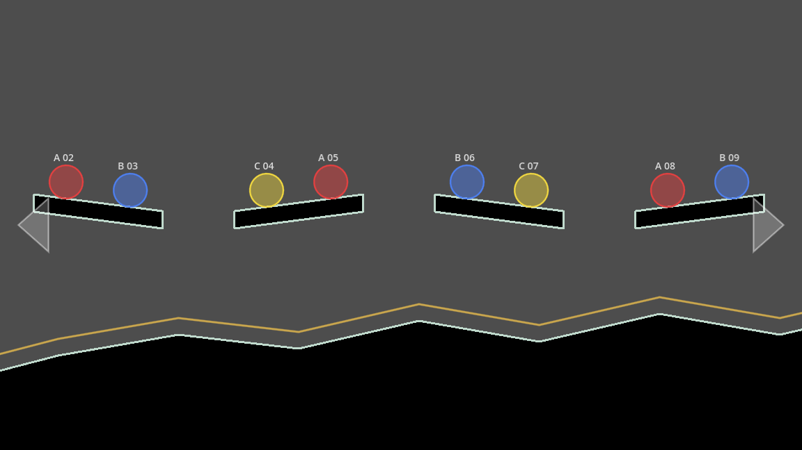

The screenshot is from a debug run with a display: a real left-button press
at the right button's centre, held 1.5 s, carried the camera from distance
0 to 1677.9 px along the loop, the Camera2D following.

**Tests.** `tests/unit/test_camera.gd` on a synthetic loop (a 3000 px rail
out, a slide back underneath, 6800 px): starting on the nearest rail point,
one step per short press, at least one step per press, the left button
wrapping onto the return route, a steady pace while held then easing,
turning back, forward moving the view left on a right-to-left rail,
rounding the frontier to the start, a gate opening without a jump, the
drag's pace and 8 s, the glide back, a new call restarting the drag, an
edge press off the rails without a jump, the zoom never changing, the
buttons shown by default, the view's left edge, determinism and restore;
and through the simulation, an edge tap moving the camera and never
calling, hold and release, a second finger doing nothing, a call dragging,
and the camera in the dump. `tests/e2e/test_camera_e2e.gd` on the test
level: a right hold goes through section 1 up to the frontier turn, back
along slide 1 (the view moving left) and into the start basin; a left hold
goes the other way; a call by the tree drags the camera for 8 s and it
comes back to the rails by the tree; the Camera2D mirrors the simulation at
zoom 1; a scripted run gives the same hash twice. `test_call_e2e.gd` aims
the camera with `camera.place()` now, not by moving the Camera2D.

**Choices.** The camera lives in the simulation, not the scene, so taps and
scripted runs see the same view. The view is set in `sync_view()`, not
inside `Simulation.step()`, so unit tests that set `sim.view` by hand keep
working. The drag and the return share one pace. A per-segment rail offset
was left out: framing zones cover it.

### Framing zones (chunk 13)

Master spec §5.6 "Automatic framing", rule 19, DoD 18
(`req_camera_rails_and_framing`, `rule_framing_zone_wherever_wider_view_needed`).
A `FramingZone` (`src/components/framing_zone.gd`, an Area2D) is placed in
the level like any component. Its editor properties:

| Property | What |
|---|---|
| `stable_id` | `<place>.frame.<name>` |
| `size` | the box it covers, centred on its position, level px |
| `zoom` | as Camera2D.zoom: 1 is normal play, below 1 shows more (0.7 shows 43 % more), above 1 closes in; 0.25-2 |
| `offset` | how far the view shifts from where the rails put it, level px (negative y is up) |
| `exit_hold` | seconds of holding an edge button to leave it; -1 (default) uses `Camera.EXIT_HOLD` |

`Level.build()` collects them into `LevelData.framing_zones` (stable ID ->
`{"box", "zoom", "offset", "exit_hold"}`), and `Simulation.load_level()`
hands them to the camera (`camera.zones`) before starting it. The test level
had two in chunk 13, from `tools/greybox_test_level.gd`: `s1.frame.high-step`
(x 3.5-4.5 screens, zoom 0.85, offset (0, -120): the loop and the ledge) and
`s1.frame.tree` (x 4.5-5.5, zoom 0.7, offset (0, -250): the loop, the
tree's lower platform and the bough). Since then: `s2.frame.parade` and
`s2.frame.gate` (chunk 15), `s3.frame.bowl` and `s3.frame.basket` (chunk
16), and `s2.frame.cave` (chunk 16d: x 10.6-11.9, zoom 0.7, offset
(0, -140): settled, the view spans y -767 to 159, the loop and the cave's
pocket with its sleepers at y -724, for rule 9).

**Framing.** A zone frames the camera while its **rail point** (the rails'
place, before framing) is inside the zone's box; the box is tested against
that point, so a zone above the way out doesn't frame the slide under it.
Framed, the camera's place is the rail point plus `frame_shift`, which eases
toward the zone's `offset`, and `zoom` eases toward the zone's zoom; both
ease back to (0, 0) and 1.0 when the rail point leaves. The ease is
`FRAME_EASE` (1.5) times the difference left per second, never slower than
`ZOOM_SETTLE` (0.02 /s) for the zoom or `SETTLE` (30 px/s) for the shift,
so it lands without creeping: just under 3 s from 1.0 to 0.7. A zone reframes
the rails, it doesn't pin the view: the camera still moves along them
inside. Where boxes overlap the current zone keeps the camera, else the
smaller ID. A camera started inside a zone (a level load, a fixture's
camera) shows its framing at once. A call still drags the camera out of a
zone; it keeps the zone's framing while dragged and is framed again by
wherever its rail point lands.

**Leaving a zone** (O70's proposed default). In `RAILS`, a move that would
take the rail point from inside the current zone's box to outside it is
held back (the camera stays at the edge) until the edge button has been
held for the zone's exit hold (`EXIT_HOLD`, 1 s, unless the zone sets its
own) since it was pressed in that zone (`zone_hold`, ticks; it restarts on
each press and on entering a zone). A short press, or a hold let go before
then, stays inside: the rest of the press is dropped at the edge. Once the
hold has lasted long enough the right to leave stays until the next press,
so the ease after the finger lifts carries the camera on out. **With STEP
and PACE:** a press still moves a `STEP` and a hold still moves at `PACE`
inside a zone; only the crossing of its edge waits. Holding across a whole
zone is never slowed as long as crossing it at `PACE` takes longer than its
exit hold (the test level's zones are one screen wide: 1.33 s at `PACE`,
over the 1 s). Zones are entered freely.

### Idle camera and screensaver mode (chunk 13)

Master spec §5.6, §5.7, DoD 19 (`req_idle_camera_and_screensaver_zoom`).
`Camera.watch(slimes, touching, screensaver, bedtime)` runs once a tick before
`step()`: `touching` is whether a finger is down (a finger held down counts
all along), and `Simulation._apply_input` calls `camera.touched()` for every
touch that counts, before the tap does its job. `quiet` counts the ticks
since the last touch. Tilt doesn't count as input for this clock: it
steers free slimes, it doesn't take the camera.

- **Cue.** From `IDLE_SECONDS - CUE_SECONDS` (35 s) the zoom goes slowly
  (smoothstep over 10 s) from where it was to `IDLE_ZOOM`, while the camera
  stays the child's (on its rails). A touch stops the cue and the zoom
  eases back to its framing.
- **Following.** At `IDLE_SECONDS` (45 s) the camera switches to `FOLLOW`:
  it picks the **train slime whose centre is nearest the camera's point**
  (the smaller id on a tie; with none it tries again each tick) and glides
  after it, keeping it `RAIL_OFFSET` under the middle of the view, at
  `FOLLOW_EASE` (2) times the distance per second, between `SETTLE` and
  `FOLLOW_PACE` (half a screen a second, above the slide's 360 px/s). A
  hopping slime runs a little ahead of the view (about half a second of
  its motion). Framing zones are ignored while following.
- **The follow rule.** The camera keeps its slime's id. Through **fusion**
  it follows the fused slime: `SlimeBodies.merge` keeps the lower id, so if
  the followed id is gone the camera takes the slime of the same species
  with a lower id nearest where it was. Through **splitting** it follows the
  piece that keeps the id (`SlimeBodies.split`'s first part). A slime gone
  any other way: the train slime nearest where it was.
- **Taking control back.** Any touch ends following and still does its
  normal job: the camera glides back to the rails as after a call
  (`RETURN`), framed again only if its point (the view's centre) is still
  inside a framing zone, else as in chunk 12; an edge button puts it
  straight back on the rails at the nearest point and moves it on; a call on
  open ground drags it toward the call. The idle clock starts again.
- **One zoom.** `IDLE_ZOOM` = 1/1.15 (15 % wider than normal play, within the
  spec's 10-20 %) is the only zoom while following, in idle and screensaver
  mode alike: it replaces a zone's zoom, it never stacks with one. It never
  zooms in (chunk 23C, D103): where the camera is already wider (a zone
  under 0.8696, like the tree's 0.7), the cue and the idle camera keep that
  zoom (`_idle_zoom()`).
- **At bedtime** (chunk 23C) the idle camera follows no one: `watch()`'s
  `bedtime` drops the followed slime and the camera stays where it is
  (`FOLLOW` with `follow_id` -1), and no idle camera starts; the cue may
  still settle the zoom. At sunrise it follows the train slime nearest it.
- **Screensaver mode.** `simulation.screensaver` (true: screensaver mode).
  Turning it on starts the idle camera at once, at `IDLE_ZOOM`, with no cue.
  A touch takes the camera back as above; it idles again after the usual
  45 s. The core default is false (a session, and test mode and the unit
  tests play as in one). Once sessions are open (`session.open()`: normal
  play, or a test-mode run with `"sessions": true`), the session sets it
  every tick: on in screensaver mode, off during a session and at bedtime
  (see "Sessions (chunk 17)"). It is a mode set from outside, so it is not in `Simulation.dump()` nor in saves; the
  camera's own dump records what it did (`screensaver` as last seen,
  `quiet`, `cue_from`, `follow_id`, `follow_species`, `follow_point`,
  `frame_zone`, `frame_shift`, `zone_hold`, and since chunk 23C
  `show_distance`, `show_tick`).

`camera.place()` (tests, debugging) also ends following, restarts the idle
clock and frames the camera by the zone its centre is in.

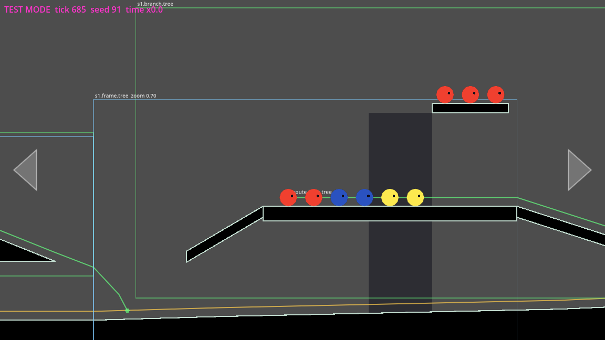

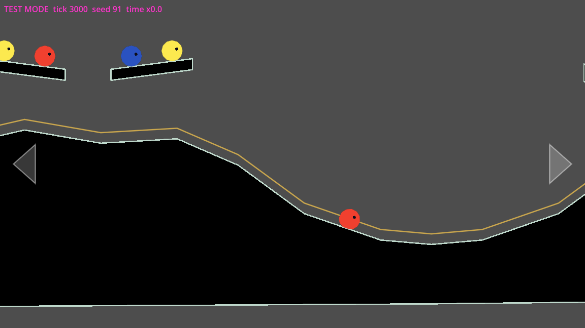

The screenshots are from a debug run with a display, seed 91: a scripted
right hold to the middle of the tree's zone (the camera at distance
5769.6, zoom 0.7, shift (0, -250)), and a fresh run left alone for 50 s
(following slime 1 at zoom 0.8696; at 40 s the cue had it at 0.9348).

**Minimum zoom (Known gap 4), data only.** A base (size 1) slime's visible
edge is `RING_RADIUS_SIZE_1` + `EDGE` = 24 level px from its centre, so it
is drawn 48 level px across: 48 viewport px at zoom 1, 40.8 in
`s1.frame.high-step` (0.85), **33.6 in `s1.frame.tree` (0.7)**, 41.7 at
`IDLE_ZOOM` (measured about 33 px across in the tree screenshot). On the
reference phone (S20 FE, 2400×1080 at about 405 ppi, 1.667 physical px per
viewport px) that is 80 px (5.0 mm) at zoom 1 and 56 px (3.5 mm) at 0.7,
the Meadow's smallest. No rule is set here.

**Tests.** `tests/unit/test_camera_framing.gd` (synthetic loop, one zone):
`Level.build()` collecting the zones with their exit hold, entering a zone
reframing smoothly (the zoom only going out, less than 0.01 a tick, no jump
in place) and settling on its zoom and offset, not there after 0.5 s, a
camera started inside framed at once, the slide under a zone not framed,
short presses forward and backward staying inside, a hold leaving after
1 s, a shorter hold staying, a hold across the zone not slowed, a hold let
go near the edge easing on out, a zone's own exit hold, only the zone
setting the zoom, a call from inside a zone keeping and regaining its
framing, dump and restore. `tests/unit/test_camera_idle.gd`: idle at 45 s
with the cue from 35 s (half way at 40 s), a finger held down counting as
input, waiting without a train slime, following the train slime nearest
the middle (not a free slime or a sleeper) and gliding to it, following
through a fusion (either id) and a split (with `SlimeBodies` directly), a
touch taking control back and restarting the clock, a touch stopping the
cue, an edge press from following, zones ignored while following, framing
resumed on touch only inside a zone, screensaver mode starting at once
(also inside a wide zone, keeping its zoom since chunk 23C), one shared zoom, and through the
simulation the zones handed over, screensaver mode, tilt not counting, a
tap on open ground taking control and still calling, an edge tap taking
control and moving the camera, dump and restore.
`tests/e2e/test_camera_framing_e2e.gd` on the test level (seed 91): the
zones reach the camera, a right hold into `s1.frame.tree` reframes it
(zoom 0.7, the shift, the platform and the loop on screen, the Camera2D
mirroring the zoom), four short presses stay inside and a hold leaves after
about 1 s, 45 s alone gives the cue then the follow of the first slime and
a tap takes the camera back and calls, screensaver mode, and a repeatable
hash. `test_camera_e2e.gd`'s call to the tree now stops short of the tree
(in the high step's zone): the tree's zone shifts the view onto the call
point, which left the drag nothing to do.

**Choices.** Framing is relative to the rails (rail point plus a shift),
not a fixed view per zone, so the camera still travels inside a zone and a
zone's edge needs no special seam. The exit hold is a fence on the rail
point rather than a slower pace, so short presses behave the same inside a
zone and a long hold is not slowed. Tilt is not input for the idle clock.
`screensaver` stays out of the dump so a reload in normal play still
matches the saved hash.

### Chunk 23C: call dead zone, idle zoom, showing a gate open, idle camera at bedtime

Build plan items 23.1, 23.4, 23.10 and 23.12 (master spec §5.6; D101,
D103; ux D4, D5). All in `Camera`, plus one accessor on `FrontierSets` and
three lines in `Simulation`.

- **Call dead zone (23.1, D101).** `Simulation._tap` hands a call to
  `camera.on_call(point, tick, view)`. `Camera.in_dead_zone(point, view)`:
  the call point shows inside a box centred on the screen, `DEAD_ZONE`
  (0.2) of its width by 0.2 of its height (230.4 × 129.6 px on the
  1152 × 648 viewport), measured on the screen, so the same at every zoom.
  Inside it the call happens as usual (the slimes answer, the ripple) and
  the camera doesn't move: on the rails nothing changes; off them (a drag,
  a return, the idle camera or a gate's show just taken back) the camera
  is held where it is for the call's window (a `DRAG` toward its own
  position), then glides back to the rails as after any call. So a call
  inside the box during a drag stops the drag where it is. Outside the
  box, `follow_call()` as before. The box's edge counts as inside.
- **The idle zoom never zooms in (23.4, D103).** The cue goes from its
  starting zoom to `_idle_zoom(from)` = `min(IDLE_ZOOM, from)`, and
  following (and screensaver mode's start) keeps `min(IDLE_ZOOM, zoom)`.
  In the tree's zone (0.7) the zoom stays 0.7; in a zone narrower than the
  idle zoom (section 2's gate zone, 0.9) the cue zooms out to 0.8696 as
  before. The zoom a followed camera keeps stays with it out of the zone
  (framing is ignored while following).
- **Showing a gate open (23.10).** `FrontierSets._open_gate` records the
  tick in a transient `_opened_on` (emptied by `start()`, not saved), and
  `frontier.gates_fired_open(sim)` returns the gates a basket fired open
  on this tick. `Simulation.step` hands each to
  `camera.show_gate(box, view, loop, open_gates, tick)`, after
  `camera.watch()`: unless the gate's box is wholly in view (or an edge
  button is held), the camera enters `SHOW` and glides in `SHOW_SECONDS`
  (1.5 s) to the rail point nearest the gate's centre on the grown loop,
  framed by the zone there (the zoom and shift ease on the way), a
  straight glide timed to arrive on the 90th tick; then it is on the rails
  there (`RAILS`), under normal control, and stays. Any touch takes it back
  (`_take_back()`, as from the idle camera): a call drags it, an edge press
  moves on from the nearest rail point, another tap sends it back to the
  rails. The show ends the idle camera and restarts the idle clock, so it
  stays at the gate rather than going back to a slime. A gate saved open
  (a fixture, a reload) shows nothing: only a firing in this run counts.
- **The idle camera at bedtime (23.12).** `watch()` gets
  `session.phase == Session.BEDTIME`. Following at bedtime, the camera
  drops its slime (`_follow_no_one()`: `follow_id` -1, `follow_point` its
  own point) and `step()` holds it still; no idle camera starts at
  bedtime. The cue may still run to the idle zoom. At sunrise (screensaver
  mode) it follows the train slime nearest it again. Before, a camera
  still gliding to its slime when bedtime began kept gliding to the
  now-asleep slime.

**Values (proposed; the spec gives none).** The dead zone's edge counts
as inside. The glide to a gate is a straight, even glide of exactly 1.5 s
to the rail point nearest the gate's centre (not the gate's centre
itself), so the camera ends on the rails. "In view" for a gate is its
whole box inside the view. No show while an edge button is held. The show
restarts the idle clock (a following idle camera, or screensaver mode's,
gives way to it and resumes 45 s later).

**Tests.** `tests/unit/test_camera_dead_zone.gd`: the box's size and
edges, the same on the screen at six zooms, a call inside it leaving the
camera on the rails through its window, one just outside dragging at the
drag's pace, one inside during a drag stopping it for the new window then
the return, one inside a return holding it, and through the simulation a
call inside the box answered by the slime in range with the camera still.
`tests/unit/test_camera_gate_show.gd` (synthetic loop, gate at 3000 px):
a gate off screen shown in 1.5 s without a jump and ending on the rail
point, staying there then moving on with the edge buttons, easing into a
zone's framing at the gate, a gate in view moving nothing, a gate half in
view shown, a call, a touch and an edge press during the glide, no show
while a button is held, the idle clock restarted and the cue stopped, the
idle camera giving way, dump and restore mid-glide; and through the
simulation `gates_fired_open()` on the firing tick only, a basket saved
fired showing nothing after a load, a basket firing showing its gate
within 1.5 s, and a gate in view keeping the camera still.
`tests/unit/test_camera_idle.gd` adds: screensaver mode inside a wide zone
keeping its zoom (this test expected `IDLE_ZOOM` before D103, and was
changed with the spec), the cue and the idle camera keeping a wide zone's
zoom, a narrower zone's cue zooming out, and at bedtime following no one
and staying put (then following at sunrise) and no idle camera from a cue
at bedtime. End to end on the test level:
`tests/e2e/test_camera_dead_zone_e2e.gd` (seed 23: inside and just outside
the box, the box in every framing zone (seven) from `gate2-open`, stopping a
drag, a repeatable hash); `test_camera_framing_e2e.gd` adds the tree's zone
(the zoom never above 0.7 over 50 s alone) and section 2's gate zone
(zooming out to the shared zoom); `tests/e2e/test_camera_gate_show_e2e.gd`
(seed 14, `s1-basket-5of6`: gate 1 in view within 1.5 s of the firing and
staying, a tap during the glide calling and dragging, gate 1 already in
view leaving the camera still, a repeatable hash);
`tests/e2e/test_camera_bedtime_e2e.gd` (seed 4242, `wind-down` with
sessions: the camera idle, or in its cue, when bedtime begins stays put
through the whole 10-minute cooldown, 30 s ticked, 9 min skipped, the rest
ticked, then follows a train slime after sunrise; a repeatable hash). The
e2e runs set `camera.quiet` at the start so the camera is idle when bedtime
comes 10 s in.

## Fusion and bumping

Master spec §5.2 and §5.3, D20, D37, D49 (`rule_fusion_contact_time`,
`rule_max_size_three`, `rule_dip_may_nudge_fusion`). `Fusion`
(`src/sim/fusion.gd`, pure logic) holds the contact counts; the ring
operation is `SlimeBodies.merge`, reached through `Simulation.fuse()` so the
stable identities follow. `Simulation.step()` calls `fusion.step(self)` after
the split zones and before the free slimes and the train follow (they drop
the fused-away slime's records).

**Contact timers.** After the bodies tick, every touching pair
(`SlimeBodies.touching_pairs()`, rings within `TOUCH_SKIN` 2 px) that
counts adds one tick to its count. A pair counts when both slimes are awake
(train or free; sleepers never count), of the same species, both centres on
screen, and neither in a split zone (a slime fused there would split again
at once). A pair that stops touching or counting for even one tick loses
its count. **No grace:** two slimes resting against each other stay
touching every tick (`test_179_ticks_of_contact_do_not_fuse_and_180_do`
checks every tick), so solver jitter never needed one.

At `CONTACT_TICKS` (180, 3 s) the pair acts:

- sizes adding up to 3 at most: it **fuses**. The fused slime keeps the
  lower runtime id and with it that slime's state and records (a train
  slime keeps its progress, a free slime its phase, call point and stream),
  at the size-weighted centre, momentum kept. Its identity is the union of
  both (D72).
- above 3: it **bumps**. Each slime gets a push apart (`BUMP_SPEED` 240
  px/s shared by size, the smaller moving more) and a lift (`BUMP_LIFT`
  200 px/s up), and the count starts again. A pair that stays together
  bumps once every 3 s, not every tick.

**On screen only.** The view is `Simulation.view` (the scene copies the
camera into it before every tick; unit tests set it by hand). A centre is
on screen when it is inside the view shrunk by `VIEW_MARGIN` (24 px, a base
slime's drawn radius, so the whole body shows). Off screen the count is
**dropped, not paused**: a pair that comes back into view starts from zero.

**The dip nudges fusion** (level rule 5, test level 1.3). Measured first:
without help, two base slimes of one species put on the Meadow dip's rim
pass through the dip at the train's pace. Over 20 seeds none fused in 60 s;
the longest contact was 16 to 115 ticks. Two lighter tweaks weren't enough:
holding touching pairs only (9 of 20 seeds fused) and doubling the hop
interval on landing at the floor (13 of 20). The kept nudge is sim-side, in
`Fusion`:

- a **dip floor** is found from the loop (`Fusion.dip_floors()`): a vertex
  of the outgoing route from which the route rises `DIP_DEPTH` (100 px)
  above it on both sides before going any lower; the floor is the stretch
  around it at most `DIP_FLOOR_RISE` (30 px) higher. The Meadow's fusion
  dip gives one floor, 3217 to 3570 px along the loop; the smaller dips and
  the slide have none. Recomputed when the open gates change, not state.
- **gathering:** a train slime on a dip floor doesn't hop while a train
  slime it may fuse with (same species, sizes up to 3) is less than
  `DIP_GATHER` (300 px, two base hops) behind it along the loop, so the one
  behind catches up. For the train slime **directly behind** it (no other
  train slime between them) it waits as long as that holds. For a partner
  with other slimes between them, it waits only until its own progress has
  not advanced for `DIP_WAIT_SECONDS` (5 s; the train's stall mark,
  `marked_at`, which moves on every 24 px of progress, so no new state and
  nothing new in saves). Chunk 16f added the limit (below);
- **holding:** two such slimes touching on the floor don't hop until they
  fuse or lose contact.

Both apply only on screen, where fusion can happen, and only to pairs that
may fuse: pairs that would bump, or of different species, pass through. A
held slime's hop timer is kept at `DIP_HOLD_SECONDS` (0.25 s), so it hops
soon after it is let go. With it, all 20 seeds fuse, in 7.5 to 11.6 s.

**A mixed queue on a dip (chunk 16f).** Since 16e the train reaches the
dips as about 20 base slimes whose species alternate (A, B, C, A, ...), so
a partner behind a slime on the floor usually has a slime of another
species between them and can't catch up. Gathering used to wait for it
with no limit and held the whole queue: 8 alternating slimes put on the
Meadow dip crept a few px a second, 9 of 10 seeds still on the floor after
120 s, 7 of 10 with train slimes stalled (D118); `gate2-open` seed 6 held 17 train
slimes on section 3's bowl floor for 6 minutes (1 lap in 15 min). Now the
partner directly behind is waited for as before, and one with slimes
between them for `DIP_WAIT_SECONDS` at most. Measured on the Meadow dip
(seeds 1 to 10 for the queue, 1 to 20 for the rest):

| Case | Before 16f | After |
|---|---|---|
| two C slimes on the rim (the chunk 10 check) | 20 of 20 fuse, 454 to 679 ticks | the same runs, tick for tick |
| A, C, C, B (neighbours of one species) | 15 of 20 fuse; the other 5 stay on the floor | the same 15 fuse, tick for tick; the other 5 leave the floor in 23 to 35 s |
| A, B, C, A, B, C, A, B | 1 of 10 leaves the floor in 120 s; 7 with stalled slimes | all leave in 33 to 58 s, 0 to 3 fusions, none stalled |

Waiting only for the slime directly behind (no limited wait) passes the
queue faster (19 to 26 s) but leaves the `bump` fixture's 3 + 1 bump
unmet: its size 1 sits ahead of the size 3 and waits for a size 2 behind
that, which is what kept the 3 + 1 pair together for 3 s. With the 5 s wait
the fixture's 3 + 1 pair bumps once, at tick 179, on seeds 1 to 8 (before:
six times in 20 s, since the 1 never left). The 2 + 2 pair bumps within
20 s on seeds 1 and 3 to 7 (seed 5 is the end-to-end test's), no longer on
seeds 2 and 8, where it bumped only in the pile the held size 1 kept.
`DIP_WAIT_SECONDS` is a new tuning value, proposed for `specs/tuning.md`.

**State and saves.** The counts are state: `dump()["fusion"]` is
`[[a, b, ticks]]` in id order. They are saved too, in the save's
`transient.fusion`, because it is trivial and keeps the reload invariant (a
reloaded save has the same hash and fuses on the same tick).

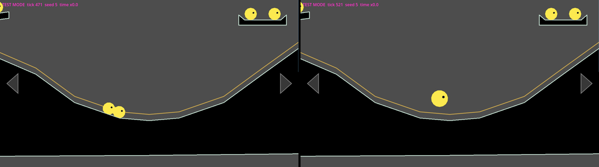

The screenshot is from a debug run with a display, seed 5, the camera on
the dip at zoom 1: two species-C base slimes put on the rim (2.58 and 2.68
screens) gather on the floor and fuse at tick 491 (8.2 s).

**Tests.** `tests/unit/test_fusion.gd` (flat floor, automatic hops off, the
view set by hand): 179 ticks don't fuse and 180 do, with the summed size; a
small hop at tick 100 breaks the contact and the fusion comes exactly 180
ticks after the contact is back (293); different species and sleepers
never count; free slimes fuse; 1 + 2 fuse; 2 + 2 and 3 + 1 bump (both
remain, pushed apart and lifted, the smaller faster, at most one bump per
3 s); off screen, half off screen and inside the margin nothing fuses, and
going off screen drops the count; a fused train slime keeps its progress
and hops on along the loop; identities merge; determinism; the counts in
the dump and through a save; `dip_floors()` on a synthetic loop; the
nudge on a synthetic dip lying on the flat floor (16f): a partner directly
behind is waited for past 5 s, one behind a slime of another species for
5 s and no more, and nothing waits for a partner out of reach or for a
2 + 2. `tests/e2e/test_fusion_e2e.gd` on the Meadow: from `bump` the size 3 and
size 2 meet and are both there after 10 s [DoD 6, bump]; two base slimes
on the dip rim fuse within 20 s and the run is repeatable; the fused slime
leaves the dip; 2 + 2 and 3 + 1 on the dip meet and stay apart in size;
(16f) 8 alternating slimes leave the dip's floor within 75 s (seed 5: 43
s), and in A, C, C, B the two C slimes fuse there within 20 s.

**Choices.** The nudge is a small sim-side wait, not a level edit and not a
physics change: the dip geometry is the level's, and the train's grip and
hop aims stay as they are. The count is dropped, not paused, off screen, so
a fusion the player sees always shows its full 3 s. The bumped pair's count
starts again rather than bumping every tick, which would shake them apart
on every contact.

**Known gaps.** In the `bump` fixture's 10 s the pair meets (touching for
75 ticks, the longest run 68) but never reaches 3 s together, so no bump
push happens in that run; the bumps themselves are covered by the unit
tests. The `bump` fixture holds a 3 + 2 pair, while the build plan's
"`bump` (2 + 2 and 3 + 1)" names other sizes; 2 + 2 and 3 + 1 are covered by
scripted spawns on the dip instead.

## Sleepers, waking and the hint

Master spec §5.2, D13, D70, D65 and D95 (`req_waking_sleepers`,
`req_first_play_hint`, `req_controls_tap_zones`). The code is in `Sleepers`
(`src/sim/sleepers.gd`, stateless) and `Hint` (`src/sim/hint.gd`,
`simulation.hint`). `TapFeedback` draws the hint.

- **Placing.** `Level.build()` adds every `Sleeper` component to
  `LevelData.sleepers` (stable ID, species, position). On a fresh state,
  `Simulation.load_level` creates the first slime and then every sleeper
  (`Sleepers.place`) in stable ID order. Each sleeper is size 1, in state
  `sleeper`, named by its stable ID. A restored save brings its own
  sleepers and gets no new ones. The test level has 29. The markers only
  draw in the editor: the game draws the bodies.
- **Asleep.** A sleeper doesn't simulate. `SlimeBodies` skips its hops,
  integration, ring and terrain constraints, so its points never move. It
  still takes part in the contacts, as a wall: the other slime takes the
  whole overlap, can rest on it, and wakes it. Two sleepers are never
  paired.
- **Waking.** Right after the bodies tick, `Sleepers.wake` wakes every
  sleeper touching a free slime when both are on screen: any part of the
  ring in `simulation.view`. Train slimes never wake one. The woken slime
  becomes free and `unsure` at its own centre, then heads back and rejoins
  like any free slime. It can wake another sleeper on a later tick.
- **Tapping.** A tap on a sleeper is a call centred on its body.
  `Sleepers.tap_targets` moves the level's box onto the body and drops it
  once the sleeper is awake.
- **The hint.** The hint has one place: the sleeper nearest the first
  slime's marker (the smaller ID on a tie). It is due until the first call:
  any tap that calls, on open ground or on a sleeper. The game calls
  `hint.world_shown(tick)` whenever it shows a simulation. If no call comes
  in the 10 s after that, the hint shows, but never during bedtime
  (`hint.bedtime`, which chunk 17 drives). `TapFeedback` draws it as a
  steady ring plus a ring that swells and fades every 1.2 s of sim time.
  This is placeholder art.
- **Saving.** `hint_done` sits at the top level of the save (absent means
  false, so the hint is due). `transient.hint` holds `{since, bedtime}`.
  `readable()` keeps `hint_done`.

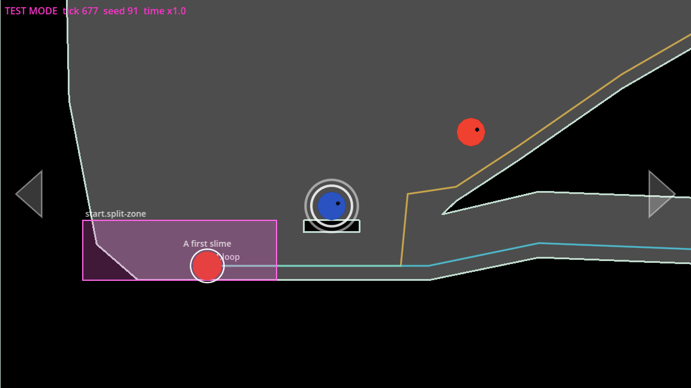

The screenshot comes from a debug run with a display: fresh, seed 91, no
input, tick 677. It was recorded with the movie maker under
`xvfb-run -a -s "-screen 0 1280x720x24"`, `--fixed-fps 60 --quit-after
700 -- --test-mode --seed=91`.

**Tick cost.** Measured with `Simulation.step` on the test level, seed 909,
over 3600 steps, headless. The figure is the median of rounds 2 and 3.

| Case | Slimes | ms per step |
|---|---|---|
| No sleepers | 1 | 0.057 |
| 29 sleepers (not simulating) | 30 | 0.142 to 0.148 |
| The same 29 as bedtime-asleep (simulated) | 30 | 0.91 to 0.94 |

The 54 000-tick session test now takes 7.9 s. The bench's "still" case
(`tools/bench_slimes.gd`) uses bedtime-asleep slimes, because sleepers no
longer simulate.

**Tests.**
- `tests/unit/test_sleepers.gd` (12 tests):
  - placing, and a restored save placing none;
  - never moving, and resting on a sleeper;
  - train slimes not waking one;
  - on and off screen, and both having to be on screen;
  - unsure, then rejoining;
  - the tap following the body, and a woken sleeper no longer a target;
  - determinism.
- `tests/unit/test_hint.gd` (10 tests):
  - 10 s after the world shows, next to the first sleeper;
  - showing again restarts the count;
  - done for good, a call hiding it, and a tap that doesn't call leaving it due;
  - bedtime, and a level without sleepers;
  - the save round trip, a save without the mark, and a bad mark.
- `tests/e2e/test_sleepers_e2e.gd` (7 tests, on `fresh`):
  - every sleeper asleep;
  - the hint after 10 s with no call [DoD 16];
  - a call at 5 s means no hint, even after a reload;
  - a reload counts 10 s again;
  - a call on the first sleeper wakes it and both rejoin;
  - no waking in a lap without calls;
  - repeatability.
- `tests/unit/test_call.gd` gains a heading-back test from a ledge above
  the loop.

**Crowd check** (scratch runs, not tests):
- **Hill sleepers can't be reached.** Hill sleepers `.02` to `.13` sit on
  slabs about 150 to 210 px above the hill surface, beyond a base slime's
  `max_rise` of about 133 px.
  - A called slime came no closer than 65 to 70 px (the tree: 105 to 112;
    the bough: 380; ledges B and C: 69 to 76).
  - In 8 minutes of taps, none woke.
  - This is a level design question, not code. The slabs also have to
    clear size-3 train slimes on the loop below.
- **Woken on a ledge.** Force-woken hill sleepers (6 per run) first got
  stuck on their slab's corner. The way back is now fixed (see the call
  above), with a test.
- **Corner snag.** A slime can snag on bump 2's right end, around
  (1746 to 1751, −164 to −174). At a convex corner that isn't square,
  `TerrainSegments` takes the first-listed segment on a tie. That can
  count a point just past the corner as inside the terrain, so a
  wedge-shaped strip of air acts as solid (seen at x 1778 to 1802,
  y −184).
  - After the fix, one slime still stuck there on 9 of 10 seeds.
  - A fix (the vertex's summed normal on a tie, in both `resolve` and
    `SlimeBodies._solve_terrain`) changes contact physics everywhere, so
    it is left open.
- **Lost by stalling.** Crowds were lost by the 60 s stall rule:
  - at the start basin's lip, around (716 to 723, 370 to 381), on seed 4
    (seed 2 before the fix);
  - on the fusion dip's floor, around (3459 to 3592, 200 to 218), on
    seeds 6 and 9, mixed species (the dip nudge held a mixed queue; limited
    in chunk 16f, see "Fusion and bumping").
  - Not settled; the start crowd from chunk 6's known limit remains.

**Choices and gaps.**
- The hint ends on the first call, not on the first call that wakes a
  sleeper as D65 words it. This follows D95 and `req_first_play_hint`.
- The done mark lives in the level's save. Deleting the save brings the
  hint back.
- A reload while the hint is due restarts its 10 s, so the hash of a
  reloaded run can differ from the unbroken run's while the hint is due.
- The bedtime flag stays off until chunk 17.
- Tests changed because sleepers now exist and don't simulate:
  - test_slime_physics, test_slimes_in_game and the bench use
    bedtime-asleep bodies;
  - the e2e counts expect 1 + the level's sleepers at load;
  - the `bump` fixture expects 3 awake slimes.

## Frontier sets (chunk 14)

Master spec §5.4, DoD 9-14 (`req_switch_basket_gate_set`,
`req_interactive_objects_general`, `rule_gate_opens_via_switch_basket_set`,
`rule_frontier_set_inert_after_gate_open`, `rule_signpost_at_every_fork`,
`req_level_completion_celebration`). `FrontierSets`
(`src/sim/frontier_sets.gd`, pure logic) is `simulation.frontier`;
`FrontierView` (`src/frontier/frontier_view.gd`, the node `Frontier` under
main) draws it. Its class doc is the reference; in short:

**Data flow.** The components (`Switch`, `Basket`, `Gate`, `Signpost`)
only configure: `Level.build()` turns them into `LevelData.switches`,
`baskets`, `gates`, `signposts` and `rules` (level pixels). At load (and on
a save restore) `frontier.start(sim)` fills `sim.object_states` and
`sim.gate_states` with each object's state, syncs the train's open gates
and builds the doors. Each tick, after fusion, `frontier.step(sim)`:

1. catches every train or free slime whose centre is inside a basket's box
   (state `in_basket`: no hopping, no train, no call; it falls and settles);
2. weighs each basket (a size-3 slime weighs 3) and moves it through its
   phases: `filling` (collecting while its switch is flipped) -> `full` at
   its quota -> `reward` once its box's centre is in the view, for
   `REWARD_SECONDS` -> `fired`: its rules run (its gate opens) and, when
   every basket of the level has fired, the celebration plays, once per
   save;
3. lets a basket that isn't holding (fired, or its switch flipped back)
   release its slimes, lowest id first, one every `RELEASE_SECONDS`, at its
   outlet when there is room; the slime is moved there at rest and rides
   the train again;
4. sets the doors: a flipped switch's trapdoor is open, a closed gate's box
   is solid, an open gate's lid shuts the old slide entrance; a door only
   shuts once no slime is in its way. The shut ones go to
   `SlimeBodies.doors`, solved like the terrain.

Then `sim.gates` follows the train's open gates. A tap on a switch
(`Simulation._tap`, `KIND_SWITCH`) calls `frontier.tap_switch()`: it flips
only while the basket is `filling`, so the set is locked once full and inert
for good once fired. Since chunk 23E (D109) a switch that isn't answering
(`switch_answers()`) and a basket don't take the tap at all: it is a call. At bedtime taps reach no object (chunk 17), so the
switch can't be flipped then.

**Opening a gate** adds it to the train's open gates: the loop grows
(`LoopData.current_segments`: the section's return route is replaced by the
next section's segments). Train slimes on the outgoing part keep their
distance; those still on the old return route are put the same distance
from the new loop's end, and every progress mark restarts.

**Editor configuration.** In the level scene:

- `Switch`: at the fork, before the gate; `basket_id` its basket;
  `trapdoor` a box (relative to the switch) of the loop's ground over the
  basket, solid while the flow goes onward, open while flipped. Tappable
  (its box plus the tap margin).
- `Basket`: its box is where caught slimes rest (the pit under the
  trapdoor); `quota` the weight that fills it; `on_full_object` its gate,
  `on_full_action` `open`; the outlet (below).
- `Gate`: its box blocks the loop while closed (put it across the next
  section's outgoing route); `entrance_lid` a box (relative to the gate)
  over the old slide entrance, solid once the gate is open. The section's
  return `LoopSegment` names it in `gate_id`.
- `Signpost`: next to its switch (`switch_id`), one at every fork; not
  interactive. The game draws its arrow the way its switch sends the flow.

**The outlet** (Known gap 3, O62: not settled by the spec) is a basket
property. `onward_route` (the default): on the onward route, `outlet_before`
px (200) along the loop before the start of the return route its gate
retires (`FrontierSets.onward_outlet`); a level with no such route falls
back to the outgoing route's point nearest the basket. `point`:
`outlet_point`, relative to the basket. Released slimes land there and ride
on through the open gate.

**Saved.** `objects` (switches and baskets) and `gates` hold the states
above by stable ID, and `celebration_done` the celebration's mark; the
celebration's start tick is transient (`transient.frontier`), so a reload
never replays it. A save holding states of objects the level doesn't have
keeps them as they are.

**Placeholder art** (`FrontierView`, z 5): the shut trapdoors, closed gate
boxes and shut lids as blocks; the switch's and signpost's arrows (down
into the basket when flipped, else along the loop); the basket's quota as
slime outlines filled by weight, pulsing during the reward; rings for the
celebration; bunting for the lasting mark (chunk 23D).

**Tuning** (constants in `FrontierSets`): `REWARD_SECONDS` 2.0,
`RELEASE_SECONDS` 0.3, `CELEBRATION_SECONDS` 4.0, `OUTLET_CLEARANCE` 8 px
(the outlet is free when no slime is closer than the two radii plus this),
`DOOR_CLEARANCE` `SlimeBodies.EDGE` (3 px); the basket's `outlet_before`
200 px.

**Fixtures.** `s1-basket-5of6` (basket 1 at 5 of 6, the first slime about
to drop in) and `s1-optout` (basket 1 at 3 of 6, to flip back), both with
the camera on the basket (see "Fixtures").

**Test mode.** To watch a set fire:

```json
{"seed": 14, "fixture": "s1-basket-5of6", "time_scale": 1.0}
```

The first slime drops through the open trapdoor, the outlines fill to 6,
the reward pulses (2 s), gate 1 opens, the lid shuts slide 1's entrance and
the six slimes are let out one by one at the outlet, then ride section 2's
loop and back down to the start. The celebration waits for basket 2 (since
chunk 15; to watch it, run `s2-basket-offscreen` and bring basket 2 into
view). To opt out, start
from `s1-optout` and tap the switch (a `tap` step at its screen position): the basket
lets its slime go and its outlines empty. With `--save=` under a scratch
directory, a reload after the celebration shows no celebration.

**Tests.** `tests/unit/test_frontier_sets.gd` (on a synthetic level: the
outlet, catching and weighing, the reward waiting for the view, firing and
the loop remap, release pacing and clearance, opting out, the lock and
inertness, the doors, the celebration once, saves, same seed same hash),
`tests/e2e/test_frontier_e2e.gd` (the game scene on the fixtures, basket on
screen: DoD 9, 10, 11, 13, 14, and a child process with the same hash) and
`tests/e2e/test_frontier_level.gd` (the test level's set against the level
rules: a signpost at every fork, the trapdoor over the basket, the outlet
on the onward route, the gate and its lid, a return route per section,
every branch still reachable with the gate open).

**Known gaps.** Section 3's segments are a stub (chunk 16). What a basket
does at bedtime, undecided when chunk 14 was built, is settled by D105 and
built in chunk 23D (below).

### Chunk 23D: baskets at bedtime and the celebration's lasting mark

Items 23.5 and 23.11 of the build plan (D105; master spec §5.1, §5.4,
§5.7; ux D4). Atoms: `req_switch_basket_gate_set`,
`req_session_lifecycle`, `req_slime_states`, `req_hopping_behavior`,
`req_level_completion_celebration`, `req_persistence_and_saves`.

**Baskets at bedtime (23.5).** `FrontierSets.paused(sim)` is true while the
session is at bedtime, and `frontier.step()` then runs `_basket_wait`
instead of `_basket_step`: baskets still catch (nothing is awake to catch)
and weigh, the doors keep their states, but no phase changes and nothing is
released. The slimes in a basket were never put to sleep (`_bedtime` only
touches train and free slimes) and sunrise only wakes bedtime-asleep
slimes, so they stay `in_basket` through bedtime and sunrise, and the
releases resume at sunrise where they stood (`next_release` has passed).
A reward due (`full`) doesn't turn to `reward`, so no gate opens; a reward
playing has its `since` moved on by one every bedtime tick, so its clock
stands still and it plays the rest at sunrise. A celebration playing when
bedtime begins stands still the same way (`celebration_since`) and isn't
drawn (`celebration_showing(sim)`: playing and not at bedtime). Why this
shape: the pause needs no new saved field. The session's phase and the
existing `since` / `celebration_since` already hold it, so a save taken at
bedtime reloads the same, with no save format change.

**The lasting mark (23.11).** `frontier.mark_showing(tick)` is true once
the celebration has played (`celebration_done`, the level's saved done
mark) and its burst is over; `FrontierSets.mark_point(level)` is the start
of the loop (distance 0). `FrontierView.mark_at()` gives where the mark is
drawn, or null; it draws placeholder bunting there (two thin posts and six
pennants in the celebration's colours, `MARK_*` constants), not solid and
not tappable. A reload shows it at once (the done mark is saved); a level
whose celebration hasn't played has none. The real look is ux-writer's
(ux D4 names bunting as an example).

**The double hop (23.11).** `CelebrationHops` (`src/sim/celebration_hops.gd`,
`frontier.hops`): when the celebration begins, every train or free slime
whose centre is in the view gets two hops to do; each tick of the burst
(not at bedtime) each of them that stands on something hops straight up
(`SlimeBodies.hop`, strength `HOP_STRENGTH`), so the second hop comes on
landing. Slimes asleep, in a basket or off screen don't; hops still due
when the burst ends are dropped. The hops still due are state: in
`frontier.dump()` (`celebration_hops`, so the hash) and in saves
(`transient.frontier.celebration_hops`, `[[slime id, hops left]]`,
optional: absent means none; format still 1).

**Values** (proposed; the spec gives none): `CelebrationHops.HOPS` 2,
`HOP_STRENGTH` 0.6 (about 50 px high, half a second in the air; both hops
fit well inside the 4 s burst); the bunting `MARK_HALF_WIDTH` 90 px,
`MARK_HEIGHT` 150 px above the ground, `MARK_SAG` 20 px,
`MARK_PENNANTS` 6, `MARK_PENNANT_DROP` 26 px.

**Tests.** `tests/unit/test_frontier_bedtime.gd` (synthetic level:
releases pause and resume, the slimes in a basket stay through sunrise, a
due reward waits and no gate opens, a playing reward stands still and plays
the rest, the last basket's celebration waits for sunrise, a celebration
playing at bedtime hides and resumes, a bedtime save reloads the same and
goes on the same), `tests/unit/test_celebration.gd` (the mark after the
burst, after a reload, never without the celebration; the double hop of
every awake slime on screen and of nobody else; the hops saved and hashed;
same seed same hash), `tests/e2e/test_frontier_bedtime_e2e.gd` (from
`bedtime` with basket 1 releasing: nothing leaves until sunrise, then one
at a time; from `s1-basket-5of6`, full and in view at bedtime: no reward and
gate 1 shut until sunrise; a bedtime save reloads the same; repeatable) and
`tests/e2e/test_celebration_e2e.gd` (from `stress-still`, woken early:
the camera stays put through the burst, a tap during it calls, the awake
slimes on screen hop, the mark stands at the start of the loop, after a
reload too, and not on `fresh` or `gate2-open`). `stress-still` is at
bedtime, so the DoD 14 test in `test_frontier_e2e.gd` now wakes it
(`session.sunrise`) before basket 3 can fire. Shared helpers for the new
unit tests: `tests/unit/frontier_test_support.gd`.

**Test mode.** To watch the celebration and the mark, load `stress-still`
(at bedtime: basket 3's reward waits) with a `skip` step of 600 s to reach
sunrise, then bring basket 3 into view (a held right edge button); with
`--save=` and a reload, the mark is there at once.

**Not built here.** No slime has an asleep look yet (all asleep slimes,
bedtime-asleep or in a basket at bedtime, look like awake ones but for the
dusk tint): "shown asleep" waits for the ui_ux tree's slime look.

## Off-screen simulation (chunk 15)

Master spec §5.3, D10, D69, D70, D96, DoD 5 and 10
(`req_offscreen_simulation`, `rule_left_alone_and_lost`, and
`req_switch_basket_gate_set` for the off-screen filling). `Offscreen`
(`src/sim/offscreen.gd`, pure logic) is `simulation.offscreen`; its class
doc is the reference. `SlimeBodies` gained a per-slime `calm` (ACTIVE,
RESTING, PARKED) and a low-detail flag.

**Physics only on or near the screen.** `offscreen.step(sim)` runs at the
start of every tick, before the train steers. A slime whose centre leaves
the view grown by `PARK_MARGIN` (384 px) is parked: not simulated, not
even a wall. One that comes within `NEAR_MARGIN` (288 px) is simulated
again where it was put, so it appears just outside the view; between the
two a slime keeps what it was. Parked slimes move at the deterministic
pace (`Offscreen.pace(size)`: a hop's reach per mean hop interval, about
67 px/s for a size-1 slime; about 64 px/s on screen):

- a train slime: its progress moves `pace × dt` along the loop (slide
  speed on a slide), and its centre goes to that loop point lifted by its
  size (`Offscreen.lift`) along the loop's upward normal
  (`Offscreen.up_normal`: where a slime resting on the slope has its
  centre; straight up on the flat). `Offscreen` advances the progress
  itself (`Train.advance` from the loop point, which projects onto itself),
  then `Train.follow()` projects the centre as usual (laps, gates; never
  backward). Fix in chunk 16s: the centre used to be lifted straight up and
  only `follow()` moved the progress; on a downhill stretch the lifted
  centre projected behind the progress whenever `pace × dt` was less than
  lift × the slope's sine (about 4.5° for a size 3, 7.7° for a size 2), so
  a big slime stopped there (section 3's ramp, 2.3 screens in section 1)
  and was lost as stalled 60 s later; uphill it ran up to 3.5 times too
  fast. `tests/unit/test_offscreen_slopes.gd` and
  `tests/e2e/test_offscreen_slopes_e2e.gd` cover it.
  Single file (chunk 16): a parked train slime never moves closer than the
  two slimes' widths (ring radius plus `EDGE`, each) behind the train slime
  ahead of it along the loop, parked or simulated; it waits there, as on
  screen it would bump into it (`Offscreen._train_room`, from the distances
  at the start of the tick, so the order doesn't matter; on one spot the
  higher id is ahead). Before, a parked slime faster than the one ahead (at
  the slide's speed behind one sliding slower on screen, or a bigger slime's
  pace) ran through it; the two came back on screen on one spot, where two
  rings never come apart, and crawled, blocking the train behind them until
  one was lost as stalled (found by the DoD 1 test from `gate1-open`).
  `tests/unit/test_offscreen_single_file.gd` covers it;
  over an open trapdoor it drops into that basket's box, in the first clear
  slot of a grid its own width plus `SLOT_GAP` (4 px) apart, bottom row
  first. Baskets so keep counting weight off screen; the reward and firing
  already wait until the basket is in view (chunk 14);
- a free slime: it takes the nearest point of its branch's route back when
  within `ROUTE_NEAR` (288 px), queued a slime's width behind any slime
  already on that route (single file, not one point), and follows it; out
  of any branch, a straight line to the nearest loop point within
  `ROUTE_NEAR`. At the end it rejoins the train. With nothing near it
  stays put, and the timer below loses it;
- sleepers, slimes in a basket and bedtime-asleep slimes stay put.

Fusion and waking already happen on screen only (chunks 10 and 9).

**Left alone and lost (D10).** A free slime outside the view (the screen,
no margin) counts ticks from `away[id]`. After `LEFT_ALONE_TICKS` (600,
10 s) it is left alone (`is_left_alone`); `LOST_TICKS` (3600, 1 min) later
and still free it is lost (`Offscreen.lose(sim, id)`, public since chunk
23A): moved to the start of the loop, back on the train (`LoopStart.move`,
shared with the stuck and stalled safety nets, chunk 23A) and logged in
`offscreen.lost` (`{"id", "tick", "reason": "lost"}`, last 16). On screen
the count stops; a free slime that stays on screen is never lost (DoD 5).
A train slime isn't lost but stalled: `train.stalled` (see "Train").

**Cheaper states.**
- Resting piles (`SlimeBodies`): pile slimes (in a basket, asleep at
  bedtime) that touch rest together once every one has been supported and
  within `REST_DRIFT` (1 px) of its anchor for `REST_TICKS` (30). A
  resting slime is a wall, like a sleeper, and two walls are never paired.
  A pile wakes locally (chunk 22l, D156; it woke whole before): a
  disturbance wakes only the resting slimes it touches, the rest of the
  pile rests on, a wall, keeping its `pile` id. A resting slime wakes on a
  touching slime faster than `WAKE_SPEED` (30 px/s: a hop, a landing, a
  neighbour moving), its own state change (bedtime, sunrise, a basket
  catching or releasing it), a new velocity or body, a slime moved away
  by a body (a basket's release), removed, fused or split touching it; a
  call wakes the resting slimes within its radius and a tilt change every
  resting slime, each by itself (`Offscreen`); a door opening or shutting
  wakes the resting slimes within `FrontierSets.DOOR_WAKE_REACH` (80 px)
  of it. See "Chunk 22l", "The local wake".
- Sleepers don't simulate (chunk 9); bedtime-asleep slimes now rest once
  settled, and park off screen like every slime.
- Slimes in a full basket rest as a pile.
- Detail levels (zoom and crowd): every calm ACTIVE ring takes the detail
  level `Offscreen.detail_level()`, resampled from its current shape
  (`SlimeBodies.set_active_detail`); points per level (0 is full) and size
  are `SlimeBodies.POINTS_BY_DETAIL`:

  | Size | 0 | 1 | 2 | 3 |
  |---|---|---|---|---|
  | 1 | 12 | 10 | 8 | 6 |
  | 2 | 15 | 12 | 10 | 8 |
  | 3 | 18 | 15 | 12 | 9 |

  The level is the higher of the zoom's and the crowd's. Zoomed out (below
  `LOW_ZOOM` 0.8, back from `FULL_ZOOM` 0.85 up) gives at least level 2
  (`LOW_DETAIL`). The crowd is the slimes costing physics this tick, counted
  after the parking (`SlimeBodies.crowd_count()`: calm ACTIVE, not
  sleepers): level 1 from 20, 2 from 30, 3 from 40 (`Offscreen.CROWD_STEPS`),
  a level going down only once the count is 5 below its step
  (`CROWD_EASE`: 15, 25, 35), so rings never reshape back and forth.
  Resting and parked rings keep their points (a reshape would wake a
  resting slime) and take the level on the tick they are ACTIVE again. The
  count comes from the slimes' states only, never from a measured time, so
  a run stays repeatable.

**Saves and hash.** A body's `"rest"` (calm, rest count, anchor, pile) and
`"detail"` level (absent: 0; an older save's `"low": true` reads as level
2), and the Offscreen state (`"offscreen"`: zoomed out, crowd level, away
counts, proxies, lost log) are saved (`SaveData`, optional keys) and in
`dump()`, so a reload continues the same way. `offscreen.enabled` is a
mode, like the screensaver: the game turns it on (`src/main.gd`,
`_new_simulation`); off, every slime is simulated, which the core's unit
tests rely on.

**Section 2, Caves (greybox).** `tools/greybox_test_level.gd` builds
section 2 as in `specs/levels/test/README.md`: the descent (8.5 to 9), the
parade's overhang ledges, the second dip and its hollow, the cave (the
stepped climb, the pocket at y -700, shelves A and B, its branch
`s2.branch.cave` and route back `s2.route-back.cave` landing on the loop at
11.92), frontier set 2 (signpost, switch at 10.97, basket 2 at 12.2 to
12.55 with a 170 px pit, quota 15, gate 2 at 12.8 opening section 3),
slide 2 back along the tunnel, two framing zones (`s2.frame.parade`,
`s2.frame.gate`) and 40 sleepers (A 7, B 7, C 7, D 19, numbered left to
right). Section 3 is a stub (`s3.loop`, `s3.slide`). Basket 2 is now the
level's last basket: the celebration waits for it. The second dip's hollow
has sat over the dip's far slope since chunk R22 (see "Chunk R22: the
second dip's hollow off the loop's path").

**Fixtures.** `s2-basket-offscreen`, `s2-cave-return` and `lost` (see
"Fixtures"). All fixtures were regenerated for the new level.

**Test mode.** To watch a basket fill off screen, run
`{"seed": 14, "fixture": "s2-basket-offscreen", "time_scale": 1.0}`: the
camera is on switch 2; the first slime rides off screen and the basket
fills (about 26 s in). Pan to basket 2: the reward plays and gate 2 opens.
`lost` shows the lost path at 70 s with the camera left on the basin.

**Tick cost.** Headless, Ryzen 5 PRO 8640HS, Godot 4.7.2.
`tools/bench_offscreen.gd` times 600 ticks after 600 untimed:

| Case | Slimes | Before, ms/tick | After, ms/tick |
|---|---|---|---|
| Pile: a full basket (60) and the train beside it (20), `SlimeBodies.tick` | 80 | 3.794 (rest off) | 0.966 (rest on), 0.809 (rest on, zoomed out) |
| Test level, `Simulation.step`, the first slime and 40 train slimes along the loop, camera on the start | 110 | 2.612 (offscreen off) | 1.919 (offscreen on, 86 parked) |

The "before" columns are the same script with the rule off. The level case
grew with section 2's 40 sleepers (before section 2: 70 slimes, 2.074
ms/tick). `tools/bench_slimes.gd` is unchanged by design (it settles only
180 ticks, too short for its 200-slime pile to rest): size 1 still 10.389,
moving 10.796; mix still 12.865, moving 12.300 (before: 10.494, 10.077,
11.773, 11.161; the spread is run-to-run noise).

**The whole level, 200 slimes.** `tools/bench_level.gd` and its numbers
are in "Test level sections 2 and 3, full population (chunk 16)".

**Tests.**
- `tests/unit/test_offscreen.gd` (21 tests, synthetic level): parking and
  the margins, the train pace and the loop, dropping into a basket and the
  clear slot, the route back and single file, left alone and lost, never
  lost on screen, zoomed-out detail, the call and tilt wakes, saves, same
  seed same hash.
- `tests/unit/test_offscreen_slopes.gd` (4 tests, synthetic level with a
  1-in-5 slope down and one up; chunk 16s): parked size-2 and size-3 train
  slimes keep the pace down and up a slope, ride lifted along the loop's
  normal, and lap the whole loop (every corner, the slide) without being
  lost.
- `tests/unit/test_slime_rest.gd` (17 tests): piles rest whole and wake
  whole on each disturbance, walls, low detail, saves.
- `tests/e2e/test_offscreen_e2e.gd` (9 tests, game scene): DoD 10 from
  `s2-basket-offscreen`, DoD 5 from `s2-cave-return` and `lost` (left alone
  at 600, lost at 4200 to the loop start; followed, never lost), the camera
  coming back, a save keeping the state, same hash in process and in a
  child process.
- `tests/unit/test_offscreen_single_file.gd` (4 tests, synthetic level;
  chunk 16): parked train slimes keep single file: off the slide behind a
  slower one, a bigger one behind a smaller one, two on one spot coming
  apart, and a parked one behind a simulated one between the margins.
- `tests/e2e/test_offscreen_slopes_e2e.gd` (1 test, game scene, chunk
  16s): from `gate2-open`, a size-3 train slime spawned at 12.9 screens
  with the camera on the start basin stays parked and moves on at least
  95 % of the pace every 5 s for 85 s, down section 3's ramp and on, and is
  never lost.
- Changed because the level grew: `test_test_level.gd` (section 2's IDs,
  sleepers, branch, set and framing zones), `test_frontier_level.gd` (a set
  per section), `test_sleepers_e2e.gd` (69 sleepers), `test_frontier_e2e.gd`
  (the celebration waits for basket 2). `test_slime_physics.gd` turns the
  rest rule off for its contact-solver pile; `slime_test_support.gd` checks
  the new arrays and low-detail point counts.

**Known gaps.** The section 2 greybox is checked by the fixtures' paths
(the cave's route back, trapdoor 2), not yet by a size-3 slime on every
step and shelf. The off-screen pace is an ideal pace (no stalls). Queued
proxies whose place is before the route's start wait at its start. When a
basket has no clear slot left, the slot falls back to the top row's centre
and can overlap.

## Test level sections 2 and 3, full population (chunk 16)

Build plan chunk 16 (`req_level_design_rules` and the level rule atoms,
`req_scope_one_level_four_sections`, `rule_max_200_slimes_per_level`,
`req_test_level_and_test_mode`): section 3 in greybox, the full population
of 200 base slimes, the fixtures for the whole loop, the level rules
checked over the whole level, DoD 1 over the whole level, and the tick cost
measured. Section 2 came with chunk 15 ("Off-screen simulation (chunk
15)"). Sub-steps: 16a/16b (section 3, the population, the fixtures), 16s
(the off-screen stall), 16c-A (the level rule tests, the bench), 16d (the
terrain-contact fix, the cave's framing zone), 16c-B (the DoD 1 test, the
parked train slimes' single file, these notes).

**Section 3, Big bowl (greybox).** `tools/greybox_test_level.gd`
(`_build_section_3`, the `S3_*` tables, `_on_ledge`), regenerated into
`levels/test/level.tscn`:

- the loop: from gate 2 (12.66 screens) down the entry ramp (13.0 to 13.6),
  across the bowl's floor (13.6 to 15.05, ground y 100), up the far wall
  (15.05 to 15.62) to the plateau (ground y -120), over basket 3's trapdoor
  to slide 3's entrance at 16.4 (loop y -144). `s3.slide`, the level's last
  return route (no gate), drops down a chute at 16.4 and runs back under
  sections 2 and 1, joining slide 2's and then slide 1's tail; section 2's
  pillar 2 was taken out to make room;
- the terrain: `S3Crust`; two flat ramp ledges (y -210 and -160); six
  shelves floating in the bowl, three tiers a side (tops about -90/-105,
  -250/-265, -410/-425, tilted down toward the bowl's middle); the rim over
  the far wall and the plateau (15.05 to 16.19, top -300 to -310); all
  25 px thick;
- 130 sleepers `s3.sleeper.01` to `.130` (numbered left to right; three
  digits past 99, so sort them by number, not as text): 10 E on the ramp
  ledges, 15 on each shelf and 30 on the rim, species cycling A E B E C D;
- frontier set 3: signpost `s3.signpost` (15.62), switch `s3.switch`
  (15.67), basket `s3.basket` (centre 16.01, 0.58 screens by 220 px, pit
  floor y 100, quota 60, no rule: the celebration is its target; outlet a
  point 200 px before slide 3's entrance), trapdoor 15.72 to 16.3; no gate;
- framing zones `s3.frame.bowl` (centre 14.375, 1.85 screens wide, zoom
  0.5) and `s3.frame.basket` (centre 15.875, 1.15 screens, zoom 0.8);
- three exploration branches with their routes back into the bowl:
  `s3.branch.left-shelves`, `s3.branch.right-shelves`, `s3.branch.rim`
  (`s3.route-back.*`), in groups Bowl/LeftShelves, Bowl/RightShelves and
  Bowl/Rim.

16d added `s2.frame.cave` to section 2 (Section2/Cave; centre 11.25
screens, y -150, 1.3 screens by 500 px, zoom 0.7, offset (0, -140)): on the
rails from 10.6 to 11.9 the view spans y -767 to 159, the loop and the
cave pocket's 14 sleepers (y -724) at once (rule 9). It stays clear of
`s2.frame.gate` and above O65's 0.6 floor.

**Population.** 1 first slime (A) and 199 size-1 sleepers:

| Section | A | B | C | D | E | Total |
|---|---|---|---|---|---|---|
| S1 (first slime included) | 10 | 9 | 11 | | | 30 |
| S2 | 7 | 7 | 7 | 19 | | 40 |
| S3 | 20 | 20 | 20 | 20 | 50 | 130 |
| Level | 37 | 36 | 38 | 39 | 50 | 200 |

**Fixtures** (the table in "Fixtures"): `gate1-open`, `gate2-open` (added:
the whole loop), `stress-still` and `stress-moving` are new; `bump` was
rebuilt with two size-2, one size-3 and one size-1 C train slime on the
dip's floor (both bumps, 2 + 2 and 3 + 1, on seeds 1 to 8, never a
fusion). `stress-still` is the slow one to build (see "Fixtures"): size-1
slimes don't stack, so a 140-slime pile spreads for about a minute before
it rests; the builder settles it at the zoomed-out detail its camera shows,
reloads it and settles it again 6 times, and keeps the state whose reload
rests soonest (670 ticks then; about 410 ticks, about 7 s, since chunk
19). Every fixture is regenerated when the level changes.

**The level rules over the whole level** (numbered as in
`specs/level-design.md`):

- `tests/e2e/test_level_rules.gd`: rule 11 (S1 A, B, C; each later section
  adds one), the species total (3 + sections - 1: the test level's 3 give
  5, v1's 4 would give 6), rule 9 (every exploration branch shows a sleeper,
  or for the high step the top of its route back, in a settled rail view of
  its section, framing zones included), rule 3 (in every gate state the
  section's slide takes the frontier back to the start, every segment joins
  the next), rule 5 (the dips at 2.5 to 3.5 and 10 to 10.5 are at least
  80 px below both rims).
- `tests/e2e/test_level_ways_back_e2e.gd`: rules 7 and 8 by behaviour. From
  both ends of every row of sleepers (58 spots), with the level as the loop
  first reaches that section (`fresh`, `gate1-open`, `gate2-open`) and every
  other slime taken out, the sleeper's slime is made free and heading back,
  and must rejoin the train within 70 s (left alone, then lost). Slowest
  after 16d: section 1 17.7 s, section 2 46.4 s (the cave's route), section
  3 26.6 s. About 11 s.
- `tests/e2e/test_level_dod1_e2e.gd`: rules 1 and 2 and DoD 1 (below).
- Already covered: rules 4, 6, 8, 12, 13 and 16 to 19 by
  `test_test_level.gd` and `test_frontier_level.gd` (tags added in 16c-A:
  `rule_max_200_slimes_per_level`, `rule_framing_zone_wherever_wider_view_needed`,
  `rule_gate_opens_via_switch_basket_set`); rule 15 by `test_frontier_sets.gd`
  and `test_frontier_e2e.gd` (and over a session by the DoD 1 test); rule 10
  (nothing needs tilt) by `test_frontier_level.gd` and `test_tilt_e2e.gd`;
  rule 14 (no exploration on the slides yet) by `test_frontier_level.gd`;
  rule 20 by `test_level_registry.gd` and `test_test_level.gd`.
- Rule 21 (every interactive object below the parent zone at the rails'
  framing, D111) by `test_level_rules.gd` and `test_level_checker.gd`
  (chunk 23E). Rule 16's "piles mostly still" is measured (the bench), not
  asserted.

**The off-screen stall (16s).** A parked size-2 or size-3 train slime
stopped on a downhill stretch and was lost as stalled: its centre was
lifted straight up and projected behind its progress. `Offscreen` now moves
the progress itself and lifts the centre along the loop's normal (see
"Off-screen simulation (chunk 15)").

**Terrain contact at sharp corners (16d).** Seven sleeper spots broke
rule 7 (the dip hollows, the hills' bumps 2, 4 and 6): a heading-back slime
stayed stuck. The cause was the terrain contact, not the heading-back aim:
at a sharp convex corner both segments are equally near, and when the
other face's segment was listed first a wedge outside the corner counted
as inside, so ring points passing there were pulled onto the corner. Now
a vertex's own normal (the mean of its two segments') decides there, in
`TerrainSegments.resolve` and `SlimeBodies._solve_against` (see "Terrain
contact"). No level tweak was needed. It changed `stress-still`'s settling
(its reloads rest in 670 to 910 ticks, were under 600) and
`test_tilt_e2e.gd`'s neutral-tilt comparison (15 s instead of 20: the
called slime now reaches the call point and is back on the train by 19 s).

**Parked train slimes keep single file (16c-B).** Found by the DoD 1 test:
a parked train slime going faster than the one ahead ran through it, and
the two came back on screen on one spot, where two rings never come apart.
Now a parked train slime waits a slime's width behind the train slime ahead
(see "Off-screen simulation (chunk 15)").

**Tick cost: the whole level, 200 slimes.** `tools/bench_level.gd` runs
`Simulation.step` as the game does (the view follows the camera, off-screen
simulation on, no input) and times every tick:

```sh
tools/level.sh bench                  # or: godot --headless --path . -s res://tools/bench_level.gd -- --ticks=600
tools/level.sh bench --fixture=s3-basket-59of60 --lead-in=700
```

- `start`: the level as new (the first slime and 199 sleepers), the camera
  at the start; 600 ticks untimed first.
- `stress-still`: the fixture, the camera where it puts it (the bowl, zoom
  0.5); timed from the tick the loaded pile rests, detected (chunk 22,
  D131: tick 407 on the bench's seed; until chunk 22 a fixed `REST_TICK`
  670), and over before the idle camera's cue changes the zoom. A pile that
  doesn't rest within `REST_WITHIN` (900) ticks isn't timed: exit code 3.
  The script prints `camera_steady=true` when the zoom and the rails held
  throughout.
- `stress-moving`: the fixture, the camera on the bowl; 60 ticks untimed
  (the rings take shape from the saved centres), then the train climbing out
  of the bowl. Train slimes fuse on the way, so the bodies drop while the
  base slimes stay 200.
- Any other fixture by name (`--fixture=NAME[,NAME...]`), after a 60-tick
  lead-in; `--lead-in=N` replaces every case's lead-in (chunk 22).

Each case prints a `RESULT` line (its fields: "What was measured and how"
under [Chunk 22: performance](#chunk-22-performance); `parked=` became
`on_screen=`, `simulated=` and `off_screen=` there, and those became
`physics=`, `on_screen=`, `in_range=` and `parked=` in chunk 22d) and a row
of a table.
The numbers below are chunk 16's; chunk 22's, after its fixes, are in
"Chunk 22: performance".

Runs on the same machine (Ryzen 5 PRO 8640HS, Godot 4.7.2, headless),
600 timed ticks each. 16c-A ran beside a test suite (a little high); 16d
and 16c-B ran alone:

| Case | Base slimes | Bodies | 16c-A median (p95) | 16d median (p95) | 16c-B median (p95), mean | Notes |
|---|---|---|---|---|---|---|
| `start` | 200 | 200 | 1.067 (1.315) | 0.962 (1.008) | 0.980 (1.027), 0.991 | 196 parked |
| `stress-still` | 200 | 200 | 1.422 (1.832) | 1.323 (1.396) | 1.329 (1.399), 1.338 | the 140 in the bowl resting all along, basket 3's 60 parked |
| `stress-moving` | 200 | 200 to 137 | 15.398 (19.695) | 15.094 (18.904) | 14.821 (18.599), 15.385 | 1 parked; fusing as it goes (138 bodies left before 16d) |

All in ms per tick. The single file (16c-B) orders the train slimes with a
native sort: a first version with `sort_custom` cost about 1 ms a tick in
`stress-moving` (200 train slimes, one parked).

`stress-still` resting costs about as much as the level's start (a first
reading of 8.5 ms/tick, before 16b, was the pile not resting yet).
`stress-moving` is the worst moving case, a measurement rather than a
target (D96): beyond what normal play produces. Since D153 it is an abuse
test: no crash, no freeze, at least 15 fps.

**DoD 1 over the whole level** (`tests/e2e/test_level_dod1_e2e.gd`, 4
tests). A 15-minute session with no input, through the game scene and test
mode (off-screen simulation on, the camera left to itself, so the idle
camera follows the train), from `gate2-open` and from `gate1-open` (20
train slimes each), checked every 30 ticks: no train slime's progress goes
back; no gate closes, no basket's phase goes back, no switch flips, the
train's open gates never shrink; the level keeps its 200 base slimes;
nothing is in the train's lost log (stalled, out of bounds) nor in the
off-screen one; every train slime makes at least 2 laps. The run repeats:
a second in-process run gives the same hash at 2 minutes, and a child
process (`--test-mode --seed= --fixture= --run-ticks=54000`, started first
and run alongside, its pipe drained as the test goes) gives the same hash
at 15 minutes. Then every size laps the whole loop: from `gate2-open` with
its train slimes taken out, a size-1 A, a size-2 B and a size-3 C (so they
don't fuse) each complete a lap, once with the camera left to itself (so
partly off screen) and once with the camera held on the size-3 slime.
The file took about 4 minutes before 16f added the seed 6 session (in 16e's suite run: the sessions 86 s
from `gate2-open` and 85 s from `gate1-open` in process, plus the 2-minute
rerun, the child running alongside; the laps 25 s and 27 s, each size
lapping in 21 600 to 23 400 ticks, about 6 minutes of play). Seed 2: every
train slime makes 2 or 3 laps from `gate2-open`, 3 or 4 from `gate1-open`. It is the
slowest test file; if the suite's time matters, it is the one to run apart.

**The start basin jam (fixed in chunk 16e).** Before 16e, DoD 1 broke on
seed 2 from both fixtures, and probes on seeds 1 to 4 and 16 lost a train
slime as stalled in 5 of 10 sessions, always in the start basin: the
slides' tail ran back along the basin floor (0.62 to 0.3 screens) over the
loop's first stretch the other way, so each slime coming home shoved the
train slimes heading for the rise back 100 to 250 px; slimes queued there
fused past the split zone (which ended at 0.4) and a size 3 then crawled
under the first sleeper's ledge (37 px in 20 s); a slime kept behind its
recorded progress for 60 s was lost. Chunk 16e rebuilt the basin (see "The
test level"): the slides come home under a terrace and up into a pocket
behind the loop's start, the ledge is where a called base slime reaches it,
and the split zone reaches past it. The session tests have no known break
now. The train's stall rule (`Train.LOST_STALL_*`) is chunk 6's
placeholder and is not changed.

Probes after 16e, 15 minutes with no input from each fixture (the probe
stops at the first loss): seeds 1 to 8 and 16 from `gate1-open` and from
`gate2-open`, 18 sessions, none lost a slime or went back. From
`gate1-open` every slime made 3 laps. From `gate2-open` they made 2 or 3,
except seed 6, where the dip nudge held a mixed queue in the bowl (fixed in
chunk 16f, below).

**The dip nudge and DoD 1 (chunk 16f).** The dip nudge waited with no
limit for a partner that a slime of another species kept back, so a mixed
queue stood on a dip's floor (see "Fusion and bumping", "A mixed queue on a
dip"). Probes, 15 minutes with no input, seeds 1 to 8 and 16 from each
fixture: before 16f, `gate2-open` seed 6 left 13 of its 17 train slimes at
1 lap; after, every train slime made 2 or 3 laps from `gate2-open` and 3 or
4 from `gate1-open` in all 18 sessions, none stalled or lost, nothing went back.
The DoD 1 test now also runs `gate2-open` on seed 6 (without the repeat
runs), so the file takes about 6 minutes.
The level bench (`tools/bench_level.gd`) is unchanged within noise: 0.999,
1.325 and 15.119 ms median per tick (`start`, `stress-still`,
`stress-moving`).

**Known problems still open.**
- On screen, woken bowl slimes crowd: a rejoin probe lost 6 train slimes to
  stalls and left one free slime stuck at 14.57 screens, y 26; 40 size-1
  slimes in the bowl for 5 min lost 0, 1, 0 on seeds 1 to 3.
- Reach: ramp ledge 1 (y -210) and the upper shelves only by a size 2 or 3;
  the rim only by a size 3 from the plateau's right end (16.3 to 16.4).
- Big piles outside a basket rest slowly: the rest rule's anchor is where
  the count started, so in a large touching group of size-1 slimes (which
  don't stack) some member always creeps past 1 px until the whole pile has
  stopped spreading. Kept for v1 and revisited in chunk 22 (O87, D107):
  measured there, not changed (see "Resting piles (D107)").
- A centre can end up inside a terrain outline when a ring hits the end of
  a floating piece thinner than the 32 px `TerrainSegments` needs (the
  level's are 20 to 25 px): its points end up on both faces. No spot of the
  level triggers it since 16d; pieces of 32 px or more would remove it
  (O91, D100).

**Deviations from `specs/levels/test/README.md`** (for spec-writer):
- `s2.frame.cave` (16d, above) is not in the README's framing-zone table,
  its stable IDs, or `specs/tuning.md`'s zone values.
- `stress-still` rests about 410 ticks (about 7 s) after loading since
  chunk 19 (about 670, 11 s, from 16d); the README says about 8 s.
- The start basin (1.1) is rebuilt (chunk 16e, "The test level"): the
  loop's start is at 0.21, y 476 (was 0.3), at the top of a ramp, with a
  pocket behind it (floor y 500, 0.05 to 0.21; the level's left wall is
  0.03 thick there); the loop's route rises over the ramp to 0.25, 416 and
  its first stretch runs on a terrace (top y 460, 0.26 to 0.6), then
  climbs out at 35-38° (the lip at 0.64 is gone);
  the slides' tail runs under the terrace (0.78, 561; 0.64, 576; 0.28,
  586) and up the ramp to the loop's start (0.255, 566; 0.21, 476), no
  longer along the basin floor; the first slime starts at 0.19,
  476 (was 0.3); the first sleeper sits at 0.46, 311 (was 0.48, 376) on
  `FirstLedge`, 0.42 to 0.5, top y 335, 20 px thick (was 0.44 to 0.52,
  top y 400), 0.27 screens to the right of the first slime (the README
  says about a third); the split zone spans x 0.03 to 0.54, y 370 to 560
  (was 0.12 to 0.4, y 400 to 500), past the first sleeper's ledge, so only
  base slimes pass under it (a ledge a called base slime can reach is too
  low for a size 2 or 3 to pass under at its pace). The slides' tail is
  still a placeholder (O22).
- The `bump` fixture (chunk 16f, "Fusion and bumping"): both bumps within
  20 s on seeds 1 and 3 to 7, the README says seeds 1 to 8 (seeds 2 and 8
  now show the 3 + 1 bump only). The end-to-end test's seed 5 shows both.
- `Fusion.DIP_WAIT_SECONDS` (5 s, chunk 16f) is a new tuning value, proposed
  for `specs/tuning.md`.

**Running.**
```sh
godot --headless --path . -s res://tools/greybox_test_level.gd   # the level
godot --headless --path . -s res://tools/make_fixture.gd         # all fixtures
godot --headless --path . -s res://tools/make_fixture.gd -- stress-still
godot --headless --path . -s res://tools/bench_level.gd          # tick cost
tools/test.sh -gdisable_colors -gselect=test_level_dod1_e2e      # DoD 1
```

### Chunk R22: the second dip's hollow off the loop's path

LD1's checker found that the test level broke level rule 22 (b)
(`specs/level-design.md`, D117, D123; D126): `Terrain/Dip2Hollow`, holding
`s2.sleeper.15` and `.16`, sat on the second dip's near rim (x 9.93 to
10.09, floor y -150, underside y -130), overhanging the loop's flat ground
(y -20) from 9.93 to 10.0 only 110 px up, where a size-3 hop reaches about
130 px, with its floor 130 px up, within a called base slime's reach (about
133 px), outside the split zone.

**The fix** (D126's proposed default: move the hollow off the loop's path).
The hollow now sits over the dip's far slope, reached from the far rim
(y -20 from x 10.5), where the ground falls away under it. Raising it in
place would have put its floor out of a called base slime's reach.

| | Before | After (chunk R22) |
|---|---|---|
| `Dip2Hollow` outline (x in screens, y in px) | (9.93, -170), (9.95, -150), (10.07, -150), (10.09, -170), (10.09, -130), (9.93, -130): lips at both ends | (10.26, -155), (10.28, -135), (10.42, -135), (10.42, -115), (10.26, -115): a lip at the back (left), open toward the far rim |
| Floor, underside | y -150, y -130 | y -135, y -115 |
| `s2.sleeper.15` | (9.97, -174) | (10.3, -159) |
| `s2.sleeper.16` | (10.05, -174) | (10.38, -159) |
| Underside over the loop's ground | 110 px at 9.93 to 10.0 | at least 136 px (at 10.42; the slope's ground is y 21 there) |
| Floor over the ground it is called up from | 130 px (the near rim, straight below) | 115 px (the far rim, 0.08 screens to the right) |

Stable IDs are unchanged (rule 20) and still numbered left to right
(`.14` at 9.78, `.17` at 10.775). The dip itself, the loop and every other
piece are unchanged.

**How the spot was chosen** (a throwaway probe, not kept: the level's
section 2 start state, only one sleeper and one caller left, the call
centred on the sleeper, seeds 1 to 3, one caller of each size from ten
spots between 9.6 and 10.9). Before, a called base slime woke `.15` only
from the near rim, and `.16` only a size-3 caller woke. After, a called
base slime wakes `.16` from the far rim (6 of its 7 spots, x 10.52 to
10.9, most seeds), and size-2 and size-3 callers from there wake `.15`
from about half of them. Placements over the near slope (x 10.06 to 10.10,
floor y -120 to -140) passed rule 22 too, but a called slime hopped past
the rim into the dip: a base slime woke `.15` from 2 spots of 8 and `.16`
from none, and at x 10.06 a woken slime didn't get back (rule 7).

**Checks.** `check_level --level=test` (full): 22 PASS, 0 FAIL, exit 0
(rule 7: section 2's 16 row ends back within 45.8 s; rules 9, 17 and 18
pass). A woken `.15` or `.16` falls into the dip, which is the loop, back
in about 7 s and 3 s. `tests/e2e/test_level_checker.gd`: `KNOWN_BREAKS` is
empty (the table stays for any later break), rule 22 PASS in
`TEST_LEVEL_STATUSES`, and the command line exits 0 on the test level.
`tests/e2e/test_dip2_hollow_e2e.gd` (new) checks the hollow sits over the
far slope and that a base slime called from the far rim (x 10.52, 10.6 and
10.8, seed 1) wakes `s2.sleeper.16` (in 0.9 to 3.6 s); both fail on the old
geometry.

**Fixtures.** Regenerated: every save moved only the two sleepers' centres
(4 lines each). `fresh` and `stress-moving` came out byte for byte.
`stress-still` doesn't come out byte for byte, but not because of this
change (it has no sleeper, and the old level makes the same output): since
chunk 23D baskets stand still at bedtime, so the fixture's settling at
bedtime leaves basket 3 `filling` (weight 60, trapdoor open) instead of
`full` (trapdoor shut), which `tests/e2e/test_fixtures_e2e.gd` expects.
The committed `stress-still` is kept; making `make_fixture.gd` build it
full again is left open. `levels/test/level.tscn`'s other changed lines are
Godot's regenerated `unique_id`s.

**For spec-writer** (`specs/levels/test/README.md`, section 2 as built and
its "Planned change" paragraph, rule 22's row): the hollow is now at 10.26
to 10.42 over the second dip's far slope, floor y -135, its 2 D sleepers at
10.3 and 10.38 (y -159); rule 22 (b) passes on the test level.

## Sessions (chunk 17)

Master spec §5.7, DoD 20-22, D95 (`req_session_lifecycle`), with O68
(reopening resumes where it was) and O69 (only a tap that reaches the world
starts a session) built to their proposed defaults. `Session`
(`src/sim/session.gd`, pure logic) is `simulation.session`; the scene layer
hands it the clocks and shows its effects.

**The state machine.** Phases are strings (`Session.PHASES`):

```
screensaver --world tap--> session --14:00--> wind_down --15:00--> bedtime --25:00--> screensaver
```

One timer, `elapsed_ms`, counts real milliseconds since the session
started: `WIND_DOWN_MS` (840 000), `BEDTIME_MS` (900 000), `SUNRISE_MS`
(1 500 000: bedtime plus the 10-minute cooldown). Sunrise is the transition
`sunrise(sim, cue)` back to screensaver mode (the parent's wake early calls
it too, chunk 18). `advance()` runs once a tick, after the input and
before the slimes move; its checks are sequential, so a long gap goes through every
phase it passed, each with its effects. A sunrise more than
`SUNRISE_CUE_LATE_MS` (1 s) late shows no cue (`sunrise_tick` = -1): a
cooldown that ran out while the app was closed lands in screensaver mode
without replaying sunrise.

**Who starts a session.** `Simulation._tap()`: a tap whose zone is open
ground or an object starts one when `session.can_start()` (sessions open,
screensaver mode), and still does its usual job (a call, a sleeper call).
The parent band and the edge buttons never do (the edge button still
presses). `start()` takes the tilt's neutral.

**Sessions open or not.** `session.enabled` is a mode set from outside and
not in the dump, like `screensaver`: `main.gd` calls `session.open(sim)` in
normal play after loading the save, and test mode does when its run says
`"sessions": true`. Open, the session sets `simulation.screensaver` every
tick (on only in screensaver mode). Not open (the unit tests, test mode by
default) the game plays untimed, as in an endless session, and
`screensaver` is left to whoever set it; a restored session or bedtime
still counts down.

**The clock rule.** The simulation never reads a clock (a unit test lints
`src/sim/` for it). Before every tick `main.gd` calls
`session.read_clock(reading)`, a `Session.reading(wall_ms, mono_ms,
epoch)`: in normal play `SessionClock.now()` (`src/save/session_clock.gd`:
Unix time, `Time.get_ticks_usec()`, and an epoch naming this process), in
test mode `test_mode.clock_at(tick)`. Without a new reading time stands
still. The session keeps `anchor` `{wall_ms, mono_ms, elapsed_ms}` (where
counting last started over) and `clock` `{wall_ms, mono_ms, epoch, tick}`
(the last reading counted):
- same epoch: `elapsed = anchor.elapsed + max(mono - anchor.mono, wall -
  anchor.wall)`. The monotonic clock ignores the player setting the wall
  clock back; the wall clock covers a phone asleep, which may pause the
  monotonic one. Counting from the anchor, not step by step, keeps the two
  from adding jitter.
- a new epoch (the app was killed or the phone restarted): the time away is
  the wall clock's gap, `max(0, wall - clock.wall)`; the anchor starts over
  there, and a session or wind-down takes the tilt's neutral again.
- `elapsed_ms` never decreases.
Coming back from the background (`NOTIFICATION_APPLICATION_RESUMED`) calls
`session.reopened()`: the next step takes the neutral again during a
session or wind-down.

**Effects.**
- Wind-down: `dusk(tick)` ramps 0 to 1 over the minute; `hop_rate(tick)`
  slows the hop timers from 1 to `WIND_DOWN_HOP_RATE` (0.5), through
  `SlimeBodies.hop_rate` (set every tick, not dumped; at 1.0 the arithmetic
  is unchanged, so no earlier hash moved).
- Bedtime (`_bedtime`): train and free slimes become bedtime-asleep where
  they are, hops let go; sleepers and slimes in a basket are left alone
  (a slime in a basket sleeps in place: it stays `in_basket`, and the
  frontier sets stand still until sunrise, chunk 23D below "Frontier
  sets").
  The edge buttons hide (`camera.edge_buttons_visible`, a held one lets
  go), `hint.bedtime` is set, and `session.save_due` asks the game root to
  save (it does when autosave is on). Taps at bedtime still ripple and the
  parent band stays, but they hit no object, no edge button and never call.
- Sunrise (`_wake`): a bedtime-asleep slime within `FreeSlimes.REJOIN_DISTANCE`
  (plus its extra radius) of the loop is the train again (the train adopts
  it; its lap count starts over), any other is free and heads back. The
  edge buttons show, the hint may show again, screensaver mode is on, and
  `dusk()` fades from 1 to 0 over `SUNRISE_SECONDS` (3 s) when there is a
  cue.
- `SessionScreen` (`src/session/session_screen.gd`, a `CanvasModulate` on
  the game root, so the HUD isn't tinted) lerps white to `DUSK_COLOUR` by
  `dusk()`, and keeps the screen on during a session or wind-down only
  (`DisplayServer.screen_set_keep_on`; skipped headless). `DUSK_COLOUR` is
  a placeholder until the ui_ux tree settles the dusk.

**Saves.** `SaveData` writes `session` (`session.dump()`: `phase`,
`elapsed_ms`, `anchor`, `clock`, `sunrise_tick`, all whole numbers and
strings) and checks it (a known phase, whole numbers, `anchor` and `clock`
together). Restoring puts back what it implies (at bedtime: edge buttons
hidden, the hint's bedtime); the first step after a reload counts the time
away by the rule above, so a killed session or bedtime resumes where it
was. `enabled`, `save_due`, the pending reading and `reopened` stay out of
the dump, so a normal-play reload still has the saved hash.

**Test mode's clocks and skipping time.** `TestClock`
(`src/test_mode/test_clock.gd`) is a pure function of the tick: both clocks
run 1000/60 ms a tick from a base (the save's `session.clock` and its tick,
else wall 1 800 000 000 000 ms, mono 0, epoch `"test"` at tick 0), plus the
script's `skip` steps on the run's start tick or later (a reloaded run
doesn't count again the skips before its save). The run's `"clock"`
setting says what happened before it starts: `"away"` seconds pass on both
clocks, `"restarted": true` gives a new epoch and a monotonic clock from 0.
So a scripted session reaches bedtime with `{"tick": 150, "do": "skip",
"seconds": 900}`, and a kill-and-reopen is a save then a run with `"load"`
and `"clock": {"away": 60, "restarted": true}`. `Session.jump(sim, ms)`
sets the timer directly (tools and tests). When the parent deletes the level
save in test mode, the fresh simulation restarts at tick 0 but the clock
carries on from the old reading (`TestClock.carried()`, via
`test_mode.carry_clock()`; see "Parent gate and settings (chunk 18)").

**Fixtures.** `wind-down` (14:50), `bedtime` (15:00) and `sunrise` (9:55
into the cooldown), made by `tools/make_fixture.gd` from the fresh level:
a session started on the default test clock and jumped with
`Session.jump()`. Run them with `"sessions": true`
(`tests/e2e/scripts/session_sunrise.json` does).

**Tests.**
- `tests/unit/test_session.gd` (28 tests): untimed by default, opening,
  which taps start a session and the neutral, the phase thresholds, dusk and
  the hop rate, bedtime's effects and inert taps, waking near and far from
  the loop, the clock rule (wall set back, monotonic lagging, never
  backwards, restarts with and without a gap, reopening), catching up with
  and without a cue, save round trips and checks, the readable form,
  `TestClock`, `skip` parsing, test mode's settings, and the no-clock lint.
- `tests/e2e/test_session_e2e.gd` (8 tests) on the test level: DoD 20
  (parent band and edge button don't start a session, a world tap does,
  bedtime 15 minutes later; resume after a kill in test mode and in normal
  play with a stand-in `session_clock`, which also saves at bedtime), DoD
  21 (from `wind-down`: dusk, slower hops, the tint, then bedtime asleep,
  saved, buttons hidden, a tap only ripples), the `bedtime` fixture, DoD 22
  (from `sunrise`: sunrise 5 s in, screensaver mode, everyone awake, the
  next tap starts a session), repeatable in process and in a child process.
- Wake early (DoD 22's parent part), the time left and carrying a session
  through a save's delete: `tests/unit/test_session_parent.gd` and
  `tests/e2e/test_delete_save_e2e.gd` (see "Parent gate and settings
  (chunk 18)").

**Choices.** One timer through all phases, rather than a timer per phase,
keeps catching up one comparison per limit. The clock rule trusts the
larger of the two clocks inside an epoch and the wall clock across one; a
player who moves the wall clock forward while the app is closed shortens
the cooldown (accepted: the monotonic clock can't survive a restart).
Bedtime-asleep slimes fall and settle like any body, then rest as a pile
(chunk 15's resting-pile rule: a settled pile stops simulating and is a
wall until something disturbs it; bedtime and sunrise, as state changes,
wake it), and off screen they are parked like every slime.

## Parent gate and settings (chunk 18)

`specs/concept.md` "Session and parental controls", D30, D55, D57, D83, D98,
D104, D109, D113, D114 and ux D6 (`req_parent_gate_and_access`,
`req_denial_and_stepup_behavior`, `req_actor_roles_and_permissions`,
`rule_parent_code_not_stored_plaintext`,
`rule_time_left_shown_only_behind_code`). The code is in `src/parent/` (the
parent layer) and `src/save/parent_store.gd` (the parent code); the game root
has a few hooks. The look is placeholder (plain Godot controls): the design
tokens are ux-writer's, still to come.

**The parent layer.** `ParentGate` (`src/parent/parent_gate.gd`) is one
CanvasLayer (layer 60: above the debug overlay's 50, below test mode's 128)
holding a state machine over the running game:

| State | What shows | Leaves it |
|---|---|---|
| `HIDDEN` | nothing | a parent-zone press: `BUTTONS` |
| `BUTTONS` | the parent buttons (wake early, leave, settings) | 5 s with no press (`HIDE_STEPS` 300); a press elsewhere; a press on a button: `PROMPT` for its action |
| `PROMPT` | the code prompt (`ParentCodePrompt`) for `pending_action` | the right code runs the action (`act()`); 15 s idle (`IDLE_STEPS` 900); a press outside the panel |
| `SETTINGS` | settings (`ParentSettings`) | the close button; 30 s idle |
| `SETUP` | setup (`ParentSetup`), first launch only | Finish |

Nothing it does pauses the simulation or the session timer. The game root
wires it in three places: `intercept(event)` first in `_unhandled_input`
(before the debug overlay), `advance()` once per simulation step at the end of
`step_simulation()` (so normal play and test mode's `run_ticks` both drive
it), and `parent_gate.simulation` set on every simulation swap
(`_use_simulation`). Every timer counts simulation steps (60 a second), so a
headless test fast-forwards it with ticks. The gate reads the simulation's
view (the screen's millimetres) and session (the phase), and asks the game
for `now_wall_ms()` and to run an action. Its controls all ignore the
mouse: `intercept()` hit-tests its own rects on touches and real (not
emulated) left clicks, and a press it takes is swallowed with its release.

**Surfaces.** The prompt, settings and setup (and, since chunk 20, the
forgotten code's new-code screen, `NEW_CODE`) are `ParentSurface`s
(`src/parent/parent_surface.gd`): the gate owns the input and the timing, a
surface answers `opened()`, `covers(at)` (the press is the surface's; false
means outside), `press(at)`, `step()` (once per simulation step while open)
and `lay_out(view)` (on open and every frame), and calls `gate.close()` or
`gate.open_state()` to move on. To add one: a `ParentSurface` subclass, a
state in `ParentGate.State`, `add_surface(State.X, surface)` in the gate's
`_build()`, and `open_state(State.X)` to enter it; `covers_world()` lists
the states that hide the debug bar.

**The parent zone.** A press in the parent zone
(`TapDispatcher.parent_zone_height`, 7 mm) while `HIDDEN` reveals the parent
buttons, only once a code is set, and still goes on to the simulation (its
ripple; the parent zone never calls nor starts a session). With the buttons
open, a parent-zone press off them restarts the 5 s and is forwarded too.
**A tap outside closes and does its normal job:** a press outside the
buttons or outside an open surface closes it and is not swallowed, so it
calls, flips a switch or starts a session as usual (DoD 24); if it was in
the parent zone, the buttons show again. The buttons sit in a row from the
top-right corner (`ParentLayout.button_rect`, slot 0 settings, 1 leave, 2
wake early); every slot keeps its place, and wake early shows only at
bedtime, following the phase live. No button shows a time left.

**The code prompt** (`parent_code_prompt.gd`): a panel two thirds of the
screen's width on a scrim, centred below the parent zone (the parent zone
and the scrim are outside it). On the right the pad (`ParentPad`: 0-9 and a
delete key, an in-game pad, never the phone's keyboard); on the left the
title, the six slots as dots (`ParentCodeSlots`, never the digits), the
wait's message, and "Forgot the code?". The 6th digit submits: the right
code runs the action and the parent's authority ends with it (the next
action asks again); a wrong one shakes the slots (0.4 s, visual only),
clears the entry and counts one try. The tries are the store's, one count
for every button: the 5th wrong in a row starts a 30 s wait during which
the pad refuses digits and the message counts down; the wait survives
closing the prompt and a kill. "Forgot the code?" was a stub note in
chunk 18; chunk 20 brings the reset (see "Forgot the code? (chunk 20)"
under "Chunk 20: Android"). A press
on the panel restarts the 15 s. The wake-early prompt shows the time until
sunrise, live, and closes once bedtime ends on its own.

**Wake early and leave.** Wake early calls `game.wake_early()`, which
pushes `Simulation.wake_early()` as a simulation input: on the next step, at
bedtime, `session.sunrise()` runs (with its cue) and screensaver mode
follows; outside bedtime it does nothing (a press can race the natural
sunrise). Being an input, it lands on a fixed tick and a run stays
repeatable. Leave calls `game.quit_app`, the tree's `quit()` unless a test
put its own Callable first; screen pinning stops just before
(`platform.stop_pinning()`, chunk 20).

**Settings** (`parent_settings.gd`) fill the screen, so every press is
theirs. The header shows `Session.time_left_ms()` as m:ss
(`ParentText.time_left`): until bedtime in a session or its wind-down,
until sunrise at bedtime, "No session running" in screensaver mode. That
and the wake-early prompt are the only places a time left shows. Settings
close after 30 s with no press, the warning line counting the last 10 s; any
press restarts the 30 s, which also cover the change-of-code and delete
screens (at 0 everything closes back to the game). Three screens:
- `MAIN`: "Change the code" and, under "Delete a level's save:", one
  button per level listed (`levels()`: the running level only);
- `CHANGE_CODE` (`ParentChangeCode`, also setup's code step): the new code
  typed twice on the pad; a match goes to `store.set_code()` at once (the
  old code stops working, the tries reset), a mismatch shakes, clears and
  starts again from the first entry;
- `DELETE` (`ParentDeleteSave`): the second confirmation (the code was the
  first). Yes calls `game.delete_level_save()` (below) and shows MAIN with
  "save deleted" or an error line; No goes back with nothing deleted.
Closing settings ends the parent's authority.

**Setup** (`parent_setup.gd`): a gate made on a store with no code opens it
at once, before the world takes a tap. It fills the screen (no call, no
session start, no reveal) and has no idle timeout. Four steps, "Step n of
4": welcome, the code typed twice (`ParentChangeCode`; a match moves on by
itself), a forgotten code, screen pinning (explained; Android asks for it right
after Finish, chunk 20). Back on steps 2 to 4. The code is held in memory and saved
(`set_code`) only by Finish, which closes setup for good. An interruption
drops it and starts over from step 1: the app killed (nothing was saved,
so the next launch shows setup again), `NOTIFICATION_APPLICATION_PAUSED`,
and on desktop only `NOTIFICATION_APPLICATION_FOCUS_OUT`
(`ParentSetup.interrupts()`).

**Code storage.** `ParentStore` (`src/save/parent_store.gd`) is one file
for the whole app, `user://parent.json`: not a level save, so deleting a
level's save erases neither the code nor the tries. FORMAT 1:

```
{"format": 1,
 "code": {"salt": "<hex>", "hash": "<hex>"} or null,
 "wrong_tries": <int, in a row>,
 "wait_until_ms": <int, wall clock Unix ms; 0 = no wait>}
```

The code is never written: only SHA-256 of a salt then the code's bytes,
with a fresh 16-byte salt (`Crypto.generate_random_bytes`) at every
`set_code`. A code is exactly 6 ASCII digits; anything else is refused
loudly. A wrong try and the start of a wait are on disk at once; once a wait
has ended the next try starts the count from 0; a right code or a new code
resets it. The wait's times are the game's wall clock
(`main.now_wall_ms()`: `session_clock` in normal play, so the debug
overlay's speed runs it faster too; test mode's `TestClock` at the current
tick), so it survives a kill. `wait_left_ms()` clamps a clock moved back: a
wait never has more than 30 s left (its end moves and is saved).

**The backup and the fallback** (chunk 19, D130, proposed). Every write
goes to the file, then to its **mirror backup** `parent.json.bak` with the
same content (so never the code in plain text either), each through its
side file (`parent.json.new`, `parent.json.bak.new`), read back, then
renamed into place: a kill mid-write leaves both whole, and the backup
holds the tries and the wait's end exactly. Loading (`ParentStore._load`):

- the file if it reads;
- else (missing, or unreadable: not JSON, another format, a bad field) the
  backup if it reads, refused loudly: its code, `wrong_tries` and
  `wait_until_ms`; the next write mends the file;
- neither there: no code (first launch, setup);
- neither readable (or one unreadable, the other missing): **locked**
  (`is_locked()`, refused loudly). A locked store says a code exists
  (`has_code()` true, so setup never shows again, DoD 23) but no code
  matches: every try is wrong and counts, the 5 tries and the 30 s wait
  apply as usual, in memory only. Both files are left untouched until a
  new `set_code`, which writes them and unlocks the store. The "Forgot the
  code?" route (chunk 20) sets one on a phone with a screen lock; without
  one, clearing the app's data is the only way out.

Before chunk 19 an unreadable file was read as "no code", so setup ran
again and whoever held the phone chose a new code.

**Strings.** Every parent-facing string goes through `ParentText`
(`src/parent/parent_text.gd`), a table of key to `{"en", "fr"}` (the French
says "vous"; the child sees no text). A plain table rather than Godot's
`.po`/CSV translations: no import step, and it tests headless. Add every
key in both languages (`test_parent_text.gd` checks it); placeholders are
`{name}`, filled with `String.format()`. `language()` is "fr" on a French
phone, else "en"; `ParentText.language_override` ("en", "fr", "" for the
phone's) is the seam for tests and tools, set before the gate is built
(the surfaces read the language when they are made).

**Sizes.** Everything is in millimetres through `ScreenView.mm_to_px`, so
targets have the same physical size on every phone: `ParentLayout` (the
buttons 14 × 10 mm, 3 mm apart, 1 mm from the edges; text 2 mm; the prompt's
panel), `ParentPad` (keys 10 mm, 2.5 mm apart), `ParentSettings` (targets
10 mm high, 3 mm apart). Every target is at least 9 × 9 mm and 2 mm apart
(D109; the e2e tests measure them). There is no token file yet: ux-writer's
future `src/ui/tokens.gd` will replace these constants.

**Deleting a level's save** (D43, D104, DoD 29). `SaveStore.delete(level_id)`
is the only way a save goes: it removes the level's file and its side file,
and since chunk 19 its backup and the backup's side file (a missing file
is no error; set-aside and pre-migration files stay: see "Saves and
fixtures", "Files and autosave"), and lifts the level's write block, so a
fresh level saves again even where a file had blocked it. It is
called only from `main.delete_level_save()`; two lints in
`tests/unit/test_save_store.gd` enforce `rule_saves_never_wiped` (no other
`src/` code removes a file, and no other caller of the store's delete).
`delete_level_save()`
deletes, then `restart_fresh(true)`: a fresh simulation that keeps the
running session (`Simulation.carry_session(old)`: phase, timer, clocks,
the tilt's neutral, a sunrise cue moved to the new ticks or dropped if it
began before tick 0; `Session.take_over()` puts the fresh world's awake
slimes to sleep at bedtime and sets screensaver mode and the hop rate), so
bedtime and sunrise come when they would have. Then the fresh save is
written at once (a kill right after resumes the same session). In test
mode `test_mode.carry_clock()` swaps in `TestClock.carried()` (see "Test
mode's clocks and skipping time"). Without a save store it only reloads.

**The debug overlay** sits under the parent buttons while they show
(`ParentGate.menu_bottom()`), hides while a surface covers the world
(`covers_world()`), and an armed Kill ignores parent-zone presses (see
"Debug overlay").

**Test isolation.** `game.parent_store` defaults to `ParentStore.new()`
(`user://parent.json`) for the main scene only, like `save_store`; a game
a test adds has none, and no store means no parent layer
(`parent_gate` null), so every older test runs as before. The parent tests
set `game.parent_store = ParentStore.new("user://test-.../parent.json")`
before adding the game, seeded with a code (`set_code`) or empty for
setup, and replace `game.quit_app`. In test mode, `block_real_input` keeps
real input off the parent layer as off the world, and `enable_test_mode`
with it on closes any open surface (first launch's setup; no code saved, so
the next launch shows it again).

**How to test.**

```sh
tools/test.sh -gselect=test_parent_          # store, text, buttons, prompt, settings, setup
tools/test.sh -gselect=test_delete_save_e2e  # the delete and wake early through the game
tools/test.sh -gselect=test_session_parent   # time left, wake early, carrying a session
tools/test.sh -gselect=test_save_store       # SaveStore.delete and its lints
```

By hand on desktop: `godot --path . src/main.tscn`. The first launch shows
setup; choose a code and finish. Then click the band along the top to
reveal the parent buttons. To see setup again, delete `user://parent.json`
and, since chunk 19, its backup `parent.json.bak` (one left alone is used
instead): on Linux `~/.local/share/godot/app_userdata/Slime Train/`. On
desktop, the window losing focus restarts setup.

Tests: `tests/unit/test_parent_store.gd` (17), `test_parent_text.gd` (8),
`test_session_parent.gd` (10), `test_save_store.gd` (the delete and its
lints), `tests/e2e/test_parent_buttons_e2e.gd` (18),
`test_parent_prompt_e2e.gd` (20), `test_parent_settings_e2e.gd` (19),
`test_parent_setup_e2e.gd` (14), `test_delete_save_e2e.gd` (7). Chunk 19
added the backup and locked-store tests to `test_parent_store.gd` and
`tests/e2e/test_parent_store_e2e.gd` (the damage paths through the game).

**Choices (proposed).**
- The 6th digit submits (no OK key).
- A parent-zone tap on an open prompt closes it and reveals the buttons.
- The wake-early prompt closes when bedtime ends on its own.
- Setup's code step advances by itself once both entries match.
- Back on setup's steps 2 to 4 (back on the code step: the code is chosen
  anew).
- Setup has no idle timeout.
- Losing the focus interrupts setup on desktop only (a phone's focus also
  goes to its notification shade).
- Deleting a level's save lifts its write block.
- The phone tilt (the session's neutral) is carried into the fresh
  simulation; a sunrise cue from before its tick 0 is dropped.
- Settings list only the running level (v1 ships one).
- A test-mode run that blocks real input closes setup.
- A mismatch in the change of code starts again from the first entry; a
  failed delete shows an error line.
- Test mode's skips up to the delete are folded into the carried clock's
  base; later ones count when the fresh tick reaches them.

## Debug overlay

Developer tooling for playing the test level, not a build-plan chunk: a bar
of controls under the parent band, in debug builds only. The code is all
in `src/debug/`; the game root has a few hooks (`add_debug_overlay()`,
`restart_fresh()`, the speed factor in `_process`, a line of
`_unhandled_input` right after the parent layer's). Tests:
`tests/unit/test_debug_overlay.gd` and `tests/e2e/test_debug_overlay_e2e.gd`.

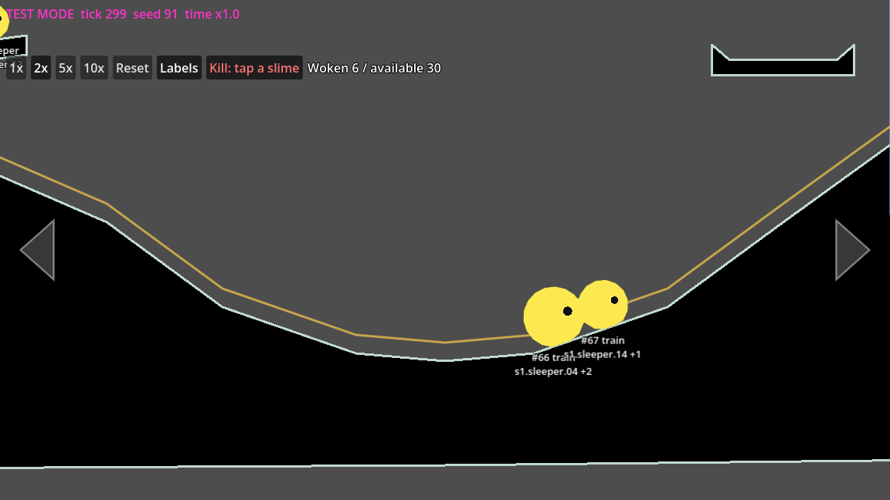

The screenshot is from a debug run with a display (`xvfb-run`, `--fixed-fps
60`, `-- --test-mode --seed=91 --fixture=bump`), with a scratch script turning
labels on and 2x at frame 3 and arming Kill at frame 150: tick 299 at frame
152. The magenta banner above is test mode's; its "time x1.0" is test mode's
`time_scale`, and the overlay's speed multiplies it.

| Control | What it does |
|---|---|
| **1x / 2x / 5x / 10x** | The simulation speed. Each frame runs that many times the ticks (the same ticks, see below) |
| **Reset** | Asks ("Reset? click again"). A second click within 2 s starts the level over and replaces its save |
| **Labels** | Draws each slime's runtime id and state under it (`#12 train`) and its stable ID on a second line (`s1.sleeper.04 +2`: its first member and how many more). Only for the slimes seen on screen (`LABEL_REACH`, 160 screen px past its edge), and nothing redrawn while off (chunk 22). They cost a lot on the phone: measure with labels off |
| **Kill** | Arms the kill tool (red, "Kill: tap a slime"). The next tap sends the slime under it to the start of the loop, as a lost slime |
| **60 fps** | The frame rate (`Engine.get_frames_per_second()`, rounded), refreshed at most every 250 ms |
| **Woken n / available m** | The counter, in base slimes, refreshed at most every 250 ms (see below) |
| **Physics a : on screen b : in range c : parked d** | The slime counts, in slimes, refreshed at most every 250 ms (see below; chunk 22d) |

The last action's result shows after the slime counts for 4 s ("Kill: #12 sent
to the start of the loop", "Reset: fresh level, save replaced") and Reset
also prints it.

**Speed and the clocks.** The game root multiplies its frame time by the
overlay's `speed` before `FixedStep`, like test mode's `time_scale` (they
multiply), and raises the hitch cap with it (`MAX_TICKS_PER_FRAME`, 2
ticks a frame since chunk 22, times the speed rounded up, so 20 at 10x;
`FixedStep.max_ticks_for`). The ticks are the very same ticks: a run at 10x has
the same state hash as at 1x after the same tick. The sessions' clock runs
at the same speed: `DebugClock` wraps the game root's `session_clock` and
adds (speed - 1) x the real time elapsed to both its wall and monotonic
readings, so at 10x a session reaches bedtime in 1 min 30 s. The offset
only grows (back at 1x the time already gained stays), so a session never
sees its clock go back. After a restart the real clock has no offset, and
the new epoch counts no time away until real time catches up (the rule is
`max(0, wall - saved wall)`). In test mode the session clock is test mode's
tick-counting `TestClock`, which already follows the speed. Autosave stays
on real time (every 15 s of wall time, whatever the speed): it guards
against losing real play, not simulated time.

**Reset.** `main.restart_fresh()` starts the level over as a first launch
does: a fresh simulation from a new random seed in normal play (sessions
open, so the next tap starts one), or from the run's seed in test mode (no
fixture, sessions open when the run has them; a test script carries on by
tick number from the new tick 0).
Then, when the game autosaves (normal play, or test mode with `autosave`),
the overlay saves at once through `SaveStore.write`: the fresh state is
written over the level's file, by the usual side file and rename, never by
deleting it. A save SaveStore has blocked (unreadable or unusable at
launch) is still never written over: the reset happens, the file stays, and
the overlay says "save not written". The 2 s window is real time.

**The counter.** "Woken" and "available" count base slimes, by the members
each slime carries (D72), so fusing and splitting don't move them; a slime
with no members (one a test spawns) counts its size, in section 1.
Available: every base slime from an accessible section. Woken: those not in
the sleeper state (train, free, in a basket, asleep at bedtime). Sections
aren't recorded per slime, so a member's section is its stable ID's prefix:
`sN.` is section N, and anything else (`start.first-slime`) is section 1.
The accessible sections are section 1 plus every section in the loop's
current segments with the open gates (`LoopData.current_segments`): a
section's entrance is the previous section's return-route gate, so opening
`s1.gate` makes section 2 accessible. The open gates are the train's
(`Train.open_gates`, kept in step by the frontier sets).

**The slime counts.** `DebugCounts.count_slimes()` counts slimes (bodies:
a fused slime counts once, whatever its size) in one pass, read from the
simulation's own state (`SlimeBodies`' calm, `Offscreen`'s parking) rather
than recomputing the margins (see "Off-screen simulation" for them). The
groups overlap (On screen and In range share most slimes), so the four
don't add up to the total:

- **Physics**: the slimes that cost physics on a tick: calm ACTIVE and not
  a sleeper. It is `SlimeBodies.crowd_count()`, the count crowd detail
  steps on. A slime in a basket and one asleep at bedtime still settling
  count; a sleeper, a resting slime and a parked one don't;
- **on screen**: its centre is in the view's visible rect
  (`Fusion.view_rect()`, the rect `Offscreen` parks around), any state,
  parked or not. A parked slime whose centre is there (the view just moved)
  counts here; the next tick unparks it;
- **in range**: not parked (`SlimeBodies.is_parked`), any state: on screen
  or within `Offscreen`'s margins, or everything when the off-screen
  simulation is off (tests, a game a test adds);
- **parked**: neither simulated nor touched, moved by `Offscreen`'s
  proxies.

`count_slimes()` also returns `resting` (calm RESTING, any state), which
only the perf log shows. Until chunk 22d the bar read "Slimes a on screen :
b simulated : c off screen", three groups that added up; it counted slimes
in a basket on screen as "on screen" and never showed what the physics
cost (see "Chunk 22d: debug counters and the largest awake cluster").

The fps, the slime counts and the woken/available counter refresh at most
every `STATS_MS` (250 real ms), counting included (`update_stats`), as the
counts loop over every slime; each label's text is assigned only when it
changes (an assignment redraws the bar even with the same text). Until
chunk 22 the counts ran every frame and only their text waited.

**Kill.** The tap is intercepted before the simulation: the game root's
`_unhandled_input` asks `DebugOverlay.intercept()` right after the parent
layer, and while Kill is armed the next press below the parent zone (and
its release) is the overlay's; a parent-zone press is never the kill
tool's. So no
tap, ripple, call or session start reaches the simulation, even with test
mode's `block_real_input` on. `DebugKill.slime_at` picks the slime whose
drawn body, grown by the tap zones' 24 px margin, holds the point (the
nearest centre if several). The move is the lost-slime move,
`Offscreen.lose(sim, id)` (public since chunk 23A, called directly): the
slime goes to the start of the loop, back on the train (`LoopStart.move`:
the first free spot from the start, see "Safety nets: stuck and stalled
slimes (chunk 23A)"), and is logged in `offscreen.lost`. Any slime can be sent, a sleeper too: it
becomes a train slime (that's what makes it useful for testing). One use,
a tap on no slime, or any other control disarms it; a click on Kill again
does too.

**Input.** The controls are Buttons with `mouse_filter` STOP and consume
their mouse clicks before the game sees them. The game root also swallows
a touch on a control (on a phone the touch comes besides the emulated
click). The bar, the counter and the labels ignore the mouse: the rest of
the screen plays as usual. The bar sits 8 px under the parent zone
(`TapDispatcher.parent_zone_height`, placed every frame from the
simulation's view), or 8 px under the parent buttons while they show
(`ParentGate.menu_bottom()`), and hides while a parent surface covers the
world (`covers_world()`), so it never eats a parent-zone tap and
the band keeps its meaning; a control over the world takes that spot's
taps, which is fine for a debug tool. The overlay is a CanvasLayer (layer
50) above the HUD, below the parent layer (60); the labels are a
world-space Node2D beside `TapFeedback`, and only read the simulation.

**The release guard.** The game root adds the overlay only when
`TestModeGuard` allows it (a debug build) and only when it is the running
main scene; a game a test adds gets one only through
`add_debug_overlay()`. It names the overlay by path only
(`DEBUG_OVERLAY_SCRIPT`), and no script outside `src/debug/` names a debug
class (a lint in `tests/unit/test_debug_overlay.gd`), so a release export
loads nothing from `src/debug/` and its preset can leave it out.

**The perf log (chunk 22).** `src/debug/perf_log.gd` (`PerfLog`), the same
way: the game root adds it by path (`add_perf_log()`), after
`TestModeGuard` allows it, when the user arguments hold
`--perf-log[=SECONDS]` (default 5), in normal play or in test mode. It
prints a `PERF_INFO` line, then a `PERF` line every window: fps, frame
times, ticks per frame, ms per tick, the rest of the frame, the slime
counts (the parked ones included), the active bodies and pairs, the
camera's section and the zoom (the fields: "Measuring on the phone"
under [Chunk 22: performance](#chunk-22-performance)).
`--max-ticks-per-frame=N`, read with it, sets the fixed step's cap for the
run. The lint above covers `PerfLog` too. Tests:
`tests/unit/test_perf_log.gd`.

## Saves and fixtures

Master spec §6.4 and D72 (`req_persistence_and_saves`,
`rule_saves_never_wiped`). The format is `SaveData`
(`src/sim/save_data.gd`, pure logic); `Simulation.to_save()` and
`Simulation.from_save(save, level_data, terrain, fallback_seed)` wrap it. A
reloaded save has the saved state hash and stays equal to the run that
never stopped, tick for tick (`tests/unit/test_save_data.gd`), when no
slime was saved in mid-air.

**The save format before the first store release** (D149). Keeping a
player's save across a save-format change, with a migration, is owed only
once the app has **shipped** (gone out in a store: the first store release;
v1 never ships). Until then a save-format change may be additive or
breaking, needs no migration and no special approval, and is recorded like
any other choice (the chunk's record, this section, the atoms). A breaking
change bumps the format number (`format` 2, 3...) so that an old save is
refused plainly rather than misread; an additive change with safe defaults
may keep it. No format migration code is kept before shipping. One switch
says whether the app has shipped: `SaveData.SHIPPED`, `false` until the
first store release, and turning it on is part of that release. From then
on every save-format change ships with its migration. A save a build can't
use is handled by that switch (see "A read" below). The fixtures are saves,
so a breaking format change converts every fixture in the same change; the
fixture and test-mode script formats themselves stay hard contracts.
Chunk 19w changed nothing in the format (still format 1).

**Mid-air on load** (chunk 19, D12, DoD 28; `MidairLanding`,
`src/sim/midair_landing.gd`, the last step of `SaveData.restore`). A slime
saved in the air (its body not supported, neither a sleeper nor in a
basket, and not parked: Offscreen places a parked slime, and it falls once
simulated again) is moved straight down onto the first surface below it: a terrain
or shut door surface facing up (a ring point `terrain_skin` off it), or the
upper side of another slime's ring. It is put down at rest (previous points
= points) and supported; it never moves up. Slimes in the air are put down
lowest first, so one above another lands on it. With no surface below it
(beyond the level's edge) it is lost (`Offscreen.lose`: to the loop start,
in the lost log). Such a reload differs from the saved state; reloading it
again is exact (`tests/unit/test_midair_load.gd`). A hand-made save's slime
without a body (every fixture's) is not supported yet, so it is put down
too, by a pixel or so from its rest height.

**Migration by level version** (chunk 19, decision C, proposed; D72;
`SaveMigration`, `src/sim/save_migration.gd`). `SaveData.problems` accepts
a save of an older version of the level and refuses a newer one (a newer
game's: set aside before shipping, kept and blocked once shipped; D149).
`SaveData.restore` migrates an older save first (a
deep copy; keyed by stable IDs): a sleeper whose stable ID the level no
longer has as a sleeper, whose spot moved (over 1 px, `SaveMigration.MOVED`)
or whose species changed, and an awake slime whose centre is no longer in
open space (inside the terrain, `TerrainSegments.is_solid`; outside
`Train.bounds_for`; in a basket, in no basket of the level) are displaced:
they stay in the save and, once the rest is restored and before the mid-air
rule, are lost the usual way (`Offscreen.lose`: to the loop start, in the
lost log), so each is lost once and the population stays whole. A level
sleeper no slime holds is added asleep at its spot (a body-less entry, the
next runtime id). Object and gate states of stable IDs gone are dropped (and
gone gates leave `train.open_gates`); new ones are left out and take their
initial state on load (`FrontierSets.start`). The header takes the level's
version. Before the first write, the game keeps the file the save was read
from as `<level id>.json.v<old version>` (`SaveStore.keep_version_copy`:
side file, read back, rename; never written over: a copy with the same bytes
is kept as it is, another file takes `.v<old>.2`, ...; never removed, not even
by the parent's delete). A copy that fails blocks the level's writes. The
same generic detection tells whether a fixture is older than its level
(`LevelFixtures.stale`). Tests: `tests/unit/test_save_migration.gd`, the
version tests of `tests/e2e/test_save_e2e.gd`.

### What a save holds

One JSON object, keys sorted, tab-indented:

| Key | What |
|---|---|
| `format` | 1. Any other format, newer or older, is refused, never read half-way (D149) |
| `level` | `{"id", "version"}`. Another id, or a newer version, is refused; an older version is migrated on load (chunk 19, below) |
| `sim` | `tick`, `seed` and `rng_state` (strings: 64-bit), `next_slime_id`. Optional |
| `slimes` | Every slime, in runtime id order (at least one): `id` (its stable ID, below), `members`, `runtime_id`, `species` (a letter), `size`, `state` (`train`, `free`, `sleeper`, `bedtime_asleep`, `in_basket`), `centre`, `velocity`, then `train` (distance, laps, slide, stall mark; a `lost` flag from before chunk 23A is ignored) or `free` (phase, since, point, route back, stream state), and `body` (points, previous points, the solver's centre, hop timer, heading, held, supported, stream state; optional `rest` and `detail`, the ring's detail level 1 to 3, absent 0, an older `"low": true` read as 2: see "Saves and hash" in the off-screen section) |
| `offscreen` | The off-screen state (chunk 15): `zoomed_out`, `crowd_level` (0 to 3, absent 0), `away`, `proxies`, `lost`. Optional |
| `train` | The open gates and the stalled log (`stalled`: `{"id", "tick", "reason"}`, chunk 23A; the key was `lost` before and is ignored now) |
| `call` | The last call (point, tick), or null |
| `objects`, `gates` | Stable ID to state (chunk 14): a switch `{"flipped", "trapdoor_shut"}`, a basket `{"phase", "weight", "since", "next_release"}`, a gate `{"open", "entrance_closed"}` (see "Frontier sets (chunk 14)") |
| `celebration_done` | `true` once the level's celebration has played; left out (false) before. Optional |
| `transient` | The view, the camera, the ripples, the last taps, the facings, the input log, the tilt (reading, neutral, flat), the fusion contact counts and the celebration's start tick and double hops still due (`frontier`: `celebration_since`, `celebration_hops` `[[slime id, hops left]]`, optional, chunk 23D). Optional |
| `session` | The session (chunk 17): `phase`, `elapsed_ms`, `anchor` and `clock` (the clock readings it counts from; see "Sessions (chunk 17)"), `sunrise_tick`. Optional: none is screensaver mode |
| `stuck_slimes` | The stuck safety net (chunk 23A): `counts` (`[lower id, higher id, checks]`) and the `stuck` log (`{"id", "other", "tick", "reason", "moved"}`). Optional: none is no count, no case |

Not saved: the fingers on the screen and input not yet consumed (a
restarted game has no finger down: a held edge button is let go), and what
each tick recomputes (hop aims, touching pairs, rest shapes).

**Exact reals.** Godot's JSON parser doesn't always read a 17-digit double
back to the same double (about one in seven), so every real goes through
`SaveData.exact()`: a plain number when it reads back the same, else
`"f64:<16 hex digits>"`, its IEEE bytes. Body points are base64 of their
coordinates as little-endian doubles. JSON reads every number as a float;
the loader turns whole numbers back into ints where the state has ints.

**Hand-made saves** (fixtures) may leave out `sim`, `runtime_id`, `body`,
`train`, `free.rng_state` and `transient`: the run's seed and tick 0, ids 1,
2, ... in list order, a rest ring at the centre, the loop's closest point,
a fresh stream, an empty view. `SaveData.readable()` cuts a save down to
that form; it keeps a running session (its last clock reading moved to tick
0, where the readable save starts) and drops one in screensaver mode. `SaveData.problems(save, level)` lists what makes a save
unusable, without pushing errors.

### Stable identity (D72)

Runtime ids change with every fusion and split; a save names slimes by the
placed base slimes they are made of (`SlimeIdentities`,
`src/sim/slime_identities.gd`). A slime's `members` are those stable IDs,
sorted; its `id` in the save is the first member.

- A placed slime has one member: the first slime `start.first-slime` (named
  by `load_level()` from the level's FirstSlime marker), a woken sleeper its
  own ID (chunk 9).
- A fusion (`Simulation.fuse(a, b)`, the hook for chunk 10) gives the union
  to the lower runtime id, the one `SlimeBodies.merge` keeps.
- A split gives the members out in sorted order: part 0 (the original id)
  the first, part k the k-th. Members beyond the part count stay with part
  0; parts beyond the member count get none (a slime a test spawned has
  none).

### Files and autosave

`SaveStore` (`src/save/save_store.gd`) keeps each level's save in
`user://saves/<level id>.json` (on Linux,
`~/.local/share/godot/app_userdata/Slime Train/saves/`), with a backup
beside it since chunk 19. A test gives it another directory. The game
(`src/main.gd`, `_resume_play`) reads it at start in normal play: a usable
save is resumed, a missing save with no backup means a fresh start (the
first slime woken).

**The files of a level save** (chunk 19, DoD 28; `L` stands for
`<level id>` in the save directory):

| File | What it is | The parent's delete |
|---|---|---|
| `L.json` | The save | removes it |
| `L.json.new` | The side file of a write: the new save before it takes the save's place | removes it |
| `L.json.bak` | The backup: the save before the last write, a whole older save | removes it |
| `L.json.bak.new` | The side file of the backup copy | removes it |
| `L.json.unreadable`, then `.unreadable.2`, `.3`... | A save that couldn't be read, set aside by a read, or (before shipping, D149) a save the level refuses, set aside with its backup; its bytes untouched; `L.json.bak.unreadable...` for a backup | leaves it (proposed: not the save) |
| `L.json.v<N>`, then `.v<N>.2`... | The file a save of level version N was read from, kept before its migration (`SaveStore.keep_version_copy`, through its side file `.v<N>.new`; "Migration by level version" above) | leaves it (never removed) |

**A write** (`SaveStore.write`, `write_file`), in three steps:

1. the save's text goes to `L.json.new`, is read back and compared;
2. if `L.json` is there and reads as a save, its bytes go to
   `L.json.bak.new`, are read back, and that file is renamed onto
   `L.json.bak` (an unreadable save is never copied onto the backup);
3. `L.json.new` is renamed onto `L.json`.

A step that fails stops the write with a message; nothing more is swapped,
so the old save and backup stay. A rename replaces a file whole and the
save is never removed first, so a kill at any point leaves `L.json` whole
(the old save or the new one) and `L.json.bak` whole (an older save); a
side file a kill leaves behind is written over by the next write. A save
the storage damaged mid-write (cut short) is caught by the next read.

**A read** (`SaveStore.read`): the save if it reads; else the backup if it
reads (`"source": "backup"`, the reason in `"error"`, which the game
prints); else a fresh start. A file that is there but can't be read (not
JSON, not a save) is **set aside** (proposed, rather than blocking the
level): renamed to its first free `.unreadable` name, its bytes untouched,
so no write lands on it, and the level is not blocked, so it saves again.
With nothing readable the game says so and starts fresh (status FRESH, the
new paths in `"set_aside"`). Only if a set-aside rename fails is the level
blocked (`SaveStore.block`, status UNREADABLE: the file left where it is,
nothing written for the session). A save that reads but that the level
refuses (`SaveData.problems`: another format, older or newer, another
level, a newer level version, a bad field) depends on `SaveData.SHIPPED`
(D149; the game root's copy, `save_shipped`, which tests set):

- **before shipping** (off, today): it is **set aside with its backup**
  (`SaveStore.set_aside_save`: each of `L.json` and `L.json.bak` that is
  there renamed to its first free `.unreadable` name, bytes untouched), the
  level starts fresh with autosave on (not blocked: the next autosave
  writes a new save), and one line on the error output says so: `Save:
  <path> can't be used (<reasons>); not shipped yet, so it is set aside as
  <set-aside paths> and the level starts fresh.` A set-aside that fails
  blocks the level, as above;
- **once shipped** (on): it is kept as it is and blocked the same way, the
  game saying why (the behaviour before D149).

A file that isn't JSON is set aside either way, as above. A save of an
older level version is migrated as it loads either way (a level change,
not a format change), its file kept first as `L.json.v<old version>`; a
copy that fails blocks the level too.

It never wipes a save (`rule_saves_never_wiped`), except on the parent's
explicit delete (`SaveStore.delete`, chunk 18); the debug-only save wipe
(chunk 19w, below) is a development aid outside that rule, as its approved
wording says:

- a save with no slimes, or with a NaN, is refused and the old file kept;
- the lints in `tests/unit/test_save_store.gd`: no code under `src/`
  removes a file except `SaveStore.delete` and the save wipe's one remove
  (`SaveWipe.wipe`, `src/debug/save_wipe.gd`, the lint's one narrow
  allowance outside the stores), and only the game root's
  `delete_level_save()` calls the store's delete; the only renames are the
  two stores' (SaveStore's side-file swaps, backup copy, set-asides and
  version copies, all in `save_store.gd`; ParentStore's side-file swaps, in
  `parent_store.gd`).

The parent's delete (settings, a second confirmation; DoD 29, "its backup
goes too") removes the save's side file, the backup's side file, the
backup and the save, in that order (a delete stopped half-way never leaves
a backup that would come back as the save), leaves the set-aside files and
version copies, and lifts the block; the game then reloads the level fresh,
keeps the running session and saves at once (D104; see "Parent gate and
settings (chunk 18)"). No update, migration or load-failure path may call
it. The parent code is not a level save: it lives in `user://parent.json`
and its backup (`ParentStore`; see "Parent gate and settings (chunk 18)",
"Code storage") and a level's delete leaves them.

Outside the game, `write_file` leaves a backup too: `tools/make_fixture`
removes the `.bak` it would leave beside a fixture (git keeps a fixture's
history), and test mode's `--save=<path>` over an existing save leaves a
`<path>.bak`.

`Autosave` (`src/save/autosave.gd`) saves every 15 s of wall time, and on
`NOTIFICATION_APPLICATION_PAUSED` (Android and iOS leaving the
foreground), `NOTIFICATION_APPLICATION_FOCUS_OUT`,
`NOTIFICATION_WM_CLOSE_REQUEST` and `NOTIFICATION_WM_GO_BACK_REQUEST`
(Android's back button), and when the game root leaves the tree
(quitting). Only the main scene gets the default store; a game a test adds
without one never writes. Test mode turns autosave off unless its run says
`"autosave": true`.

To see it: `godot --headless --path . --quit-after 300` writes
`user://saves/test.json`; run it again and the game carries on from there.

### Chunk 19w: the save wipe

D148, D149. **For automated test runs only** (`tools/android/perf.sh
--wipe-save`, a scripted desktop launch), never for manual play: by hand, a
level is started over with the parent's delete of its save (settings).

- **The flag:** `--wipe-save`, a user argument after `--` (on Android, in
  the launch intent's `slime_args`). Never on by default; per launch, on
  the command line only (no setting, no toggle that stays set, not a
  test-mode run configuration key).
- **What it wipes:** every file in `user://saves/` (each level's save, its
  `.bak`, `.new` side files, `.unreadable` set-aside files, `.v<n>` version
  copies): every level is then as on a fresh install (the first-play hint
  due, the celebration able to play again, a fresh session). **Kept:**
  `user://parent.json` and its backup (the parent code and setup), and the
  directory itself. There is no `--wipe-parent`.
- **When:** once per launch, in the main scene's `_ready`, after the stores
  are made and before the level loads and `_resume_play()` reads the save.
  Only the main scene's default directory (`save_wipe_directory`, set in
  `_ready`): a store a test gives is never wiped by it.
- **Where:** `src/debug/save_wipe.gd` (`SaveWipe`), named by path by the
  game root (`wipe_saves()`) only after `TestModeGuard.allows()`, so the
  release preset leaves it out with `src/debug/*`. It is not a `SaveStore`
  method; the store still deletes only on the parent's delete.
- **A release build** ignores the flag: nothing deleted, one line:
  `Save wipe: --wipe-save ignored, not a debug build.` (On Android a
  release build doesn't even receive `slime_args`, and the debug app is
  another package, `com.slimetrain.dev`.)
- **With a save to load, refused:** `--load=PATH`, a test script
  (`--test-script`) holding `"load"`, or (proposed) a test script that
  can't be read: nothing deleted, `Save wipe: --wipe-save refused, nothing
  deleted: <why>.` on the error output, and the debug launch quits with
  exit code 1, like a bad test-mode flag. `--fixture` is no conflict
  (fixtures are `res://` files); test mode accepts the flag and leaves it
  to the wipe.
- **The log line**, on every wipe, on the standard output (logcat's
  `godot` tag on Android): `Save wipe (--wipe-save): deleted N files from
  user://saves/; parent.json kept.` A file that can't be deleted gets an
  error line (`Save wipe: can't delete <path> (...)`) and the launch
  carries on.
- **On the desktop:** `godot --path . -- --wipe-save` (normal play), or
  with a run, `godot --headless --path . -- --test-mode --fixture=<name>
  --wipe-save` (harmless there: a fixture run doesn't read the player's
  save; it matters only if the run autosaves). This wipes the desktop's
  own `user://saves/` (on Linux,
  `~/.local/share/godot/app_userdata/Slime Train/saves/`).
- **On the phone:** `tools/android/perf.sh --free-play --wipe-save` (or
  `--fixture=none --wipe-save`); with a fixture it is refused (exit 2). The
  session's `perf.log` header records the launch line, so a wiped session
  shows in its record, and the log line is in `logcat.txt`.
  `tools/perf_slow.sh` has no option: it only runs fixtures, and its extra
  arguments already pass any flag through.
- **Save and restore checks never pass it:** the kill-and-reload and
  delete-save tests, `midair`, `old-version`, every fixture and sidecar,
  the test scripts and the end-to-end suite; a manual save and restore
  check on the phone or the desktop runs without it too. A guard test
  (`tests/unit/test_save_wipe.gd`) checks that no file under `tests/` or
  `levels/*/fixtures/` names the flag, that file apart.
- **Tests:** `tests/unit/test_save_wipe.gd` (the wipe on a scratch
  directory, no flag, the release guard, the refusals, a game started with
  the flag starting fresh, a given store never wiped, the guard test, the
  release preset's exclude filter covering the file, and `perf.sh`'s
  refusal with a fixture, run without a device); the lint in
  `tests/unit/test_save_store.gd` allows the wipe's one remove, in
  `SaveWipe.wipe` only. `perf.sh`'s on-device behaviour (`--free-play
  --wipe-save` starting fresh, the log line in `logcat.txt`, the save
  resumed as before without the flag) is checked by hand on the emulator
  or the phone.

**A save the build can't use, before shipping** (D149, built in the same
chunk): see "A read" above. Tests: `tests/unit/test_save_store.gd`
(`set_aside_save`), `tests/unit/test_save_data.gd` (an older format
refused, 0 standing for one), `tests/e2e/test_save_e2e.gd` (with the switch
off, a newer format, an older one, a bad shape and a newer level version
each set aside with its backup, the level fresh and saving again; with it
on, the same saves untouched and blocked; a file that isn't JSON and an
older level version as before) and `tests/e2e/test_debug_overlay_e2e.gd`
(its blocked save, with the switch on).

### Fixtures

A fixture is a named starting point for test mode (`"fixture": "bump"`),
in the level's `levels/<id>/fixtures/` (the test level's are below): a sidecar `<name>.fixture.json`,
`{"description", "save" (true when there is a save), "camera" (optional
[x, y]: the camera starts on its rails nearest that level point; or,
since chunk LD3, a stable ID of the level: nearest that thing)}`, and the
save `<name>.json` in the hand-made form above.

| Fixture | State |
|---|---|
| `fresh` | No save: the level as new, the first slime at its marker, every sleeper asleep at its own, the hint due |
| `bump` | Four train slimes of species C on the fusion dip's floor, left to right sizes 2 (`s1.sleeper.14`, `.15`), 2 (`.10`, `.13`), 3 (`.04`, `.07`, `.20`) and 1 (`.21`), 0.05 screen apart at x 2.95 to 3.1 (the eight C sleepers nearest the dip; their bodies gone, the other sleepers asleep), and the first slime; the camera on the dip. Both bumps happen, 2 + 2 and 3 + 1, and nothing fuses (seeds 1 to 8, 20 s, chunk 16) |
| `s1-basket-5of6` | Switch 1 flipped (its trapdoor open), basket 1 at 5 of 6: a size-3 C and a size-2 B resting in it, made of the five ledge sleepers above the switch; the first slime on the loop just before the switch, so it drops in and the basket fills, fires and opens gate 1 (no celebration: basket 3 is the last); the camera on the basket |
| `s1-optout` | Switch 1 flipped, basket 1 at 3 of 6: a size-3 C resting in it (the three C ledge sleepers; the B ones asleep), the first slime at its marker; tap the switch to opt out; the camera on the basket |
| `wind-down` | The fresh level 14:50 into a session (the wind-down on, bedtime 10 s in), on test mode's default clocks. Run it with `"sessions": true` |
| `bedtime` | The fresh level with bedtime just reached: every awake slime asleep, the edge buttons hidden, the 10-minute cooldown starting |
| `sunrise` | The fresh level at bedtime, 9:55 into the cooldown: sunrise 5 s in |
| `s2-basket-offscreen` | Gate 1 open (basket 1 fired, slide 1 shut), switch 2 flipped and basket 2 at 14 of 15 (a size-3 A, B, C and D and a size-2 D resting in it, made of section 2 sleepers); the first slime on the loop just before switch 2; the camera on switch 2, 1.5 screens from the basket: the basket fills off screen, waits, and fires once in view, opening gate 2 (DoD 10); no celebration: it waits for basket 3 |
| `s2-cave-return` | Gate 1 open; 3 free size-1 slimes (A, B, C, the cave pocket's sleepers) on the cave tunnel's first shelf, down its route back; the camera on the start basin: off screen they follow the route back, are left alone at 10 s and rejoin the train (DoD 5) |
| `lost` | The fresh level with one free size-1 D (a parade sleeper) on the parade's first ledge beyond closed gate 1, with no route back or loop near: left alone at 10 s, lost at 70 s and moved to the start of the loop (DoD 5) |
| `gate1-open` | Gate 1 open as after basket 1 fired (switch 1 inert, slide 1 shut): the loop runs into section 2. 20 size-1 train slimes (the first slime and `s1.sleeper.01` to `.19`) spread along the outgoing loop from 60 px past the split zone to 400 px before its end; the other 180 asleep; the camera at section 2's start (8.3 S) |
| `gate2-open` | Gates 1 and 2 open as after baskets 1 and 2 fired (slides 1 and 2 shut): the loop runs through section 3 to slide 3. The same 20 train slimes, spread along the whole outgoing loop; the camera at section 3's start (13.0 S). Added in chunk 16 for the whole loop (DoD 1) |
| `stress-still` | Gates 1 and 2 open, all 200 base slimes woken, none left asleep: 60 size-1 slimes in basket 3 (switch 3 flipped, the basket full, waiting to be in view: out of it, they park), and 140 piled at the bottom of section 3's bowl, asleep at bedtime (a session at bedtime: outside a basket, a pile rests only asleep); the camera on the bowl (its framing zone zooms to 0.5, so the rings are zoomed-out). The pile comes to rest about 410 ticks (about 7 s) after loading since chunk 19 (670 before) and stays resting (the worst still case on one screen; see below) |
| `stress-moving` | Gates 1 and 2 open, all 200 base slimes as size-1 train slimes spread through section 3's bowl from its bottom up (the floor, the slopes, the shelves; x 13.5 to 15.33 S, inside the view), each following the loop from its nearest point; the camera on the bowl. The worst moving case, an abuse test: no crash, no freeze, at least 15 fps (D153) |
| `stress-dense` | Gates 1 and 2 open, all 200 base slimes as size-1 train slimes (each its sleeper's species), not at bedtime (no session), switch 3 and basket 3 untouched: laid along the loop line, not stacked, 9 per 300 px stretch of loop (a slime's stretch: its loop distance / 300, rounded down) and 12 in stretches 55 and 56, the two at the bottom of section 3's bowl; 70 in the bowl, 105 in section 3, 95 back through gate 2 in section 2, none past switch 3; the camera on the bowl. The dense moving case, target at least 30 fps (chunk 22m; D153 as amended by D154; see "Chunk 22m: stress-dense") |
| `s3-basket-59of60` | Gates 1 and 2 open as after baskets 1 and 2 fired, all 200 base slimes woken, not at bedtime (no session): switch 3 flipped (its trapdoor open), basket 3 at 59 of 60 (59 size-1 slimes in it, section 3's last 59 sleepers, laid out as `stress-still`'s) and the other 141 as size-1 train slimes through section 3's bowl (as `stress-moving`'s); the camera on basket 3's framing zone (18288, -150; zoom 0.8). Played on, the basket fills (about 9 s), fires in view and the celebration plays (chunk 22, D128 24.1) |
| `midair` | The fresh level with four size-1 train slimes saved in mid-air over section 1's ground (`s1.sleeper.01` to `.04`): 4 px above the ground at x 1525, 150 px above it at x 1825, 30 px above it at x 2125, and one 80 px above that one; the camera on them. A fixture keeps only centres, so loaded (test mode or normal play) each is put straight down on what is below it, at rest, none lost (D12, DoD 28; chunk 19) |
| `old-version` | A save of the test level's **version 1** (its header says so): the fresh level, but the sleeper nearest x 1525 on section 1's ground (`s1.sleeper.03`, on its ledge at (1428, -188) in version 2) sleeps there, at (1525, 0). Loaded, it is migrated: that slime is displaced and lost (to the loop start, in the lost log), all 200 kept; in normal play the file is kept as `test.json.v1` and the next save is at version 2 (D72; chunk 19). Older than the level on purpose: the stale-fixture check exempts it by name |

To make or remake them: `godot --headless -s res://tools/make_fixture.gd`
(all) or `... -- bump` (one). `gate1-open`, `gate2-open`, `stress-still`
and `stress-moving` came with the whole level (chunk 16); `gate1-open` and
`gate2-open` start the DoD 1 sessions (`tests/e2e/test_level_dod1_e2e.gd`).
`midair` and `old-version` came with chunk 19 (persistence;
`tests/e2e/test_persistence_e2e.gd`, with the DoD 28 kill-during-a-write
tests), their builders in `tools/make_fixture/persistence_fixtures.gd`.
`s3-basket-59of60` came with chunk 22, for the section 3 endgame; its
builder shares `_into_basket_3` with `stress-still`'s (moved unchanged;
`stress-still` was not regenerated). `stress-dense` came with chunk 22m,
its placement in `tools/make_fixture/stress_fixtures.gd`.
**The test level is at version 2 since chunk 19** (`level_version = 2` on
its root; nothing else changed): so that `old-version` is a genuine save
of an older version, migrated as a player's would be. Every other fixture
was regenerated then, its header's version the only change. Each fixture is a builder function in the
tool that sets up a simulation on the test level and saves it; the tool
looks the stable IDs up in the level scene and checks the save loads back.
To add one, add an entry to `FIXTURES` and its builder. Fixtures follow
the level: when it changes, run the tool again. Since chunk LD1 it takes
`--level=<id>` (another level gets the generic `fresh` and `gate<k>-open`)
and `--list` (see [level-tooling.md](level-tooling.md)).

`stress-still` is the slow one (about a minute): a fixture keeps only each
slime's centre, so a loaded pile starts from round bodies and settles again,
and size-1 slimes don't stack (a pyramid of them flattens into a row), so a
140-slime pile spreads slowly before it rests. The builder settles it at
the zoomed-out detail the fixture's camera shows until every slime rests
(at most 2 minutes, else it fails), then reloads it from its save and
settles it again 6 times, and keeps the state whose reload rests soonest
(it must within 12.5 s; about 410 ticks since chunk 19, 670 before: a
load now puts the fixture's body-less slimes down, see "Mid-air on
load"). Before chunk 16d's terrain
corner fix it rested at 490 with 4 rounds and a 10 s bar; with the fix the
reloads rest in 670 to 910 ticks (4 rounds gave 744 at best), so the rounds
went to 6 and the bar to 12.5 s, under the 15 s the load test allows. `test_fixtures_e2e.gd` checks that
the loaded pile rests.

## Level-design toolkit (chunk LD1)

Build plan chunk LD (D123), part 1: the tools. Technical: no ATD steps.
The design note, every tool's usage and the choices made are in
[level-tooling.md](level-tooling.md); the tutorial for level designers and
the project skills built on these tools come in part 2
(`docs/level-design/`, `.claude/skills/`).

- **Levels by ID:** `LevelCatalog` (`src/level_catalog.gd`) finds
  `levels/<id>/level.tscn` and `levels/<id>/fixtures/` by convention. Test
  mode takes `"level"` / `--level=<id>` and `"at"` / `--at=` (see "Test
  mode"); a normal debug run still loads the test level, and the player
  never chooses a level.
- **The level-rules checker:** `tools/check_level.gd -- --level=<id>`,
  rules 1 to 22, PASS / FAIL / MANUAL / N/A, on the library
  `tools/level_check/`. The level-rule tests of the test level call it. It
  found one break of rule 22 on the test level (`Dip2Hollow`, section 2),
  reported in [level-tooling.md](level-tooling.md), fixed in chunk R22.
- **The scaffolder:** `tools/new_level.gd -- --id=<id> [--sections=N]`
  writes a skeleton level that passes the checker, its `fresh` fixture and
  its test script `tests/e2e/levels/test_level_<id>.gd`.
- **Helpers:** fixtures for any level (`tools/make_fixture.gd --
  --level=<id>`), a level report (`tools/level_report.gd`), the level
  builder (`tools/level_builder/`, which the test level's generator now
  uses) and the `Decoration` component (O96's proposed default).
- **Species F** is now accepted by the `Sleeper` and `FirstSlime`
  components (v1's level has 6 species; the test level places A to E).

Tests: `tests/unit/test_level_catalog.gd`, `test_decoration.gd`,
`test_level_builder.gd`, `test_test_mode.gd`; `tests/e2e/test_level_selection_e2e.gd`,
`test_level_checker.gd`, `test_new_level_e2e.gd`, `test_level_tools_e2e.gd`.
The e2e tests that need a second level create a throwaway one
(`levels/zz-*`) and remove it, crashed runs' leftovers included.

## Level-design tutorial and skills (chunk LD2)

Build plan chunk LD, part 2: docs and skills only, no code.

- **The tutorial:** [`docs/level-design/`](../level-design/README.md), one
  task per page for a level designer: concepts, scaffolding, editing in the
  editor (and editing `level.tscn` as text), adding a section, the
  components and the rules each must meet, exploration branches and routes
  back, population, decoration, fixtures and test mode, reading the
  checker, the level report, and a done checklist. Every command in it was
  run on a throwaway level (`zz-tutorial`, removed); its two screenshots
  are in `docs/level-design/img/`.
- **The project skills** (`.claude/skills/`, tracked): `new-level`
  (scaffold, run the level's test, the checker and the report),
  `level-content` (add a section, place or configure an existing
  component, add a decoration, then check), `level-review` (every rule of
  `specs/level-design.md` with the checker's result, FAILs to fix, MANUAL
  items as a checklist). `level-review/scripts/rules_table.py` reads the
  rules from the spec at run time and merges the checker's `--json`.
- **Gotchas found while writing it** (in the pages): after a pull that adds
  classes, the headless tools fail to parse until `godot --headless
  --import`; `--json` output follows Godot's banner (keep `tail -n 1`);
  opening the editor drops `window/handheld/orientation=0` from
  `project.godot`; a fixture's save goes stale when the level changes.
  Chunk LD3 (below) fixes all four.

## Level-design toolkit: the tutorial's gaps (chunk LD3)

Build plan chunk LD, part 3: the gaps LD2 found by running every command.
Details in [level-tooling.md](level-tooling.md).

- **The skeleton can be finished by play.** The first skeleton's sleepers
  sat on plates 174 to 186 px over the loop, out of a called base slime's
  reach (about 133 px), and section 1 opened with A and B, which can't
  fuse: basket 1 (quota 4) couldn't be filled, yet the checker passed it.
  Each section now has a dip in the loop with a hollow on each rim (the
  test level's `DipHollow`), two sleepers in each, reached from the rim;
  sections are 3.7 screens (were 3.5). The checker: 21 PASS, rule 19
  MANUAL (rule 5 now finds the dips).
- **The check that would have caught it:** `LevelProgress`
  (`tools/level_check/level_progress.gd`), a static estimate: the sleepers
  a called slime reaches from the loop within a hop (sideways and up, by
  size), the sizes same-species slimes can fuse to, and each basket's quota
  against what can be awake by then. It is a **warning** under rule 12
  (`warn:` lines; `warnings` in the JSON; the status stays), and the level
  report's `== progress ==` section. The scaffolded level's own test now
  **plays section 1 to its basket full** with scripted calls. On the test
  level it warns for every section: section 1 may not progress (only A, B
  and C are within a base slime's hop, and three species can't fuse;
  probes agree, see level-tooling.md), and sections 2 and 3 follow from
  it.
- **`tools/level.sh <tool>`** (`check`, `report`, `new`, `fixture`,
  `bench`; `rest` since chunk 22): imports first (the stale class cache), starts Godot with
  `--no-header` (`--json` is pure JSON on stdout). The docs, the skills and
  `rules_table.py` (no more `tail -n 1`) use it.
- **`project.godot`** no longer holds `window/handheld/orientation=0`: it
  is Godot's default (landscape, D78) and nothing sets it otherwise (the
  Android presets take it from the project), so the editor has nothing to
  drop.
- **Stale fixtures are detected**, from the saves themselves
  (`LevelFixtures.stale`): a slime of the level missing from a save, one
  the level no longer has, a sleeper moved or of another species, an
  object with no state. The level's generated test and
  `test_fixtures_e2e.gd` fail with "fixture X is older than the level:
  rerun tools/level.sh fixture --level=<id> X". No format change; every
  committed fixture passes as it is.
- **`tools/level.sh bench --level=<id>`** (`bench_level.gd`, via
  `LevelCatalog`): the level as new and each fixture with a save
  (`--fixture=` to pick); the test level's cases are unchanged.
- **Small:** the level report's header names the first slime's species;
  a fixture sidecar's `camera` may be a stable ID (`Level.point_of`, shared
  with test mode's `"at"`).

Tests: `tests/e2e/test_level_progress.gd` (new), `test_new_level_e2e.gd`,
`test_level_tools_e2e.gd`, `test_fixtures_e2e.gd`; the template
`tools/new_level/test_level.gd.template` (six tests now).

## Android export (debug)

`export_presets.cfg` holds three Android presets (no credentials in it).
All are landscape (the project's `display/window/handheld/orientation`, 0),
minimum SDK 24 (Godot's default), sticky immersive (`screen/immersive_mode`),
and need `rendering/textures/vram_compression/import_etc2_astc`, which
`project.godot` enables. Building, signing and installing them: "How to
build, install and run (chunk 20)" under "Chunk 20: Android".

| Preset | Package, version | Build | ABIs | Edge to edge | Leaves out | Output |
|---|---|---|---|---|---|---|
| `Android debug` | `com.slimetrain.dev`, 0.1-dev | Gradle, with the SlimePlatform plugin | arm64-v8a (phone), x86_64 (emulator) | yes | `spikes/*` | `build/slime-train-debug.apk` |
| `Android release` | `com.slimetrain`, 0.1 | Gradle, with the SlimePlatform plugin | arm64-v8a | yes | `src/test_mode/*`, `src/debug/*`, `tests/*`, `addons/gut/*`, `addons/slime_platform/*`, `levels/test/*`, `spikes/*`, `tools/*` | `build/slime-train-release.apk` |
| `Android spike: soft slimes` | `com.slimetrain.spike`, 0.1-spike | Godot's prebuilt template, no Gradle, no plugin | arm64-v8a | no | nothing | `build/spike-debug.apk` |

- **The release APK has no level yet:** `levels/test/` is left out and no
  real level exists, so it opens on an empty world (see "Choices proposed
  for spec-writer (chunk 20)").
- **The spike's feature tag.** The official Android templates are built
  without path overrides, so a scene given on the command line
  (`command_line/extra_args`) aborts the engine. The spike preset uses a
  **feature tag** instead: `src/main.gd` checks
  `OS.has_feature("spike_soft_slimes")` first thing and changes to
  `res://spikes/soft-slimes/spike.tscn`. Options after `--` in
  `command_line/extra_args` do reach the spike (for example
  `-- --draw-only`); intent extras from `adb shell am start` are stripped for
  an exported activity, so they don't. `tools/android/export.sh` doesn't
  build it: `godot --headless --path . --export-debug "Android spike: soft
  slimes" build/spike-debug.apk`.
- On the phone, the spike runs its whole bench matrix and then a 10-minute
  soak, prints one `RESULT` line per case and quits (see
  `docs/dev/spike-soft-slimes.md`).

## Chunk 20: Android

### How to build, install and run (chunk 20)

**Machine prerequisites** (checked on Debian 13):

| What | Where | Notes |
|---|---|---|
| Godot 4.7.2 and its export templates | `godot` on the `PATH` (or `GODOT=`) | the Android build template comes from the export templates |
| Android SDK | `~/Android/Sdk` (`ANDROID_HOME`) | `sdkmanager "platforms;android-36" "build-tools;36.1.0" "ndk;29.0.14206865" "platform-tools" "emulator"` |
| JDK 21 | `/usr/lib/jvm/java-21-openjdk-amd64` (`JAVA_HOME_21`) | Gradle 8.11 (Godot's build template) and 8.14 (the plugin) can't run on JDK 25, Debian 13's default `java` |

The Godot editor settings (`~/.config/godot/editor_settings-4.7.tres`) give
the Gradle export its JDK, SDK and debug keystore:

```
export/android/android_sdk_path = "/home/<you>/Android/Sdk"
export/android/java_sdk_path = "/usr/lib/jvm/java-21-openjdk-amd64"
export/android/debug_keystore = "/home/<you>/.local/share/godot/keystores/debug.keystore"
export/android/debug_keystore_pass = "android"
```

The debug key's user defaults to `androiddebugkey`. Create the debug
keystore once if it is missing:

```sh
/usr/lib/jvm/java-21-openjdk-amd64/bin/keytool -genkeypair \
  -keystore ~/.local/share/godot/keystores/debug.keystore \
  -storepass android -alias androiddebugkey -keypass android -keyalg RSA \
  -keysize 2048 -validity 10000 -dname "CN=Android Debug,O=Android,C=US"
```

**Build and export:**

```sh
tools/android/build_plugin.sh     # the plugin's AARs into addons/slime_platform/bin/
tools/android/export.sh debug     # build/slime-train-debug.apk
tools/android/export.sh release   # build/slime-train-release.apk (release keystore below)
```

- `export.sh` rebuilds the plugin first (a stale AAR can't ship), installs
  Godot's Android build template into `res://android/build/` when it is
  missing (`--install-android-build-template`; `/android/` is gitignored),
  exports headless (`--export-debug` / `--export-release`) and stops the
  Gradle daemons (`KEEP_GRADLE_DAEMON=1` keeps them for faster repeats).
  After a Godot upgrade, delete `android/` so the matching template is
  installed.
- A headless export restarts the adb server, which kills a running
  `adb logcat`: start the capture after exporting.

**Install and run.** On the emulator: `tools/android/check_emulator.sh boot`,
`install` (exports first; `--no-build` reuses the APK), `launch` (see
"Checking on the emulator (chunk 20)"). On the reference phone (USB
debugging on; always pass `-s`, since `adb` refuses to choose when the
emulator runs too):

```sh
adb -s RFCNA0WV2AR install -r build/slime-train-debug.apk
adb -s RFCNA0WV2AR shell am start -n com.slimetrain.dev/com.godot.game.GodotAppLauncher
adb -s RFCNA0WV2AR logcat -v time -s godot:*    # Godot's print() goes to the tag godot
```

The launcher activity is `com.godot.game.GodotAppLauncher`: starting
`GodotApp` directly is refused (not exported). The release build is
`com.slimetrain`, so it installs beside the debug one.
A debug build takes extra user arguments at launch through the intent's
`slime_args` extra (`--esa slime_args --test-mode,--perf-log=5`, chunk 22;
see "Measuring on the phone").

**Release keystore.** `export.sh release` refuses to start without
`GODOT_ANDROID_KEYSTORE_RELEASE_PATH`, `GODOT_ANDROID_KEYSTORE_RELEASE_USER`
(the key's alias) and `GODOT_ANDROID_KEYSTORE_RELEASE_PASSWORD`. Godot takes
one password for the store and the key, so they must be the same; PKCS12,
keytool's default format, does that by itself. Create it once, outside the
repository, with JDK 21's keytool (it asks for the password):

```sh
/usr/lib/jvm/java-21-openjdk-amd64/bin/keytool -genkeypair \
  -keystore ~/keys/slime-train-release.keystore -alias slimetrain \
  -keyalg RSA -keysize 2048 -validity 10000 -dname "CN=Slime Train"
export GODOT_ANDROID_KEYSTORE_RELEASE_PATH=~/keys/slime-train-release.keystore
export GODOT_ANDROID_KEYSTORE_RELEASE_USER=slimetrain
read -rs GODOT_ANDROID_KEYSTORE_RELEASE_PASSWORD && export GODOT_ANDROID_KEYSTORE_RELEASE_PASSWORD
tools/android/export.sh release
```

Never commit a keystore or its password. Keep a backup: an update signed
with another key doesn't install over the app, and uninstalling it erases
the saves.

**The plugin (SlimePlatform).** A Godot v2 Android plugin, Java only (no
Kotlin, so nothing clashes with the build template's Kotlin):

- **Where:** `native/android_plugin/`, a Gradle project (wrapper 8.14.3,
  Android Gradle plugin 8.13.2, compile SDK 36, min SDK 24), compiled against
  `org.godotengine:godot:4.7.2.stable` from Maven Central (`compileOnly`: the
  app provides it). The class is
  `plugin/src/main/java/com/slimetrain/platform/SlimePlatformPlugin.java`;
  its manifest (`plugin/src/main/AndroidManifest.xml`) holds the app's one
  permission, `USE_BIOMETRIC`, and the v2 registration
  `org.godotengine.plugin.v2.SlimePlatform`, which names the engine
  singleton.
- **API** (`@UsedByGodot`): `startPinning()`, `stopPinning()`,
  `isPinned()`, `isDeviceSecure()`, `confirmCredential(title, subtitle)`
  then the signal `credential_finished(ok)` exactly once,
  `setGestureExclusion(int[])` (flattened `[x, y, w, h, ...]`, window
  pixels, re-applied on every layout change), `getPhysicalDpi()`,
  `moveToBackground()`. The game reaches them only through `PhonePlatform`
  (see "Platform wrapper (chunk 20)").
- **Into the APK:** `build_plugin.sh` copies the AARs to
  `addons/slime_platform/bin/{debug,release}/SlimePlatform-{debug,release}.aar`
  (gitignored). The editor plugin `addons/slime_platform/` (enabled in
  `project.godot`, headless exports included) registers an export plugin
  whose `_get_android_libraries()` hands the Gradle build the AAR for the
  build type; the manifest merge brings `USE_BIOMETRIC`. Gradle builds only:
  the spike preset has no plugin, so there `PhonePlatform` is the desktop
  stub.
- **Rebuilding:** after any Java change run `tools/android/build_plugin.sh`
  (`export.sh` always does); it stops its Gradle daemon unless
  `KEEP_GRADLE_DAEMON=1`.

### Platform wrapper (chunk 20)

`src/platform/phone_platform.gd` (`PhonePlatform`) is the game's one door to
the phone. `PhonePlatform.for_this_build()` wraps the Android plugin's
`SlimePlatform` singleton when the build has it, and is otherwise the
**desktop stub** (the same class with no singleton): every call does
nothing, `is_pinned()` and `is_device_secure()` are false,
`confirm_credential()` answers `credential_finished(false)` on the next idle
frame, and `safe_area()` is the window's rect.

| Call | Phone (plugin) |
|---|---|
| `request_pinning()`, `stop_pinning()`, `is_pinned()` | `startPinning()`, `stopPinning()`, `isPinned()` |
| `is_device_secure()` | `isDeviceSecure()` |
| `confirm_credential(title, subtitle)` then `credential_finished(ok)` | `confirmCredential()`, its `credential_finished` signal passed on |
| `set_back_gesture_exclusion(rects: Array[Rect2i])` (window pixels) | `setGestureExclusion()`, flattened `[x, y, w, h, ...]` |
| `move_to_background()` | `moveToBackground()` |
| `safe_area()` | `DisplayServer.get_display_safe_area()` |
| `physical_dpi()`, `screen_dpi()` (see "Millimetres on the phone (chunk 20)") | `getPhysicalDpi()`, checked against `DisplayServer.screen_get_dpi()` |

`src/main.gd` owns it as `platform`. Tests replace it before the game enters
the tree (like `session_clock` and `quit_app`) with an inline
`class FakePlatform extends PhonePlatform` that records the calls (see
`tests/e2e/test_screen_pinning_e2e.gd`).

**Launch arguments (chunk 22).** Godot 4.6 and later strip their own
`command_line_params` extra from an intent to an exported activity, and
`adb` can't start the non-exported `GodotApp`, so the plugin overrides
`GodotPlugin.getCommandLineParams()`: in a debuggable build only
(`ApplicationInfo.FLAG_DEBUGGABLE`) it reads the launch intent's
string-array extra `slime_args` and appends it to Godot's command line,
after a `--` unless the line has one, so the game reads it with
`OS.get_cmdline_user_args()`. A release build returns nothing, whatever the
intent holds. `tools/android/perf.sh` launches this way.

`src/platform/screen_pinning.gd` (`ScreenPinning`, a child of the game root)
does the rest:

- **Pinning timing.** At each launch, in the game root's `_ready()`: a later
  launch (a parent code exists, a locked `parent.json` included) asks at
  once, before the world takes a tap; a first launch asks right after setup
  finishes (`ParentGate.setup_finished`, emitted by `ParentSetup._finish()`),
  so an interrupted setup, which starts over, asks only once it is finished.
  Coming back from the background never asks. A game with no parent layer
  (no `ParentStore`, tests only) asks nothing, since nothing could leave the
  pinning (proposed). Test-mode runs ask through the platform like normal
  play (a no-op on the desktop) (proposed).
- **Leave.** `ParentGate.act(LEAVE)` calls `platform.stop_pinning()`, then
  the game's `quit_app`.
- **Back.** `project.godot` sets `application/config/quit_on_go_back=false`,
  so Back never quits. On `NOTIFICATION_WM_GO_BACK_REQUEST` the autosave
  saves (as before); while the screen is pinned nothing else happens, and
  when it isn't (the parent declined or unpinned) `move_to_background()`
  sends the app to the background, as Android normally does: the session
  keeps counting and reopening resumes.
- **Exclusion rects.** `ScreenPinning.edge_strip_exclusions(view_size,
  to_window, window_size)` turns the edge strips (`EDGE_STRIP_SHARE` of the
  viewport's width) into window pixels through the viewport's final
  transform (the `canvas_items` + `expand` stretch: a scale, no offset) and
  makes them full-height bands against the window's edges, rounded outward.
  Full height, not from the parent zone down like the strips' tap zone,
  because the parent zone is a touch area too (proposed). They are handed
  over at start and on every `size_changed` of the viewport. Android honours
  more than 200 dp of exclusion per edge only while the navigation bar is
  stickily hidden, so the game needs sticky immersive mode.

`project.godot` also sets `display/window/energy_saving/keep_screen_on=false`
(Godot's default is on): the phone's usual screen timeout applies in
screensaver mode and at bedtime, and `SessionScreen` keeps the screen on
during a session and the wind-down only. `input_devices/sensors/enable_accelerometer=true`
is on for the tilt.

### Tilt from the sensor (chunk 20)

`src/platform/tilt_sensor.gd` (`TiltSensor`, pure static functions) turns
`Input.get_accelerometer()` into a tilt reading; `src/platform/tilt_feed.gd`
(`TiltFeed`, the game root's `tilt_feed`) hands it to the simulation.

- **Axes.** Godot 4.7.2 on Android (`GodotInputHandler.onSensorChanged`,
  checked in the export template's bytecode) rotates the sensor's axes to the
  display's rotation, then passes `GodotLib.accelerometer(-x, -y, -z)`: the
  vector is in screen axes (x to the screen's right, y to its top, z out of
  the screen), m/s², and at rest it points **down, along gravity**, not up
  like Android's own reading. Held upright in landscape it reads
  `(0, -9.81, 0)`; flat, screen up, `(0, 0, -9.81)`.
- **Sign.** `degrees = atan2(x, -y)`: the angle of gravity in the screen's
  plane from the screen's down, positive when the phone's right edge dips
  (gravity leans toward screen-right, x > 0), as `Tilt` wants. How far the
  screen leans back doesn't change it.
- **Flat.** The phone is flat when gravity's part in the screen's plane,
  `sqrt(x² + y²)`, is under `sin(FLAT_DEGREES)` of its length: the screen
  within 20° of horizontal, face up or down (proposed; `specs/tuning.md` has
  no value). A reading shorter than `MIN_MAGNITUDE` (1 m/s²: no sensor, free
  fall) is flat too (proposed). A flat reading goes with 0°.
- **Feeding.** In normal play only, `step_simulation()` calls
  `tilt_feed.feed(simulation)` before every tick, and it pushes
  `Simulation.tilt(degrees, flat)` when the reading is new: the first for a
  simulation, flat or not changed, or the angle moved by `CHANGE_DEGREES`
  (1°, proposed) or more. Every input is logged (`input_log`, 64 events), so
  a steady phone must not push every tick. Test mode never reads the sensor:
  its script's `tilt` steps stay its only tilt and runs stay repeatable.
  `TiltFeed.sensor` is a Callable (default `Input.get_accelerometer`); tests
  put a fake first (`tests/e2e/test_tilt_sensor_e2e.gd`).
- **Desktop.** A reading of exactly `Vector3.ZERO` (desktop, or a phone
  before its first sensor event) pushes nothing, so desktop play is as before
  (proposed).
- **Neutral.** The reading is pushed before the tick, so a resumed session
  (`Session.reopened()`, taken in the next tick's `advance`) takes the latest
  reading as neutral. A tap that starts a session is queued before that
  tick's reading, so the session's neutral is the reading pushed before: at
  most `CHANGE_DEGREES` and one tick off, far inside the 10° dead zone.
- **Idle camera.** A tilt input never counts as a touch: it doesn't restart
  the idle clock (`Camera.watch()`).
- **Orientation.** The game stays in Godot's default fixed landscape
  (`display/window/handheld/orientation` 0), not sensor landscape (proposed;
  the spec is silent): turning the phone 180° never flips the axes under the
  player.
- **Rough check on the emulator.** `adb -s emulator-5554 emu sensor set
  acceleration x:y:z` sets the raw sensor in the device's natural (portrait)
  axes, pointing up. With the game in landscape (display rotation 90°), Godot
  reads `(y, -x, -z)`: `9.81:0:0` is upright (0°), `8.5:4.9:0` the right edge
  dipped 30° (+30°), `8.5:-4.9:0` the left edge (-30°), `0:0:9.81` flat. If
  the emulator shows the landscape the other way round, x and y change sign.
  The feel needs a real phone.
- **Tests.** `tests/unit/test_tilt_sensor.gd` (the angle and its sign, flat,
  no sensor, the feed's pushes); `tests/e2e/test_tilt_sensor_e2e.gd` (normal
  play feeds free slimes only, a steady phone is one input, the desktop
  pushes nothing, test mode ignores the sensor, neutral at a session's start
  and on resume, the idle clock runs on).

### Forgot the code? (chunk 20)

Master spec §5.8 "Forgotten code", O73. "Forgot the code?" on the code
prompt (`ParentCodePrompt.forgot_code()`) asks the game's `platform`:

- **No screen lock** (`is_device_secure()` false, the desktop stub
  included): the prompt's note explains that clearing the app's data in
  Android settings is the only way and that it erases all progress
  (`forgot_no_lock`). Nothing else happens: no try counted, the store
  untouched, the entry kept. The note takes the left column above the
  button, in place of the header, title, slots and wait message, until the
  next key (proposed; the column is too narrow for it in one row).
- **A screen lock:** `confirm_credential(title, subtitle)` with
  `forgot_confirm_title` / `forgot_confirm_subtitle` ("Confirm it's you" /
  "Use your phone's screen lock to set a new parent code", proposed). While
  Android's prompt is pending (`awaiting_credential`) the code prompt's 15 s
  idle stops, and the app losing the focus or pausing changes nothing (the
  gate and the prompt don't react to those notifications; only setup
  does), so the pending action is kept. A second tap does nothing.
- **`credential_finished(false)`** (cancelled or failed): the prompt as it
  was (entry, tries, wait), no try counted, the 15 s from the answer.
- **`credential_finished(true)`:** the gate's new `NEW_CODE` state, the
  new-code screen (`src/parent/parent_new_code.gd`, `ParentNewCode`): full
  screen, a heading (`forgot_new_code_title`) and `ParentChangeCode` (the
  new code typed twice, as at setup and in settings). A match calls
  `ParentStore.set_code()` (salted hash only; tries and wait cleared; a
  locked store unlocked, `parent.json` and `parent.json.bak` rewritten) and
  returns to the code prompt for the pending action, with the note "The code
  is changed. Enter the new code to go on." (`forgot_code_changed`,
  proposed): passing the screen lock gives no parent authority. Back, or
  30 s with no press (settings' rule, no warning line; proposed), returns to
  the code prompt with nothing changed.
- An answer that comes once the prompt has closed or been reopened is
  dropped (proposed). It works during the 30 s wait and on a locked store.
- No parent-facing text for the locked state (the spec doesn't settle it).

Tests: `tests/e2e/test_forgot_code_e2e.gd` (a `FakePlatform` with
`secure` and a recorded `confirm_credential()`; the test emits
`credential_finished`), and the desktop case in `test_parent_prompt_e2e`.

### Safe area (chunk 20)

D112: the world is drawn edge to edge (the Android export's
`screen/edge_to_edge`, sticky immersive), the controls inside the display's
safe area, clear of the punch-hole camera (on a short edge: left or right in
landscape) and the rounded corners.

- **Where it comes from:** `SafeArea` (`src/platform/safe_area.gd`, a child
  of the game root) reads `platform.safe_area()` (screen pixels;
  `DisplayServer.get_display_safe_area()` on the phone, the window on the
  desktop) and maps it through the stretch (`get_final_transform()`,
  viewport to window pixels) with the pure `SafeArea.in_viewport()`, clipped
  to the viewport. A safe area with no part on the window (headless runs
  report none) is the whole viewport. It reads it at start, on every
  viewport `size_changed` and on `NOTIFICATION_APPLICATION_RESUMED`
  (proposed: the project is fixed landscape, so the cut-out moves only with
  a resize). `sync_view()` hands the insets to the view
  (`ScreenView.set_safe_insets()`); `ScreenView.safe_rect()` is the safe area
  in viewport pixels, kept as insets so it follows test mode's
  `screen_size`. Not in `dump()` nor in saves, like `px_per_mm`.
- **What moves** (`ParentLayout`): the parent buttons' row hangs from the
  safe area's top-right corner (`EDGE_MM` from it); the code prompt's panel
  is two thirds of the safe area's width, centred in it below the parent
  zone (proposed: two thirds of the safe width, not of the screen's);
  settings, setup and the new-code screen lay their content out in
  `ParentLayout.surface_rect()` (the safe area, with their usual margins
  inside it) while their background, like the prompt's scrim, fills the
  whole screen.
- **What stays on the screen's edges** (proposed, as the atom
  `req_controls_tap_zones` measures them on the screen): the parent zone (7 mm
  band, full width, over a cut-out too), the edge strips (a tenth of the
  screen's width, `TapDispatcher.edge_button_rect()`) and their arrows
  (`EdgeButtons`, in the middle of each strip; a punch hole at mid-height may
  overlap part of an arrow), and the back gesture's exclusion.
- **Desktop:** the safe area is the window, so nothing moves.

Tests: `tests/unit/test_safe_area.gd` (the mapping on the reference phone's
2400 x 1080 window with a cut-out on the left and on the right, the view's
insets), `tests/e2e/test_safe_area_e2e.gd` (the root window resized to
2400 x 1080, a `FakePlatform` with a 100 px cut-out on either side: every
parent button, prompt, settings, setup and new-code target inside the safe
area with the 9 x 9 mm / 2 mm rules, the backgrounds full screen, the
parent zone and the edge strips on the edges, a resize read again).

### Millimetres on the phone (chunk 20)

The parent's targets are sized in millimetres (keys and buttons at least
9 x 9 mm, 2 mm apart: `req_parent_gate_and_access`, D109), converted at the
screen's density (`ScreenView.px_per_mm`, from `main.screen_px_per_mm()`).

- **Physical, not logical, dpi.** Godot's `DisplayServer.screen_get_dpi()`
  is Android's `densityDpi`: a logical bucket that the user's "display size"
  setting moves, not the panel's pixels per inch. The reference phone (S20
  FE, about 405 ppi) is believed to report 480, so the game took its 68 mm
  tall screen for 57 mm and every "9 mm" key came out about 10.7 mm. The
  plugin's `getPhysicalDpi()` (the mean of `DisplayMetrics.xdpi` and
  `ydpi`: the activity's resources on API 30+, the default display's real
  metrics below) is `PhonePlatform.physical_dpi()` (0: unknown, the desktop
  stub); `PhonePlatform.screen_dpi()` picks the density used, and
  `main.screen_px_per_mm()` divides it by the stretch as before.
- **Plausibility** (proposed; some devices report bogus `xdpi` / `ydpi`):
  the physical reading is used when it lies within
  `ScreenView.PHYSICAL_DPI_MIN_SHARE` (0.6) to `PHYSICAL_DPI_MAX_SHARE` (1.6)
  of the logical one, both included (the pure `ScreenView.dpi_for_mm()` and
  `physical_dpi_plausible()`); otherwise the logical one, with one warning
  per run. A logical reading of 0 or less still falls back to the reference
  phone's density (an error, as before). Test mode and the desktop keep the
  reference phone's density.
- **Pads that fit** (proposed): the code pad (`ParentPad`) gets the height
  it has from its owner (`lay_out(origin, view, height_px)`); when the
  preferred 10 mm keys and 2.5 mm gaps don't fit, both shrink together, the
  same share of the way to their floors (9 mm, 2 mm), so the pad is exactly
  as tall as its room (`ParentPad.sizes_mm()`); never below the floors. The
  code prompt's pad fits its panel (below the 7 mm parent zone). Settings,
  setup and the new-code screen have a heading row over the pad: when even
  the pad at its floors doesn't fit under it, `ParentLayout.rows_over_pad()`
  shrinks the gap under the row (3 mm, down to 2 mm) and then the row (10 mm,
  down to 9 mm for settings' row, which holds the close button, and to a
  5 mm line of text for setup's and the new code's headings). "Forgot the
  code?" and the entry's Back stay as tall as the keys, level with the last
  row. On a 57 mm tall, 127 mm wide screen (2400 x 1080 at 480 dpi) the
  prompt's keys are about 9.6 mm; settings', setup's and the new code's pads
  are at their floors under a 9.65 mm heading row (settings' close button
  9.65 mm) and a 2 mm gap. At the reference density nothing moves.
- **Still to check:** the emulator's AVD reports its `xdpi` as its density
  (480), so it stays a 57 mm screen to the game: the short-screen layout.
  Settings' main screen (the change-code entry and one button per level
  listed) is not fitted: with the running level only, as today, it fits a
  57 mm screen; a second level listed would run past its bottom.

Tests: `tests/unit/test_screen_view.gd` (the dpi choice),
`tests/unit/test_phone_platform.gd` (the stub's unknown density, a fake
plugin's), `tests/unit/test_parent_pad_fit.gd` (the pad's fit and the rows
over it), `tests/e2e/test_short_screen_e2e.gd` (the reference phone's window
at 480 dpi, with and without a cut-out: every target of the code prompt,
setup's code step, settings' change of code and the new-code screen inside
the safe area, at least 9 x 9 mm and 2 mm apart; at the reference density
the preferred sizes).

### Checking on the emulator (chunk 20)

`tools/android/check_emulator.sh` holds the repeatable parts of a check on
the AVD `S20FE_API_34` (a Pixel 6 clone, API 34, 2400 x 1080, density 480,
gesture navigation); its header lists the subcommands: `boot`, `install
[--no-build]`, `launch`, `pinned`, `focus`, `immersive`, `exclusion`, `perms`,
`ui`, `shot <name>`, `tilt <x> <y> <z>`, `stop`. It always talks to
`emulator-5554` (`SERIAL`): a phone plugged in is never touched by mistake.

```sh
tools/android/check_emulator.sh boot        # headless, host GPU
tools/android/check_emulator.sh install     # exports the debug APK first
tools/android/check_emulator.sh launch
tools/android/check_emulator.sh pinned      # mLockTaskModeState=NONE | PINNED
```

- **GPU.** `boot` passes `-gpu host`. With the AVD's default software
  renderer (SwiftShader) Godot's canvas shaders fail to link
  (`GL_MAX_FRAGMENT_UNIFORM_VECTORS`) and the game draws a blank grey screen.
- **What each check reads.** `pinned`: `dumpsys activity activities`'s
  `mLockTaskModeState`. `focus`: `mCurrentFocus` / `mFocusedApp` (the app
  stays in front when it keeps the focus). `immersive`: the status and
  navigation bars' insets sources, `visible=false` while hidden.
  `exclusion`: `mSystemGestureExclusion`, the region Android actually keeps
  after its limits (full height, `(0,0,240,1080)(2160,0,2400,1080)`, while the
  bars are hidden). `perms`: `aapt dump permissions` of `build/slime-train-*.apk`
  and the installed app's requested permissions (only `USE_BIOMETRIC`).
- **System dialogs.** `uiautomator dump` sees only the focused window; `ui`
  dumps every window (`--windows`), so Android's pinning confirmation
  ("Got it" / "No thanks") and the credential prompt show with their bounds.
  The credential prompt is a secure window: its screenshot is empty.
- **Driving the game.** Screen pixels are viewport pixels x 1080 / 648. The
  parent buttons hide after 5 s and the code prompt after 15 s idle, so chain
  the taps in one command (parent zone, the button, the six digits) rather
  than one tap per look at a screenshot. On a fresh install Android shows its
  "Viewing full screen" notice once, over the game.
- **Density.** Godot reads the AVD's density, 480, as the screen's dpi: to
  the game its screen is 57 mm tall (the reference phone's, at 405 ppi,
  68 mm), so millimetre-sized surfaces are larger on it than on the phone.
- **App files.** `user://` is `files/`:
  `adb -s emulator-5554 shell run-as com.slimetrain.dev ls -l files/ files/saves/`.
- **Screen lock** for "Forgot the code?":
  `adb -s emulator-5554 shell locksettings set-pin 1234`, and afterwards
  `locksettings clear --old 1234`.

### What was checked on the emulator (chunk 20)

The debug APK on the AVD `S20FE_API_34` (API 34, gesture navigation), with
`tools/android/check_emulator.sh`:

| Check | Found |
|---|---|
| DoD 27: permissions | `aapt dump permissions`: the debug and release APKs request only `android.permission.USE_BIOMETRIC`; `dumpsys package` on the device: only `USE_BIOMETRIC`; no billing classes in the dex. Godot adds `INTERNET` only for one-click deploy with remote debug, never with the command line's `--export-debug` / `--export-release`, so no debug-only exception is needed. |
| DoD 25: pinning | Asked right after setup and at each later launch, not on return from the background. While pinned, HOME, BACK, edge swipes and recents keep the app in front. Leave with the code: `NONE` and the process gone. |
| DoD 25: pinning declined | Edge swipes (10, both edges, several heights) stay in the app. BACK sends the app to the background: same process, the session resumes, no pinning prompt. |
| Immersive and exclusion | Rects `(0,0,240,1080)(2160,0,2400,1080)`: Android keeps the strips' whole height despite its 200 dp cap (600 px here), because the cap doesn't apply while the navigation bar is stickily hidden. While the bars show briefly after a swipe up, it keeps `(0,72,240,1080)` (the status bar taken out) for about 4 s. |
| DoD 26: forgotten code | The credential prompt (framework BiometricPrompt, `DEVICE_CREDENTIAL`) shows while pinned and the pinning stays. Cancel: nothing changed, no try counted. PIN, then the new code typed twice: back at the code prompt for the started action. Works during the 30 s wait and from the locked state (both files rewritten). No plain-text code in `parent.json` / `.bak`. No screen lock: the clearing-app-data explanation. |
| Lifecycle | HOME: the save rewritten at once. In the background 65 s, killed and 30 s, a reboot: the session's time left matches the wall clock. `KEEP_SCREEN_ON` set during a session only (not at bedtime, not in screensaver mode). |
| Tilt | Display at `ROTATION_90`: injected `8.5:4.9:0` gives +29.96° (the right edge dips), `8.5:-4.9:0` gives −29.96°, `0:0:9.81` flat. The neutral holds through a session's start, a resume and a reboot. The feel needs the phone. |
| Emulator limits | SwiftShader can't link Godot's shaders (grey screen): boot with `-gpu host`. 9 to 13 fps on the emulator says nothing about the phone. The AVD's physical dpi is 480, so to the game it is a 57 mm tall screen (the pads fitted at their floors). |

### Manual checklist on the reference phone (Samsung S20 FE, One UI)

For the user; `adb -s RFCNA0WV2AR ...` from the repository's root.

1. **Install.** `tools/android/export.sh debug`, then
   `adb -s RFCNA0WV2AR install -r build/slime-train-debug.apk` and start
   "Slime Train". Expect: first launch opens setup.
2. **Pinning confirmation.** Finish setup. Expect: Android's pin-app
   confirmation right after setup; accept it. Close and relaunch the app:
   asked again at once, before the world takes a tap; back from the
   background: not asked. Also try with One UI's "Ask for PIN before
   unpinning" on (Settings, Security and privacy, More security settings,
   Pin app) and note what leaving with the parent code does (unpinned, the
   app closes; does the phone ask for its PIN?). If no confirmation shows at
   all, check that "Pin app" is on and note it.
3. **Pinning declined, the back gesture.** Relaunch and decline the
   pinning. In gesture navigation: a tap on an edge strip that slides off
   the screen's edge, and a real back swipe starting on a strip, at several
   heights on both sides. Expect: the app stays in front, the strip takes the
   tap. A back swipe elsewhere (or Back): the app goes to the background and
   reopens where it was. Note whether One UI's navigation setting ("Swipe
   gestures" or "Buttons") changes anything.
4. **Tilt.** In normal play, with free slimes, hold the phone in landscape
   and dip its right edge. Expect: free slimes go right; nothing within about
   10° of the neutral, the full turn by 45°; lying flat is neutral. Say
   whether it feels right.
5. **French and English labels.** Phone language French: setup, the code
   prompt, settings, the forgotten-code screens. Expect: nothing clipped or
   overflowing. Again in English.
6. **Pad sizes.** Open the code prompt and settings' change of code. Expect:
   the pad's bottom row fully on screen; a key at least 9 mm wide and tall
   with a ruler, gaps at least 2 mm. Note the game's dpi reading:
   `adb -s RFCNA0WV2AR shell dumpsys display | grep -o "xDpi=[0-9.]*, yDpi=[0-9.]*"`
   against `adb -s RFCNA0WV2AR shell wm density`; the game uses the physical
   value when it lies within 0.6 to 1.6 times the logical one (otherwise
   logcat shows a warning).
7. **"Forgot the code?"** While pinned: the parent zone, a parent button,
   "Forgot the code?". Expect: the phone's own PIN or fingerprint prompt over
   the game, the pinning kept; after it, the new code typed twice, then the
   code prompt again, and the new code works. Cancel: nothing changed.
8. **Safe area.** The game is fixed landscape, so the punch-hole camera
   stays on one side. Expect: no parent button or text under the camera
   hole (parent buttons, code prompt, settings, setup, new code). Note how
   much of the edge strip's arrow near the hole is covered (known risk).
9. **Kill and restart.** During a session, note the time left; kill the app
   (`adb -s RFCNA0WV2AR shell am force-stop com.slimetrain.dev`, or swipe it
   away when not pinned), wait, relaunch; also after a reboot. Expect: the
   timers resume, matching the wall clock.

### Choices proposed for spec-writer (chunk 20)

Every spec-silent choice chunk 20 made, for spec-writer to confirm or
change. Details in the subsections named.

- **Fixed landscape** (`display/window/handheld/orientation` 0), not sensor
  landscape: turning the phone never flips the tilt ("Tilt from the
  sensor").
- **Back when not pinned** moves the app to the background, never quits
  (`quit_on_go_back=false`) ("Platform wrapper").
- **Exclusion:** full-height strips on the screen's edges, the parent
  zone's rows included ("Platform wrapper").
- **Screen edges vs safe area:** the edge strips' and parent zone's tap
  zones stay on the screen's edges; the parent's controls go inside the safe
  area; the code prompt's panel is two thirds of the safe width; the safe
  area is read again on resume ("Safe area").
- **Pinning:** a game with no parent layer (tests only) asks nothing;
  test-mode runs on a phone ask like normal play ("Platform wrapper").
- **Tilt values:** flat within 20° of horizontal (`FLAT_DEGREES`); a
  reading under 1 m/s² is flat; a new push from 1° of change
  (`CHANGE_DEGREES`); a zero reading (desktop) pushes nothing ("Tilt from
  the sensor").
- **"Forgot the code?":** the no-lock note in the prompt's left column; the
  credential prompt's title and subtitle; passing the screen lock only sets
  a new code, then the code prompt asks for it ("The code is changed...");
  Back or 30 s with no press leaves the new-code screen with nothing
  changed; an answer after the prompt closed is dropped ("Forgot the code?").
- **Below API 30** the credential prompt is KeyguardManager's
  confirm-credential intent (untested on a device).
- **The locked state has no parent-facing text** (the spec doesn't settle
  it) ("Forgot the code?").
- **Millimetres:** the physical dpi when within 0.6 to 1.6 times the
  logical one; the pads shrink toward their floors (9 mm keys, 2 mm gaps) to
  fit, and the rows over them too ("Millimetres on the phone").
- **`keep_screen_on` project setting false:** only sessions (and the
  wind-down) keep the screen on ("Platform wrapper").
- **The release preset ships no level yet:** `levels/test/` is left out and
  no real level exists, so the release APK shows an empty world (for
  spec-writer and the level chunk).
- **Packages and version:** release `com.slimetrain`, debug
  `com.slimetrain.dev`, version 0.1.
- **The release filter also leaves out** `tools/*` and
  `addons/slime_platform/*` (editor-side only).

## Chunk 21: end-to-end suite

Every fixture of the test level has a scripted end-to-end scenario and a
same-seed hash test; a unit test keeps it that way; the suite also runs in
an exported Linux debug build (DoD 31); a unit test reads the build files
for the no-network, no-purchase guarantees.

Suite time: about 16 min in the editor (`tools/test.sh`, 1198 tests, 958 s) and about 13.5 min on the Linux build (`tools/linux/e2e.sh`, 354 end-to-end tests, 809 s). The new fixture scenarios add about 30-40 s, `stress-moving` being the slowest (about 17 s).

### Fixture to end-to-end test

Files are in `tests/e2e/`; fixtures in `levels/test/fixtures/` (see
"Fixtures"). "Same-seed hash test" names the test that runs the fixture
twice on one seed and compares `Simulation.state_hash()`.

| Fixture | Scripted scenarios | What they assert | Same-seed hash test |
|---|---|---|---|
| `fresh` | `test_test_level_playable_e2e.gd` `test_section_1_from_fresh_fills_basket_1_and_opens_gate_1`; `test_safety_nets_e2e.gd` `test_two_train_slimes_on_one_centre_one_goes_to_the_start` | calls on the sleepers wake them, basket 1 fills, gate 1 opens; a stuck pair: the higher id goes to the start of the loop | yes: `test_fixtures_e2e.gd` `test_fresh_is_the_level_as_new` (the fixture and a plain boot, same hash) |
| `bump` | `test_fusion_e2e.gd` `test_bump_both_bumps_happen_and_nothing_fuses` | both bumps happen (2 + 2, 3 + 1), nothing fuses | yes: `test_fixtures_e2e.gd` `test_bump_runs_the_same_twice` |
| `gate1-open` | `test_level_dod1_e2e.gd` `test_a_session_from_gate1_open_keeps_the_train_going_and_loses_nothing`; `test_test_level_playable_e2e.gd` section 2; `test_object_taps_e2e.gd` | a 15-minute session: every train slime laps, nothing lost; section 2 played by calls until gate 2 opens; taps on objects | yes: `test_level_dod1_e2e.gd` (in this process and in a child process) |
| `gate2-open` | `test_level_dod1_e2e.gd` (session, bowl, every size laps); `test_test_level_playable_e2e.gd` section 3; `test_offscreen_slopes_e2e.gd`; `test_camera_dead_zone_e2e.gd` | a session loses nothing, another seed's session isn't held in the bowl by its dip's nudge, a size 1, 2 and 3 each lap the whole loop; basket 3 fires and the celebration plays; a size 3 off screen goes down section 3's ramp, never lost | yes: `test_level_dod1_e2e.gd` (in this process and in a child process) |
| `lost` | `test_offscreen_e2e.gd` `test_with_no_route_near_a_free_slime_is_left_alone_then_lost_to_the_loop_start` | left alone at 10 s, lost a minute later, back at the start of the loop | yes: `test_offscreen_e2e.gd` `test_the_lost_run_is_the_same_in_a_child_process` |
| `midair` | `test_persistence_e2e.gd` (placement at load); `test_fixture_scenarios_e2e.gd` `test_midair_slimes_land_and_play_on_the_same_twice` | the 4 slimes saved in the air land within the run and keep hopping along the loop, the population whole (300 ticks) | yes: the same test |
| `old-version` | `test_persistence_e2e.gd` (migration at load, the `.v1` copy kept); `test_fixture_scenarios_e2e.gd` `test_old_version_migrated_plays_on_the_same_twice` | the moved sleeper, put on the train, travels the loop; count and mass kept, nothing newly lost (600 ticks) | yes: the same test |
| `s1-basket-5of6` | `test_frontier_e2e.gd` `test_the_basket_fills_fires_opens_the_gate_and_releases`; `test_camera_gate_show_e2e.gd`; `test_frontier_bedtime_e2e.gd` | basket 1 fills, fires, gate 1 opens, the basket releases; the camera shows the gate; a full basket at bedtime waits for sunrise | yes: `test_frontier_e2e.gd` `test_the_fixture_run_is_the_same_in_a_child_process`, `test_camera_gate_show_e2e.gd` `test_a_run_with_a_gate_shown_is_repeatable` |
| `s1-optout` | `test_frontier_e2e.gd` `test_flipping_the_switch_back_releases_and_empties_the_basket`; `test_fixture_scenarios_e2e.gd` `test_s1_optout_flipping_back_releases_the_same_twice` | a tap on the switch flips it back, the basket empties, gate 1 stays shut | yes: `test_fixture_scenarios_e2e.gd` (the second test) |
| `s2-basket-offscreen` | `test_offscreen_e2e.gd` `test_a_basket_fills_off_screen_and_fires_once_it_comes_into_view`; `test_frontier_e2e.gd` `test_basket_2_firing_is_not_the_celebration_any_more` | basket 2 fills off screen and fires once in view; its firing is not the celebration | yes: `test_offscreen_e2e.gd` `test_the_basket_run_is_the_same_in_a_child_process` |
| `s2-cave-return` | `test_offscreen_e2e.gd` (route back, the camera coming back, the save) | off screen the slimes follow the route back and rejoin; a save keeps the off-screen state | yes: `test_offscreen_e2e.gd` `test_the_same_seed_gives_the_same_hash_in_process` |
| `stress-still` | `test_fixtures_e2e.gd` `test_stress_still_has_60_in_basket_3_and_a_bowl_pile_that_rests`; `test_celebration_e2e.gd`; `test_fixture_scenarios_e2e.gd` `test_stress_still_keeps_its_population_the_same_twice` | the counts, the bowl pile comes to rest; the celebration plays once and its mark survives a reload; the population, the basket's 60 and the asleep pile stay as loaded (300 ticks) | yes: `test_fixture_scenarios_e2e.gd` |
| `stress-moving` | `test_fixtures_e2e.gd` `test_stress_moving_has_200_train_slimes_in_the_bowl`; `test_fixture_scenarios_e2e.gd` `test_stress_moving_moves_keeping_its_200_and_runs_the_same_twice` | the 200 train slimes load; over 200 ticks never above 200 slimes or size 3, mass 200, the train moves, nothing lost. A measurement, no fps target; about 17 s, the slowest scenario | yes: `test_fixture_scenarios_e2e.gd` |
| `stress-dense` | `test_fixtures_e2e.gd` `test_stress_dense_has_200_train_slimes_along_the_loop_at_most_9_per_stretch_12_at_the_bowls_bottom`, `test_stress_dense_runs_the_same_across_a_save_and_reload`; `test_fixture_scenarios_e2e.gd` `test_stress_dense_moves_keeping_its_200_and_runs_the_same_twice` | the 200 train slimes load on the loop line, at most 9 per 300 px stretch, 12 in stretches 55 and 56 at the bowl's bottom, 70 in the bowl, none past switch 3; a save and reload runs on to the same hash (200 ticks); over 200 ticks the same checks as `stress-moving`'s (chunk 22m) | yes: `test_fixture_scenarios_e2e.gd` |
| `s3-basket-59of60` | `test_frontier_e2e.gd` `test_basket_3_at_59_of_60_fills_fires_and_plays_the_celebration`; `test_fixture_scenarios_e2e.gd` `test_s3_basket_59of60_fills_the_last_basket_and_celebrates_the_same_twice` | 59 of 60 at load, not at bedtime; basket 3 full within 30 s, fires, the celebration plays and ends, the mark shows; mass 200, none above size 3 (1100 ticks, about 18 s) | yes: `test_fixture_scenarios_e2e.gd` |
| `wind-down` | `test_session_e2e.gd` `test_the_wind_down_turns_to_dusk_then_bedtime_sleeps_saves_and_taps_only_ripple`; `test_camera_bedtime_e2e.gd` | dusk, then bedtime: slimes asleep, a save, taps only ripple; the idle camera at bedtime | yes: `test_camera_bedtime_e2e.gd` `test_a_bedtime_run_is_repeatable` |
| `bedtime` | `test_session_e2e.gd` `test_the_bedtime_fixture_is_bedtime`; `test_frontier_bedtime_e2e.gd` | the fixture is bedtime; a releasing basket lets nothing go until sunrise | yes: `test_frontier_bedtime_e2e.gd` `test_a_bedtime_run_with_a_releasing_basket_is_repeatable` |
| `sunrise` | `test_session_e2e.gd` through `tests/e2e/scripts/session_sunrise.json`; `test_delete_save_e2e.gd` | sunrise wakes the slimes into screensaver mode, a tap starts a session; deleting the save at bedtime keeps sunrise on time | yes: `test_session_e2e.gd` `test_a_session_run_is_repeatable`, and `test_a_separate_process_gives_the_same_hash` (a child process) |

The new scenarios are in `tests/e2e/test_fixture_scenarios_e2e.gd`: each
runs twice in the same test and compares the hashes at the end.

### The coverage guard

`tests/unit/test_e2e_fixture_coverage.gd` fails when a `*.fixture.json` in
`levels/test/fixtures/` isn't named by any `.gd` file under `tests/e2e/` or
any run file under `tests/e2e/scripts/`. "Named" means the exact quoted
name, `"<name>"`, used as a value: `"gate1-open-x"` doesn't count for
`gate1-open`, and comment lines, dictionary keys (`{"lost": 0}`) and
subscripts (`run["lost"]`) don't count at all. The failure lists the
fixtures no test names.

When it fails (a new fixture): add an end-to-end test that loads the
fixture, runs a scenario on it and has a same-seed hash test, then add its
row to the table above.

Limit: the guard matches text, not a fixture load, so a fixture name used
as a plain string value for something else would still count. The table
above is what says which test runs which fixture.

### Repeatability

- **One seed per scenario.** Every scenario sets its seed through test
  mode's `"seed"` (the one seeded generator, `Rng`; see "Randomness").
  Fixture saves carry no simulation seed, so the config's seed applies.
- **A same-seed hash test per fixture** (the table's last column): in this
  process, two boots, the same ticks, the same `Simulation.state_hash()`.
  Several also compare with a child process of the same binary (the lines
  that say so).
- **Within one build.** Repeatability is promised within one build: the
  desktop and the Android builds are not promised identical hashes (see
  "State dump and hash").
- **Save folders.** Each test file that saves uses its own `user://`
  folder, `user://test-<name>/` (for example `user://test-session-e2e/`).
  Known remaining risk: child processes and suites run at once in separate
  worktrees share the default `user://saves/` and `user://parent.json`.
  Autosave is off in test mode, so nothing writes there today.

### On the Linux build (DoD 31)

The end-to-end suite runs inside an exported Linux debug build, not only in
the editor.

```sh
tools/linux/export.sh                              # export only
tools/linux/e2e.sh                                 # export, then run tests/e2e/
tools/linux/e2e.sh --no-export -gselect=test_session_e2e
```

- `tools/linux/export.sh` exports preset `Linux debug` to
  `build/linux/slime-train-debug.x86_64` (and its `.pck`), in about 5 s. It
  needs the Godot 4.7.2 Linux export templates.
- `tools/linux/e2e.sh` exports, then runs `tests/e2e/` headless in that
  binary. `--no-export` reuses the last build; other arguments go to GUT.
  Exit codes: 0 green, 1 a test failed, 2 bad use or a failed export, 3
  GUT quit without running, 124 a hang (`E2E_TIMEOUT`, default 3600 s). A
  full run takes about 14 minutes.
- **The runner.** An export template has no `-s`, so for the run an
  `override.cfg` next to the binary makes
  `tests/export_runner/gut_runner.tscn` the main scene; the script removes
  it on the way out. The runner starts GUT, or hands over to the game when
  started without GUT options (a test's child process). It refuses to run
  in a release build.
- **Child processes.** Tests that start a child game build its command line
  with `tests/e2e/child_game.gd`: `--path` only in the editor (an exported
  build refuses it).
- **The preset** exports scripts as text (GUT finds tests by their `.gd`
  file) and includes GUT's `addons/gut/double_templates/*.txt`.
- **Editor-only files (proposed)**, listed in `tools/linux/e2e.sh`:
  `test_level_checker`, `test_level_selection_e2e`, `test_level_tools_e2e`
  and `test_new_level_e2e`. They run tools with `godot -s` or `--path`, or
  write levels into `res://`, which is the read-only pack in an export.
  They still run in `tools/test.sh`.

### Build guarantees

`tests/unit/test_build_guarantees.gd` (desktop, headless) reads the files
that make the build:

- every Android preset of `export_presets.cfg` has no `permissions/*=true`
  and an empty `permissions/custom_permissions`;
- the plugin's manifest
  (`native/android_plugin/plugin/src/main/AndroidManifest.xml`) requests
  exactly `android.permission.USE_BIOMETRIC` (commented-out tags don't
  count);
- `native/android_plugin/plugin/build.gradle.kts` names no billing
  library;
- no script in `src/**/*.gd` names a network class: `HTTPRequest`,
  `HTTPClient`, `StreamPeerTCP`, `PacketPeerUDP`, `WebSocketPeer`,
  `TCPServer`, `UDPServer`, `ENet*`.

## Chunk 22: performance

Build plan chunk 22, [DoD 30], D107 and D131
(`req_platform_and_performance_targets`, `req_offscreen_simulation`). What
was measured and how, what was made faster, and where the game stands
against the phones' targets. Every change to the simulation kept its
behaviour exactly: on every fixture, the same seed gives the same state
hash before and after (see "What was measured and how"). **DoD 30 is not
closed**: the reference phone hasn't been measured with the perf log yet,
and the floor phone isn't bought (see "Verdict").

The hand-played phone session that started this chunk and an independent
review of where the time goes are kept in `docs/perf/`:
[the session on the S20 FE](../perf/2026-09-30-s20fe-session.md) and
[the review](../perf/2026-09-30-independent-review.md).

### What was measured and how

Desktop numbers: Ryzen 5 PRO 8640HS, Godot 4.7.2, the machine of every
earlier bench in these notes.

- **Tick cost, headless: `tools/level.sh bench`** (`tools/bench_level.gd`,
  its cases in "Test level sections 2 and 3, full population (chunk
  16)"). Chunk 22 added:
  - `--lead-in=N`: every case's untimed lead-in is N ticks in place of its
    own, to time a later moment of a fixture. `--fixture=s3-basket-59of60
    --lead-in=700` times basket 3 releasing (full about tick 554, fired
    about 2 s later).
  - `stress-still`'s lead-in is its pile's rest, detected (see "The bench's
    start (D131)").
  - The `RESULT` line's fields, in order: `case`, `base`, `bodies`,
    `ticks`, `lead_in`, `rested_at` (the tick `stress-still`'s pile rested
    at, `-` for the other cases), `median_ms`, `p95_ms`, `max_ms`,
    `mean_ms`, `physics`, `on_screen`, `in_range`, `parked`, `resting`
    (before -> after), `zoom`, `camera_steady`, `active`, `pairs`.
    `physics`, `on_screen`, `in_range` and `parked` are the debug overlay's
    counts (`DebugCounts.count_slimes`, see "Debug overlay") at the end of
    the timed ticks. `active` and `pairs` are means over the timed ticks:
    the slimes that cost physics (`SlimeBodies.crowd_count()`, the same
    count as `physics`: slimes in a basket and slimes asleep at bedtime
    still settling included) and the solver's candidate pairs
    (`SlimeBodies.candidate_pair_count()`). The table gains the columns
    Lead-in and Max, and ends with On screen, In range and Parked. Chunk 22
    printed `on_screen`, `simulated` and `off_screen` (and the columns On
    screen, Simulated and Off screen) where chunk 22d prints these, and its
    `active` left out slimes asleep at bedtime; the numbers quoted in this
    section are chunk 22's.
- **Resting piles: `tools/level.sh rest`** (`tools/bench_rest.gd`), D107's
  two measurements; see "Resting piles (D107)".
- **Windowed runs with the perf log.** A debug run in a window (1152 × 648)
  with `--perf-log[=SECONDS]` prints a `PERF` line every window of that many
  seconds: fps, frame times, ticks per frame, ms per tick, the rest of the
  frame, the slime counts, the largest awake cluster (chunk 22d), `active`
  and `pairs` (the fields: "Measuring on the phone"). `--disable-vsync` (Godot's own) shows a frame's real cost
  instead of the wait for the next 60 Hz refresh; `--max-ticks-per-frame=N`
  (debug builds only) sets the fixed step's cap at 1x for the run. Labels
  off. Test mode leaves both flags to the perf log. For example:

  ```sh
  godot --path . --disable-vsync -- --test-mode --fixture=s3-basket-59of60 --seed=1 --perf-log=2 --max-ticks-per-frame=8
  ```
- **"Slowed" runs, a stand-in for the phone.** Godot pinned to one CPU
  core that two busy loops share: ticks 2.7 to 2.8 times slower than
  normal. The reference phone's GDScript tick is 2.0 to 2.1 times the
  desktop's cold and about 3.4 times once it throttles (chunk 1's spike),
  so a slowed run shows how the frame behaves when a tick costs more than a
  frame. Its numbers are not the phone's.
- **The profile.** The phases of a tick timed one by one, with a throwaway
  timing script (not kept), on four cases: "Profile before the fixes".
- **The same behaviour, checked after every fix.** Every fixture of the
  test level (17) runs 600 ticks in test mode on seed 909, and the final
  state hashes are compared with the run before the fix:

  ```sh
  for f in levels/test/fixtures/*.fixture.json; do
    n=$(basename "$f" .fixture.json)
    echo "$n $(godot --headless --no-header -- --test-mode --level=test \
      --fixture="$n" --seed=909 --run-ticks=600 | sed -n 's/^STATE tick=[0-9]* hash=//p')"
  done
  ```

  All 17 hashes stayed identical after every fix; for the centre cache
  also on seed 1 over 1200 ticks. The fixes change how fast a tick runs,
  never what it computes.
- **Machine load.** The desktop numbers move with the machine's load: at
  the chunk's start, `stress-moving` gave 43.9 ms median (p95 66.8, load
  about 3.7), then 28.5 (43.6) in the next run. Each before/after pair
  below was run back to back (A/B interleaved where the table says so),
  its load average noted in brackets. Compare within a table, not across
  tables. Before measuring, check that no other Godot runs
  (`pgrep -af godot`).

### The bench's start (D131)

`stress-still` was timed from a fixed tick, `REST_TICK` 670, where its
loaded pile rested when the fixture was made; since chunk 19 it rests at
about 410, so 260 ticks were wasted, and a pile resting after 670 would
have been timed while it settled. Now the lead-in lasts until the pile
rests: `tools/bench_level/pile_rest.gd` takes the pile (every slime asleep
for the night when the fixture loads) and steps until each one is
RESTING (not parked either: on screen the pile rests, it isn't parked
away), at most `REST_WITHIN` (900) ticks. It rests at tick 407 (seed 909),
printed as `rested_at=407`. A pile that doesn't rest within the bound is
not timed: the bench exits with code 3 (an unrested pile is never measured
as a resting one).

`tests/e2e/test_fixtures_e2e.gd` checks the loaded pile with the same
criterion. `tests/e2e/test_bench_pile_rest_e2e.gd` (2 tests) checks the
detection: the pile rests within the bound, RESTING at the tick found; with
too small a bound the answer is "never".

### A regression that wasn't

At the chunk's start `stress-moving` read 30.9 ms median (34 to 37 in other
runs), against 14.8 in chunk 16c-B. No tick code changed in between
(`c31d9c6..78fdfbc`): four Godot runs shared the machine. Chunk TL1 also
rebuilt section 3's bowl and regenerated `stress-moving` (`9d4052d`), so
the scenario differs from 16c-B's: 133 bodies at the end, not 137. The
chunk-start numbers below are this chunk's own, run on the current level.

### Profile before the fixes

Mean ms per tick by phase, headless, 600 ticks per case (`bench_slimes`
run beside it gave 0.99 times its recorded numbers: a quiet machine).
Shares of the tick's total where they matter.

| Phase | `stress-moving` | `s3-basket-59of60` | `stress-still` | `start` |
|---|---|---|---|---|
| Off-screen step (`Offscreen.step`) | 0.41 | 1.46 (18 %) | 0.36 (26 %) | 0.42 (42 %) |
| The train's steering | 0.84 | 0.22 | 0 | 0.01 |
| Tick: integrate | 0.40 | 0.28 | 0.05 | 0.05 |
| Tick: build the pairs | 0.36 | 0.25 | 0.37 (27 %) | 0.03 |
| Tick: slime contacts | 2.30 | 1.78 (22 %) | 0 | 0 |
| Tick: rings | 1.32 | 0.86 | 0.02 | 0.03 |
| Tick: terrain | 0.94 | 0.59 | 0.02 | 0.03 |
| Tick: door passes (5 doors shut) | 2.02 | 1.21 (15 %) | 0.08 | 0.07 |
| Fusion: count and fuse | 0.21 | 0.11 | 0 | 0 |
| Fusion: the dip nudge (`Fusion._nudge`) | 19.5 (66 %) | 0.18 | 0 | 0 |
| Frontier sets | 0.29 | 0.40 | 0.24 | 0.13 |
| The train's follow | 0.57 | 0.53 | 0.08 | 0.08 |
| **Whole tick, mean / median / p95** | 30.97 / 29.2 / 39.3 | 8.21 / 9.27 / 9.85 | 1.37 / 1.35 / 1.46 | 1.00 / 0.98 / 1.02 |

Per tick: `stress-moving` 293 candidate pairs, 193 touching, 162 active
bodies, 1370 active ring points; `s3-basket-59of60` 167 candidate pairs,
143 touching, 75 active, 17.5 resting, 107 parked. `centre_of` is called
about 1000 times a tick (0.52 µs each). The dip nudge made 21 000
`can_merge` and 3 600 `touching()` calls a tick, with about 151 slimes on
the bowl's floor.

### The fixes

Median / p95 / max ms per tick, headless (`tools/level.sh bench`), the load
average in brackets. Each fix kept all 17 hashes.

**The dip nudge.** `src/sim/fusion.gd`: `_nudge` computes the distances
once; it stops early when no slime is on a dip's floor; each slime's
partners on the floor and what it holds over come from maps
(`_floor_partners`, `_holding`) rather than searches, and the gathering goes
by index; the train gained `Train.marked_at_of()`. Tests:
`tests/unit/test_fusion.gd`, 4 more, pinning the nudge's choices.

| Case | Before (3.1) | After (2.1) |
|---|---|---|
| `stress-moving` | 27.640 / 39.112 / 42.966 | 11.955 / 14.728 / 16.644 |
| `s3-basket-59of60` | 9.490 / 10.027 / 13.104 | 9.298 / 9.645 / 11.267 |
| `gate2-open` | 1.408 / 1.491 / 2.162 | 1.414 / 1.470 / 1.664 |

**Door passes by bounding box, and the pair loop's end.**
`src/sim/slime_bodies.gd`. The terrain solve runs one pass per shut door
(`_solve_terrain`, `_solve_against`). Each slime now has a bounding box
(`_box_lo`, `_box_hi`: measured only while a door is shut, grown when a push
moves the slime), and a door's pass skips the slimes whose box lies outside
the door's grid. `_build_pairs` stops its loop at the highest index that
isn't a wall (two walls are never paired). Tests:
`tests/unit/test_slime_broadphase.gd` (4 tests).

| Case | Before (1.35) | Door passes (1.27) | And the pair loop (1.05) |
|---|---|---|---|
| `stress-moving` | 13.806 / 16.317 / 20.386 | 10.330 / 13.211 / 14.689 | 10.452 / 12.981 / 15.246 |
| `s3-basket-59of60` | 10.085 / 11.056 / 12.528 | 8.253 / 8.565 / 9.862 | 8.254 / 8.547 / 9.076 |
| `stress-still` | 1.462 / 1.628 / 2.412 | 1.336 / 1.395 / 1.830 | 1.005 / 1.065 / 1.234 |
| `gate2-open` | 1.544 / 1.666 / 2.524 | 1.386 / 1.449 / 2.250 | 1.371 / 1.430 / 2.085 |
| `start` | 1.063 / 1.219 / 2.166 | 0.975 / 1.005 / 1.214 | 0.967 / 1.005 / 1.833 |

**The off-screen step.** `SlimeBodies.set_all_low_detail(on)` sets every
slime's detail by index and returns at once when nothing would change (the
`low_detail` count); `Offscreen._detail` calls it instead of once per slime
(since crowd detail: `set_active_detail(level)` and the `detail` count).
`Offscreen._basket_below` caches the level's usable trapdoors, sorted by
ID, read again when the level changes. `Offscreen.step` reads each centre
once for the proxies (the parking pass). Tests: `test_slime_rest.gd`, 1
more (the same result as a call per slime), `test_offscreen.gd`, 1 more
(the trapdoors are the loaded level's). The off-screen phase: `s3-basket-59of60`
1.457 -> 1.196 ms, `stress-still` 0.356 -> 0.292, `fresh` 0.422 -> 0.373,
`stress-moving` 0.413 -> 0.362; the whole tick within noise. After it and
every fix above (1.46): `stress-moving` 10.638 / 13.105 / 16.343,
`s3-basket-59of60` 8.134 / 8.593 / 11.150, `stress-still` 0.987 / 1.114 /
3.406, `gate2-open` 1.307 / 1.365 / 3.643, `start` 0.914 / 1.093 / 3.151.

**The centre cache.** `centre_of(id)` averaged a ring's points at every
call, about 1000 calls a tick. The `centre[]` array can't stand in: it is
written in `_integrate`, before the solves move the points, and `translate`
adds to it (1330 of 1440 values differed from the ring's mean). A lazy
cache per slime (`_centre_cache`, `_centre_ok`): `_centre_cached(s)`
computes the centre once; `centre_of()` and `brake()` read it. It is
cleared in `tick()` (filled again after the solves), `translate`,
`set_body`, `_resample` and `_reshape` (so detail changes, merge, split and
create); park, unpark, hop and `set_velocity` touch only the previous
points. Tests: `tests/unit/test_slime_centre_cache.gd` (7 tests; 6 fail
with the clearing taken out). Hashes identical on seed 909 over 600 ticks
and on seed 1 over 1200. About 0.2 to 0.5 ms a tick saved; three
before/after pairs, median / mean:

| Case | Before | After |
|---|---|---|
| `stress-moving` | 12.97 / 13.26, 10.93 / 11.76, 11.82 / 11.77 | 10.73 / 11.21, 10.85 / 11.38, 10.55 / 10.97 |
| `s3-basket-59of60` | 8.13 / 7.96, 8.22 / 7.40, 8.39 / 8.14 | 8.09 / 7.35, 8.00 / 7.15, 7.83 / 7.01 |

**Drawing: culling and less work per frame.** Not the tick: the rest of
the frame.

- `SlimeRenderer` draws only the slimes that can be seen:
  `SlimeRenderer.is_seen(slimes, s, shown)` is true when the slime isn't
  parked and its centre lies within the shown rect grown by its ring radius
  times `CULL_REACH` (2.0) plus the skirt, so a squashed slime across the
  edge is still drawn; `SlimeRenderer.shown_rect(viewport)` is the world rect
  the viewport shows, through its canvas transform. The indices per slime
  are built once per topology change, the painters' index arrays again only
  when the topology or the seen set changes, and the vertex loop covers the
  seen slimes only (`vertex_count()` counts what is drawn; `drawn_count()`
  the slimes drawn). Before, all 200 slimes were drawn every frame, parked
  ones and slimes in a basket included.
- `TapFeedback` draws an eye only for a seen slime (`eyed_slimes`); before,
  one per slime, parked ones included.
- The debug labels redraw only while shown and label only the slimes seen
  within `LABEL_REACH` (160 screen px) of the screen.
- The debug overlay counts every 250 ms, with its refresh
  (`update_stats`); before, it counted every slime every frame and only its
  text waited.
- `FrontierView`'s way on at each switch and signpost (`way_of(id)`) is
  cached for the level and its open gates; before, `loop.closest` ran for
  each switch and signpost every frame.

Tests: `test_slime_renderer.gd` 8 more, `test_tap_feedback.gd` (2, new),
`test_frontier_view.gd` (4, new), `test_debug_overlay.gd` 3 more. Hashes
identical. `--write-movie` of 240 frames per fixture before and after: only
the overlay's text differs; the demo in blend and in direct is identical
pixel for pixel.

Windowed, 1152 × 648, `--disable-vsync`, seed 1, labels off, before and
after interleaved (load 1.9 to 3.8); two runs each where two numbers show:

| Scene (run length) | fps | Frame p50, ms | Tick, ms | Rest of the frame, ms |
|---|---|---|---|---|
| `s3-basket-59of60` (45 s) | 130, 137 -> 195, 203 | 6.4, 5.7 -> 3.5, 3.3 | 6.7 -> 6.6 | 4.6, 4.4 -> 3.1, 3.0 |
| `fresh` (25 s) | 238, 282 -> 636, 655 | 3.5, 3.3 -> 1.4 | 1.2 -> 1.2 | 4.0, 3.3 -> 1.46, 1.42 |
| `gate2-open` (25 s) | 237, 234 -> 476, 471 | 3.8 -> 1.8 | 1.6 | 3.8 -> 1.9 |
| `s3-basket-59of60` slowed (40 s) | 15.8, 15.6 -> 16.5, 16.5 | 69 -> 67 | 21.3 -> 21.7 | 21.9, 23.0 -> 18.9, 18.6 |

**The cap on ticks per frame: 8 -> 2 at 1x (proposed).** `FixedStep` turns
frame time into ticks and a frame runs at most the cap; the rest is
dropped. With a tick costing `c` ms and the rest of the frame `D` ms, a
frame lasts about `D / (1 - c / 16.7)` while `c` is under 16.7 ms; from
16.7 ms up, every frame runs the whole cap, so a frame lasts `D + 8 c` and
the game plays 8 ticks per frame at a few fps: a tick over a frame's time
multiplies the next frame (the catch-up spiral the cap was meant to stop).
`MAX_TICKS_PER_FRAME` (`src/main.gd`) is now 2: a 33 ms frame (30 fps)
still plays at full speed; beyond, the game plays in slow motion rather than
collapsing. `FixedStep.max_ticks_for(scale, cap_at_1x)` is
`cap × max(1, ceil(scale))`, so the overlay's and test mode's speeds keep
their pace. `--max-ticks-per-frame=N` sets another cap for a measurement
(debug builds only; the game root's `max_ticks_per_frame`). Tests:
`test_fixed_step.gd` (3 new, failing first), `test_perf_log.gd`,
`test_test_mode.gd`, `test_backbone_e2e.gd`. Hashes identical (the cap only
groups ticks into frames).

Windowed, 1152 × 648, vsync on, seed 1, labels off, means of the 2 s
`PERF` lines; "quiet" is the machine alone, "loaded" a load average of 13,
"slowed" as above. A cap of 8/2 means the same with either.

| Scene | Cap | fps | Frame p50 / p95, ms | Ticks per frame | Tick, ms | Rest, ms | Active | Pairs | Ticks per s |
|---|---|---|---|---|---|---|---|---|---|
| `s3-basket-59of60` quiet | 8, 2 or 1 | 60 | 16.7 / 17.9 | 1.0 | 6.8 | 9.9 | 59 | 106 | 60 |
| `s3-basket-59of60` loaded | 8 | 6.2 | 179 / 200 | 7.6 | 19.0 | 19.2 | about 69 | 122 | 49 |
| `s3-basket-59of60` slowed | 8 | 5.4 | 210 / 221 | 7.9 | 21.1 | 23.9 | 69 | 128 | 46 |
| `s3-basket-59of60` slowed | 2 | 15.6 | 70 / 76 | 2.0 | 21.3 | 22.6 | 71 | 140 | 32 |
| `s3-basket-59of60` slowed | 1 | 22.4 | 46 / 53 | 1.0 | 22.2 | 23.6 | 72 | 147 | 23 |
| `stress-moving` quiet | 8/2 | 58 | 16.7 / 18 | 1.05 | 10.7 | 6.2 | 143 | 253 | 60 |
| `stress-moving` slowed | 8 -> 2 | 3.4 -> 10.9 | 290 -> 93 (p50) | 7.9 -> 2.0 | 35 | 25 -> 22 | 168 | 310 | 29 -> 22 |
| `gate2-open` quiet | 8/2 | 60 | 16.7 / 18 | 1.0 | 2.3 | 14.4 | 2 | 0 | 60 |
| `gate2-open` slowed | 8 / 2 | 36 / 30 | 26 / 34 (p50) | 1.7 / 1.9 | 3.6 / 4.4 | 22 / 25 | 2 | 0 | 60 / 57 |

With vsync on, "rest" includes the wait for the refresh when the frame is
under budget. A cap of 1 is smoother still, but at 23 ticks per second
where 2 gives 32; 2 keeps 30 fps at full speed. Headless, `--lead-in=700`
on `s3-basket-59of60` (the releases): median 7.94, mean 7.11 ms, active
72.6, pairs 140.8; the default lead-in: 7.97 / 7.11, active 75.2, pairs 167.

**Left alone** (small, or changing the hash): the basket slot scan
(`_slot`), `_count_away`, a binary search in `is_parked`; caching the angles
(`atan2`) in the contacts and rings, which changes the hash: for the native
tick (chunk 5N).

**Where the chunk leaves each case.** Median / p95 / max ms per tick,
headless. The chunk's start is the "before" of the first fix that ran on
the case (the dip nudge's for the first three; the door passes' for the
last two, which the dip nudge doesn't touch); the off-screen column is the
run after the off-screen step; the last column is the centre cache's
medians (the drawing work and the cap don't change a headless tick).

| Case | Chunk start | After the off-screen step | End of chunk 22 (median) |
|---|---|---|---|
| `stress-moving` | 27.640 / 39.112 / 42.966 | 10.638 / 13.105 / 16.343 | 10.55 to 10.85 (-61 %) |
| `s3-basket-59of60` | 9.490 / 10.027 / 13.104 | 8.134 / 8.593 / 11.150 | 7.83 to 8.09 (about 7.9) |
| `gate2-open` | 1.408 / 1.491 / 2.162 | 1.307 / 1.365 / 3.643 | about 1.3 |
| `stress-still` | 1.462 / 1.628 / 2.412 | 0.987 / 1.114 / 3.406 | about 1.0 |
| `start` | 1.063 / 1.219 / 2.166 | 0.914 / 1.093 / 3.151 | about 0.92 |

Most of `stress-moving`'s gain is the dip nudge. Under overload, the cap of
2 gives slow motion (15.6 fps at 32 ticks per second in the slowed run)
instead of a collapse (5.4 fps).

### Resting piles (D107)

`tools/level.sh rest` (`tools/bench_rest.gd`, with
`tools/bench_rest/open_pile.gd` and `tools/bench_rest/hoppers.gd`) measures
the rest rule as it is (`REST_DRIFT` 1 px, `REST_TICKS` 30, `WAKE_SPEED`)
without changing it. `REST_DRIFT`'s code comment now says what D107 keeps:
the anchor is fixed where the count started, it never slides along.

```sh
tools/level.sh rest --case=open --slimes=20,40,80,120 --seeds=1,2,3 --within=14400
tools/level.sh rest --case=wake --pile=bowl --hoppers=0,1,3 --seeds=1,2,3 --ticks=7200
tools/level.sh rest --case=wake --pile=open --slimes=20 --hoppers=1,3 --seeds=1,2,3 --ticks=7200
```

**A. A bedtime pile in the open.** The fresh test level with gates 1 and 2
open; N size-1 free slimes heaped (about 45°) on the parade, section 2's
flat floor (x about 9.5 screens), jittered by the seed; bedtime through a
session started and its clock jumped to the end; the camera on the pile.

| N | Ticks to rest, seeds 1 / 2 / 3 | Settling, mean / max ms per tick | At rest, ms per tick |
|---|---|---|---|
| 20 | 1329 (22.2 s) / 1130 / 1215 | 1.0 / 3.3 | 0.15 |
| 40 | 9871 (164.5 s) / 10473 / 12947 | 1.7 to 2.0 / 6.5 | 0.23 to 0.31 |
| 80 | never in 4 min (seed 1: not in 10 min) | 3.3 to 3.4 / 9.2 | - |
| 120 | never; nothing simulated after 136 to 163 s | 3.8 to 4.1 / 22.5 | - |

The heap spreads into one layer and creeps a few px/s for minutes, into the
second dip. Part of "never" is the measure, not the pile: slimes creeping
past the park margin are parked, and a parked slime never counts as resting
(see "Parked slimes stacking" below).

**B. Wakes by hoppers.** The pile rests first (`stress-still`'s 140 in the
bowl, or an open pile of 20), then 7200 ticks with K hoppers: train slimes
started 300 px before the pile, passing along it one after the other.
Seeds 1 / 2 / 3.

| Pile | Hoppers | Wakes per min | Mean wake, ticks | Share of ticks awake | ms per tick, resting / awake |
|---|---|---|---|---|---|
| bowl, 140 | 0 | 0 | - | 0 | 1.0 / - |
| bowl, 140 | 1 | 10.5 / 23.0 / 15.5 | 267 / 79 / 155 (max 4287) | 0.75 / 0.49 / 0.65 | 1.4 / 6.4 to 6.5 |
| bowl, 140 | 3 | 10.0 / 2.5 / 7.0 | 319 / 1591 / 458 | 0.90 to 0.93 | 1.5 / 6.6 to 7.2 |
| open, 20 | 1 | 10.0 / 7.5 / 10.0 | 328 / 426 / 236 | 0.87 to 0.91 | 0.26 / 1.07 |
| open, 20 | 3 | 0.5 to 1.0 | awake to the end | 0.96 | 0.28 / 1.3 |

A hopper never gets past the pile: at the bowl it wedges in and wakes 124
of the 140 until the 60 s stall rule moves it to the loop's start.

**Findings (for spec-writer; the rule is not changed here).**
- A resting pile is cheap (0.15 to 0.31 ms a tick for 20 to 40 slimes; the
  bowl's 140 about 1 ms with the rest of the level).
- An open pile of size-1 slimes rests slowly with the fixed anchor: about
  20 s for 20, about 3 minutes for 40, and 80 or more not within 4 minutes.
  Settling costs 1 to 4 ms a tick on average, with spikes of 9 to 22 ms.
- A pile that awake slimes hop against is awake most of the time: the bowl
  pile with one hopper is awake half to three quarters of the time, and
  then costs 6.4 to 7.2 ms a tick on the desktop (1.0 to 1.5 resting), well
  over the simulation budget proposed below.
- So the rest rule should be revisited (D107's "if needed"): a spec-writer
  call, with the parked-stacking bug below settled first, since it skews
  the open-pile numbers.

`tests/e2e/test_bench_rest_e2e.gd` pins the first result: an open pile of
20 on seed 1 rests between 600 and 2400 ticks, every member RESTING, none
parked.

**Parked slimes stacking (likely a bug; not fixed, a design call; related
to O91).** A bedtime-asleep slime stays where it is while parked (only
train and free slimes get off-screen proxies), and parking happens at the
view grown by `PARK_MARGIN` (384 px). A parked slime is not a wall, so the
next slime creeping out of the pile slides into the same spot and parks
there too: 28 to 31 slimes on one centre (for example (12005.7, -6.0)).
Unparking only sets them ACTIVE with zero velocity, so 30 rings wake on one
spot, and two rings on one spot never come apart (see "Off-screen
simulation (chunk 15)"). The stuck safety net skips bedtime-asleep slimes
(chunk 23A), and no test covers the case. Options: (a) a parked asleep
slime stays a wall; (b) a touching asleep pile parks whole or not at all;
(c) coincident slimes are spread apart when they unpark.

### The section 3 endgame

The user's phone session saw 4 to 5 fps while basket 3 filled, fired and
the celebration played, with only 3 to 16 slimes "simulated". Two causes,
both confirmed on the desktop with `s3-basket-59of60`.

**C: the releases wake the pile.** A fired basket releases one slime every
0.3 s, 18 ticks (`FrontierSets`). Each release gives the slime a new body
(`set_body`, which wakes its resting neighbours) and puts it on the train
(`set_state`, which then woke its whole pile). `REST_TICKS` (30) is longer
than 18, so the basket's roughly 59 packed slimes stayed ACTIVE for the
whole drain. Since chunk 22l a release wakes locally ("Chunk 22l", "The
local wake"). The celebration's hop landings wake piles too. With the perf log's
active count: about 96 active while basket 3 fills, about 32 once the full
pile rests (tick 5.4 ms), bursts of about 89 during the drain (tick 8.5 ms,
+57 %), while the overlay's "simulated" stays at 20: a basket on screen
counts as "on screen", and "simulated" counts only slimes off the view.
The drain is slow too: 55 slimes left 10 s after the celebration, 44 after
60 s (issue 24.3). Changing it is a design call (D107,
`req_offscreen_simulation`): for chunk 24.

**A: the catch-up spiral.** Once a tick costs more than 16.7 ms, the fixed
step runs the cap every frame: with the old cap, 8 ticks per frame, the
ticks about 80 % of the frame (the table under "The cap on ticks per
frame"). Estimated on the
phone: a drain tick of 14 to 18 ms cold and 23 to 29 ms throttled, and a
rest of the frame of about 40 ms (from 20 fps at section 2's gate). With a
cap of 8 that gives 4.0 to 4.5 fps, which matches the 4 fps seen; with 2,
about 10 to 14 fps, in slow motion (20 to 28 ticks a second).

**Tick or drawing?** The section 3 endgame and `stress-moving` are bound
by the tick: through the spiral, a tick over a frame's time became 8 ticks
per frame (frame = rest + 8 × tick: 4 fps). Lighter scenes (a few slimes
simulated, 13 to 20 fps on the phone) are bound by drawing and the rest of
the frame, which the culling cut.

### The reference phone: what is known

The only phone evidence so far is the user's hand-played session on the
S20 FE, 2026-09-30, 15:43 to 15:54, read from the debug overlay's
screenshots (the full report: [the session on the S20
FE](../perf/2026-09-30-s20fe-session.md)). Its build was exported at 15:31
with the dip nudge, door and pair fixes of the time, but **before** the cap
of 2, the culling and the centre cache. GLES (Compatibility), Adreno 650.

| Where | Labels | fps | On screen : simulated : off screen |
|---|---|---|---|
| A migrated old save, about 100 awake at the loop's start | off | 3 | 12 : 99 : 86 |
| Fresh start (after Reset) | off | 47 | 2 : 5 : 193 |
| Section 1 | on | 13 | 6 : 5 : 186 |
| Section 2, the gate | off | 20 | 7 : 31 : 159 |
| Section 3, the right shelves, 102 woken | off | 15 | 79 : 31 : 84 |
| Section 3's endgame (basket 3 full, the celebration playing), 178 woken | off | 4 | 75 : 5 : 112 |

The last column is the bar as it was then (chunk 22d replaced it: "Debug
overlay"): "simulated" counted only slimes off the view and not parked,
so slimes in a basket on screen were "on screen" and the physics' load
didn't show.

The battery went from 33.6 to 35.8 °C, thermal status 0 then 1 (light)
from about 15:49. The debug labels alone took section 1 from 47 to 13 fps
with 5 slimes simulated: measure with labels off. The migrated save's awake
pile is a migration bug, for chunk 24.

What this says, plainly:

- **DoD 30's reference-phone half is not met** on this evidence (3 to 20
  fps in normal play, 4 at the section 3 endgame), and it is **not
  closed**. The fixes since that build haven't been measured on the phone.
- **The floor-phone half stays open**: the phone isn't bought.
- **Emulator and desktop numbers are leads, never DoD 30 evidence.**

### Measuring on the phone

What exists now:

- **`tools/android/perf.sh`**, two modes. Both export and install the
  debug APK (`--no-build`, `--no-install` skip either), clear logcat,
  start the app with the perf log at one `PERF` line a second
  (`--period=P` changes it), record the whole session and summarise it
  from the log. `--serial=S` picks the device (default: the only one
  attached); `--label=TEXT` prefixes the session folder (default `run`).
  - **Fixture mode** (the default): `[--fixture=NAME|none] [--seconds=N]
    [--warm-minutes=M]`. `--fixture=NAME` plays a test-level fixture in
    test mode (`--test-mode --fixture=NAME --seed=1`; default
    `stress-still`); `--fixture=none` is normal play from the phone's own
    save. It summarises a cold window (the first N s of `PERF` lines,
    default 60) and a warm one (the last N s of a run lasting M minutes
    after the first line, default 5; `--warm-minutes=0`: the cold window
    only), then stops the app.
  - **Free-play mode**: `--free-play [--minutes=N]`. Normal play, no
    fixture and no test mode: the user just plays. It records until N
    minutes are up (default 0: until Ctrl-C or the app stops), summarises
    the whole session and leaves the app running.
  - **`--wipe-save`** (chunk 19w, off by default): with `--free-play` or
    `--fixture=none` only (refused with a fixture, exit 2), it adds the
    game's `--wipe-save` to `slime_args`, so the session starts from fresh
    level saves (see "Chunk 19w: the save wipe").
  - **Ctrl-C** (in either mode) stops the recording cleanly, summarises
    what was recorded and exits 0. Otherwise: exit 0; 2 on bad arguments
    or no single device; 1 when the build or install fails, no `PERF` line
    comes in time in fixture mode (or the app stops there), or none was
    recorded at all.
- **The files.** Each session gets a folder,
  `build/perf/<label>-<mode>-<timestamp>/` (mode: the fixture's name,
  `normal` for `--fixture=none`, or `free-play`):
  - `logcat.txt`: the full logcat stream of the `godot` and `SlimePlatform`
    tags;
  - `perf.log`: a `# ` header (the device, its Android version, the mode,
    the launch arguments, how the session ended), the `PERF_INFO` line and
    every `PERF` line;
  - `thermal.log`: every 15 s (`THERMAL_EVERY` in the environment changes
    it), the thermal status (`dumpsys thermalservice`, 0 none to 6
    shutdown) and the battery temperature;
  - `summary.txt`: the summary printed at the end.
- **The summary** comes from the log only, by
  `tools/android/perf_summary.py` (Python 3). For the whole session, then
  the cold and warm windows in fixture mode: fps as p50, p5 (95 % of the
  seconds ran at least that fast) and min; the frame time's p95 (the median
  and the max of the lines' p95s) and the worst frame; ms per tick, ms per
  frame in ticks, outside them (the rest of the frame) and in the whole
  process; ticks per frame; `active` and `pairs`; the slime counts (mean,
  min and max, chunk 22d); the largest awake cluster's max and mean (chunk
  22d); the train hops, `hops` and `short_hops`, as their mean per line,
  and the short hops' share of the hops over the lines, a percentage
  ("n/a" without a hop; chunk 22l); the seconds spent in each section; the
  zoom range; the frame's
  parts, when the lines carry them (chunk 22b). Then the thermal status
  (first, max, last, and every change) and the battery temperature (first,
  max, last). Re-summarise a saved session with:

  ```sh
  tools/android/perf_summary.py --thermal=DIR/thermal.log DIR/perf.log
  tools/android/perf_summary.py --cold=60 --warm=60 --thermal=DIR/thermal.log DIR/perf.log
  ```

  It also reads a whole logcat capture (anything before `PERF` on a line is
  ignored). `perf_summary.py --self-test` checks its numbers on canned
  logs (the repository's test suite has no Python runner).
- **Don't run Godot on the computer during a session.** Every Godot
  process that quits (the editor, an export, the tests, another worktree's
  run) restarts the adb server, which ends the logcat stream. `perf.sh`
  resumes it from `logcat.txt`'s last timestamp (`logcat -T`; the lines in
  between are still in the phone's buffer) and drops the duplicates, so no
  line is lost (checked with `adb kill-server` in the middle of a run: 58
  lines, no gap, no duplicate), but it's noise best avoided.
- **Launching by hand.** Godot 4.6 and later strip their own
  `command_line_params` extra from an intent to an exported activity, and
  `adb` can't start the non-exported `GodotApp`. So the SlimePlatform
  plugin reads a string-array extra, `slime_args`, in a debuggable build
  only, and hands it to Godot as user arguments (see "Platform wrapper
  (chunk 20)"):

  ```sh
  adb -s <serial> shell am start -S -W -n com.slimetrain.dev/com.godot.game.GodotAppLauncher \
    --esa slime_args --test-mode,--fixture=stress-still,--seed=1,--perf-log=5
  adb -s <serial> logcat -v time -s godot:*
  ```
- **The perf log** (`src/debug/perf_log.gd`, `PerfLog`, debug builds only,
  added by the game root by path when the user arguments hold
  `--perf-log[=SECONDS]`, in normal play or test mode): one `PERF_INFO`
  line at start (model, renderer, refresh rate, window, vsync, the cap on
  ticks per frame), then a `PERF` line per window, `key=value` fields in a
  fixed order: `t`, `frames`, `fps`, `frame_ms_p50`, `frame_ms_p95`,
  `frame_ms_max`, `process_ms_mean`, `ticks`, `ticks_per_frame_mean`,
  `ticks_per_frame_max`, `tick_ms_mean`, `tick_ms_frame_mean`,
  `rest_ms_mean`, `physics`, `on_screen`, `in_range`, `parked`, `resting`,
  `largest_cluster`, `hops`, `short_hops`, `bodies`, `active`, `pairs`,
  `section`, `zoom`, then the frame's parts
  outside the ticks (chunk 22b): `slimes_ms`, `eyes_ms`, `frontier_ms`,
  `hud_ms`, `debug_ms`, `main_ms`, `setup_ms`, `render_cpu_ms`,
  `render_gpu_ms`, `field_cpu_ms`, `field_gpu_ms`, `draw_calls`, `objects`,
  `primitives` (what each times: "Chunk 22b: drawing", "How to measure the
  parts"). The class doc defines each. Frame times come from the real clock (`Time.get_ticks_usec()`), not
  the smoothed delta; `process_ms_mean` is the frame's real process span
  (from the tree's `process_frame` to the perf log's own `_process`, which
  runs last), not `Performance.TIME_PROCESS` (Godot 4.7 updates that once a
  second, with the second's worst frame). `physics`, `on_screen`,
  `in_range` and `parked` are the debug bar's counts at the line (see
  "Debug overlay"), `resting` the calm RESTING slimes, `largest_cluster`
  the largest awake cluster (see "Chunk 22d: debug counters and the
  largest awake cluster"); `hops` the train hops taken in the window
  (automatic hops of train slimes, counted at take-off; not the
  celebration's, a free slime's, nor on a slide, where a slime is held)
  and `short_hops` those that landed in the window less than half their
  `Train.hop_reach(size)` along the loop past their take-off progress (a
  hop that never lands as a train slime is no short hop): `Train`'s
  cumulative `hops_taken` and `short_hops_taken`, the perf log printing the
  difference per window (chunk 22l, D156 point 4; "Reading hops and
  short_hops"); `bodies` is every slime. `active` is the mean per frame of
  the slimes that cost physics (`SlimeBodies.crowd_count()`,
  the same count as `physics`). Logs from before chunk 22d carry
  `on_screen`, `simulated` and `off_screen` instead (centre in the view;
  off it and not parked; off it and parked), and their `active` left out
  slimes asleep at bedtime. `section` is the section the camera is in:
  that of the current loop's segment nearest the view's centre, 0 without
  a loop. `perf_summary.py` needs every field but `frame_ms_p50`, the
  slime counts, `largest_cluster`, `hops`, `short_hops`, `section` and the
  parts, so an older log still summarises, with its own counts.
- **The player's data is safe.** A test-mode run writes no save (test
  mode's autosave is off unless its run asks) and the game reads the
  player's save only in normal play; `--fixture=none` and `--free-play`
  play and autosave the phone's own save, as opening the app does. The one
  exception, asked for each run: `--wipe-save` (with `--free-play` or
  `--fixture=none` only) deletes the debug app's level saves at launch,
  the parent code kept (see "Chunk 19w: the save wipe").
  **Never uninstall the app and never clear its data** (`pm clear`):
  install with `adb install -r` only, which keeps the saves and the parent
  code. If an install is refused (another signing key), stop; never
  uninstall to get round it.
- **Screen pinning.** The pinning prompt shows at launch (the phone has a
  parent code), as in normal play; a force-stop ends the app and the
  pinning.
- **Checked so far: on the emulator only.** That proves the pipeline;
  **its numbers mean nothing** for the phone (a software device on a busy
  computer: another worktree ran Godot throughout, load 2.4 to 5.3). With
  `--fixture=s3-basket-59of60`, 20 s windows, warm after 1 minute: the
  session's fps p50 10.6, p5 9.7, min 9.2; frame p95 median 100 ms; 10.9
  ms a tick, the rest of the frame 70.7 ms; 71 active; section 3 all along;
  thermal status 0, battery 25.0 °C. Free play for 1 minute: 58 lines, fps
  26.4 / 24.4 / 22.8. Ctrl-C after 32 s of free play: "interrupted
  (Ctrl-C)", 29 lines summarised; after 25 s of a fixture run: the cold and
  warm windows summarised. Not yet done: a run on the phone, a cross-check
  with SurfaceFlinger's frame timings, the release build on the device.

### The phone checklist

For the user, on the reference phone (and the floor phone once bought),
with `tools/android/perf.sh`. Debug labels off (they alone took section 1
from 47 to 13 fps, see above). **The numbers come from the log**: each
session's `summary.txt`, never the overlay's screenshots; take a
screenshot only for a visual bug. Note each run's thermal status and
battery temperature (the summary gives both, first, max and last); unplug
the phone to let it cool between runs. Never uninstall the app and never
clear its data: `perf.sh` installs with `adb install -r` only.

1. Cold, then after 5 minutes (fixture mode's cold and warm windows), one
   run each:

   ```sh
   tools/android/perf.sh --fixture=s3-basket-59of60   # the section 3 endgame: basket 3 fills, fires, the celebration plays
   tools/android/perf.sh --fixture=stress-still --no-build
   tools/android/perf.sh --fixture=stress-moving --no-build   # a measurement, D96
   tools/android/perf.sh --fixture=gate2-open --no-build      # then play on: the train through the whole loop
   ```

2. A free-play session, normal play from the phone's own save, for 10
   minutes (Ctrl-C ends it earlier and still summarises):

   ```sh
   tools/android/perf.sh --free-play --minutes=10 --no-build
   ```

3. Keep each session's folder (`build/perf/<label>-<mode>-<timestamp>/`:
   the summary with its raw log, the logcat stream and the thermal samples)
   and note the build's commit. The fixture is in the folder's name and in
   `perf.log`'s header.

### Verdict

- **DoD 30: not met, not closed.** The reference half fails on the only
  evidence there is (the hand session above, before the cap, the culling
  and the centre cache); no perf-log run on the phone yet, and the checklist
  and `perf.sh` are ready for it. The floor-phone half is open (no phone).
- **The endgame and `stress-moving` are bound by the tick.** After every
  fix, the desktop tick is about 7 to 8 ms for `s3-basket-59of60` (drain
  bursts about 8.5 ms, about 89 active) and about 10.5 to 11 ms for
  `stress-moving`. At 2.1 times cold and 3.4 throttled on the phone: 15 to
  17 and 24 to 27 ms for `s3-basket-59of60`, 22 and 36 ms for
  `stress-moving`. The tick alone is over the whole 16.7 ms frame. Lighter
  scenes (`fresh`, `gate2-open`, resting piles) tick in 0.9 to 1.6 ms on
  the desktop (2 to 5 ms on the phone); drawing and the rest of the frame
  dominate there, and the culling cut 1.4 to 2.3 ms a frame on the desktop.
- **A budget with headroom (proposed).** This is the raw version: animated
  objects and music come later and need their share of the frame. On the
  reference phone: the simulation at most 8 ms a frame (half of 16.7),
  drawing at most 4 ms, at least 4.7 ms left for animation, audio and the
  system. The desktop equivalent of the simulation's share: a tick of at
  most 3.8 ms (the phone at 2.1 times, cold) or 2.4 ms (3.4 times,
  throttled).

  | Scene | Desktop tick, ms | Phone estimate, cold / throttled, ms | Left of the 8 ms, cold / throttled |
  |---|---|---|---|
  | `fresh` | 0.9 | 1.9 / 3.1 | 6.1 / 4.9 |
  | `gate2-open` | 1.3 | 2.7 / 4.4 | 5.3 / 3.6 |
  | `stress-still` | 1.0 | 2.1 / 3.4 | 5.9 / 4.6 |
  | `s3-basket-59of60` (the endgame) | 7 to 8 | 15 to 17 / 24 to 27 | none: the tick alone is over the frame |
  | `stress-moving` (a measurement, D96) | 10.5 to 11 | 22 / 36 | far over |

  The drawing side is not known yet: before the culling, the hand session
  suggested drawing near 40 ms a frame on the phone (20 fps with ticks of
  about 5 to 8 ms). It must be measured again with the perf log.
- **Chunk 5N: recommended, not started.** The section 3 endgame's cost is
  the GDScript tick, mostly contacts, rings and terrain on 60 to 90 active
  slimes, and the cheap fixes are done. Per the build plan, chunk 22 is
  repeated after 5N.
- **For chunk 24** (with issue 24.3): a fired basket's releases, every 18
  ticks, wake its whole pile (`REST_TICKS` 30), a design call that changes
  D107 and `req_offscreen_simulation` (done in chunk 22l, the local wake,
  D156); and the parked-stacking bug above
  (bedtime-asleep slimes creeping past the park margin park on one spot;
  O91).

### Choices proposed for spec-writer (chunk 22)

- **The cap on ticks per frame: 2 at 1x** (proposed; was 8): overload
  plays in slow motion instead of collapsing ("The cap on ticks per
  frame").
- **The frame budget on the reference phone** (proposed): simulation at
  most 8 ms, drawing at most 4 ms, at least 4.7 ms left ("Verdict").
- **The `s3-basket-59of60` fixture**, a row for
  `specs/levels/test/README.md`'s fixture list (its text is the row in
  "Fixtures").
- **The D107 findings** ("Resting piles (D107)"): revisit the rest rule
  (open piles of 40 or more take minutes or never rest; a pile hopped
  against is awake most of the time); settle the parked-stacking bug first.

### Crowd detail (proposed, D140)

The more slimes cost physics on a tick, the fewer points their rings get
(the full rules: "Off-screen simulation (chunk 15)", "Detail levels").
Each ring has a detail level 0 (full) to 3, `SlimeBodies.POINTS_BY_DETAIL`:

| Size | 0 | 1 | 2 | 3 |
|---|---|---|---|---|
| 1 | 12 | 10 | 8 | 6 |
| 2 | 15 | 12 | 10 | 8 |
| 3 | 18 | 15 | 12 | 9 |

| Crowd (calm ACTIVE, not sleepers) | Level up at | Level down at |
|---|---|---|
| Level 1 | 20 | 15 |
| Level 2 | 30 | 25 |
| Level 3 | 40 | 35 |

The level used is the higher of the zoom's (zoomed out: at least 2) and the
crowd's. Only ACTIVE rings are resampled; pile slimes (in a basket, asleep
at bedtime) stop at level 2, since a pile of 6-point rings takes about 1300
ticks to rest instead of about 410. `_resample` builds the rest ring
exactly as a new slime's (`_rest_offset`, the double-precision radius), so
a reloaded save is bit for bit the same.

**Measured gain** (headless bench, same machine, before / after, median /
p95 ms per tick):

| Case | Before | After |
|---|---|---|
| `s3-basket-59of60` | 7.902 / 8.214 | 6.427 / 6.824 (-19 % / -17 %) |
| `stress-moving` | 10.363 / 12.801 | 9.710 / 11.827 (-6 % / -8 %) |
| `stress-still` | 1.023 / 1.145 (rested at 407) | 0.996 / 1.152 (rested at 420) |
| `gate2-open` | 1.307 / 1.412 | 1.322 / 1.371 |
| `start` | 0.969 / 1.130 | 0.949 / 0.985 |

**Save keys** (format unchanged, optional keys): a body's `"detail"` (1 to
3, absent for 0) replaces `"low": true`, which an older save still loads as
level 2; `"offscreen"` gains `"crowd_level"` (0 to 3, absent 0). Tests:
`tests/unit/test_offscreen_crowd.gd`.

## Chunk 22b: drawing

Build plan chunk 22b, D138's drawing budget (at most 4 ms a frame on the
reference phone, proposed) and D140's order (this drawing pass, then chunk
5N, then chunk 22 repeated, then chunk 24, then the health review)
(`req_platform_and_performance_targets`). What the frame outside the ticks
costs, part by part, what was cut, and where drawing stands against the 4
ms. **Nothing changed on screen or in the simulation**: movie frames
compared pixel by pixel ("The look") and all 17 state hashes identical
("The hashes"). BLEND mode and the Compatibility renderer stay.

### How to measure the parts

The perf log's `PERF` line gains 14 fields after `zoom`, in this order,
each a mean per frame over the window (`PerfLog.PART_FIELDS`; the class
doc defines each):

| Field | What it times |
|---|---|
| `slimes_ms` | The slime renderer (`SlimeRenderer._process`) |
| `eyes_ms` | `TapFeedback`: its change check and its `_draw` (ripples, the hint, the eyes) |
| `frontier_ms` | `FrontierView`: its change check and its `_draw` (switches, signposts, gates, baskets, the celebration) |
| `hud_ms` | `EdgeButtons`: `_process` and `_draw` |
| `debug_ms` | The debug overlay's `_process`, its slime labels' `_draw`, test mode's overlay (debug builds only) |
| `main_ms` | The game root's `_process` outside the ticks |
| `setup_ms` | The rendering server's frame setup (`RenderingServer.get_frame_setup_time_cpu()`) |
| `render_cpu_ms`, `render_gpu_ms` | The root viewport's measured render time |
| `field_cpu_ms`, `field_gpu_ms` | The same, summed over the slime renderer's field SubViewports (0 in DIRECT) |
| `draw_calls`, `objects`, `primitives` | The frame's `Performance.RENDER_TOTAL_*_IN_FRAME` (whole numbers) |

- **The nodes' parts.** Each drawing node has a `frame_cost_usec`
  counter: the real time around its per-frame work, summed. The perf log
  reads it and sets it back to 0 every frame; a node that is absent counts
  0, a node without the counter fails. A `_draw` runs after every
  `_process` (Godot defers the redraw), so it lands in the next frame's
  read: a window's sums are right, one frame's split is not.
- **Render times** come from `RenderingServer.viewport_set_measure_render_time`,
  switched on for the root viewport and for each field SubViewport (again
  when the renderer rebuilds them). **Draw calls** are Godot's monitors, so
  on this renderer they count GLES3 batches.
- **Known limits.** `render_gpu_ms` and `field_gpu_ms` read 0 on Android
  (the GPU timer queries exist only on desktop GL). `setup_ms` reads 0.00
  on the desktop too. `render_cpu_ms` is the recording of the commands
  only: the driver's own work lands in the buffer swap, in the frame's
  unaccounted rest.
- **`other`**, in the tables below: `rest_ms_mean` minus the process
  outside the ticks (`procx`, `process_ms_mean - tick_ms_frame_mean`),
  minus `eyes`, `frontier`, `hud`, `debug` and `render_cpu`. It is the
  engine's own loop, the swap and any idle wait.
- **The summary.** `tools/android/perf_summary.py` prints the parts as three
  rows (the nodes' ms, the rendering's ms, the counts), weighted by frames,
  when the lines carry them; an older log without them still summarises.
- **On the desktop: `tools/perf_slow.sh`.**

  ```sh
  tools/perf_slow.sh [--hogs=N] [--cpu=C] [--pin=process|main] [--seconds=S] [--full-speed] [--max-fps=N] <fixture> [extra user args]
  ```

  It runs a test-level fixture windowed (seed 1, `--disable-vsync`,
  `--perf-log=2`) for S seconds (default 30) after a 12 s start, logs to
  `build/perf/desktop-<fixture>-<slow|slow-main|full>-<timestamp>.log`,
  then prints the summary. Slowed by default: pinned to core C (default
  the last) with N busy loops (default 2) on the same core.
  `--pin=process` (the default, chunk 22's method) pins the whole process;
  `--pin=main` pins only the main thread, once the game has loaded (see
  "The method: what the slowed runs got wrong"). `--full-speed`: no pin,
  no busy loop. `--max-fps=60`: at 60 fps a frame the game keeps up with
  holds one tick, as on a 60 Hz phone, so the parts are the cost of a real
  frame (see "Before and after"). Run it with labels off, and no other Godot running.
- **The throughput over a long run: `tools/thru.gd`** (chunk 22m, D153).

  ```sh
  godot --headless --no-header --path . -s res://tools/thru.gd -- [--fixture=stress-moving] [--seed=1] [--ticks=10000]
  ```

  It steps a test-level fixture headless with the game's own step (as
  `--run-ticks` does) and counts what the train does. Every 600 ticks a
  `THRU_WIN` line: train slimes crossing loop distances 19,000 and 22,000,
  stalled moves to the loop start (`stall`), other refused moves (`oob`),
  stuck moves, hops, train slimes (not parked, all), `bowl_n` (train slimes
  in section 3's bowl, loop distances 14,000 to 18,000) and the bowl's back
  half (its mean distance and advance). At the end `THRU_TOT` (the totals,
  hops taken and the first stalled tick, -1 for none), `THRU_HIST` (the
  train slimes by 2000 px of loop, parked in brackets) and the `STATE`
  line. Read only: its hash is a plain run's (`--test-mode --level=test
  --fixture=F --seed=N --run-ticks=T`). An unknown or malformed argument
  exits 2.

### The method: what the slowed runs got wrong

Chunk 22's slowed runs pinned the whole Godot process to one core. That
also puts every helper thread on the game's core: Godot's own, and the GL
driver's (Mesa's GL thread among them), which a phone runs on its other
cores. Measured on `s3-basket-59of60`, before this chunk's cuts, ms a
frame:

| Run | fps | Rest | Drawn parts (`slimes`, `eyes`, `frontier`, `render_cpu`) | `other` |
|---|---|---|---|---|
| Full speed | 206.1 | 3.01 | 0.24, 0.33, 0.97, 0.67 | 0.67 |
| One core, no busy loop (3 runs) | 51.5 to 53.7 | 11.55 to 11.97 | 0.25 to 0.26, 0.29 to 0.30, 0.79 to 0.83, 0.76 to 0.83 | 9.24 to 9.50 |
| One core, no busy loop, dummy audio driver | 45.0 | 13.91 | 0.23, 0.27, 0.69, 0.69 | 11.82 |
| Slowed, whole process pinned | 17.0 | 22.17 | 0.91, 0.91, 2.31, 2.08 | 14.86 |
| Slowed, main thread only (`--pin=main`) | 20.7 | 16.66 | 0.74, 0.36, 3.71, 2.02 | 9.21 |

- On one core with nothing else running, the rest of the frame grew from
  3.0 to about 11.6 ms while every drawn part cost the same: all of it is
  `other`, helper threads waiting for the one core. The audio driver isn't
  the cause.
- With only the main thread pinned, the slowed rest is 16.7 ms instead of
  22.
- A blocking wait (the swap) on a shared core also costs a scheduler time
  slice before the game runs again. And the slowdown isn't uniform: short
  work that fits in a slice runs at nearly full speed. The slowed runs'
  tick moved too, though its code didn't: on `gate2-open`, 12 ms or more a
  tick before the cuts, about 3.0 after (1.3 headless).

So the slowed runs overstate `other`. The 21 ms "rest" that started this
chunk was mostly this, plus the frontier view and the render recording.
**The phone estimate below uses the full-speed parts times the phone
factor** (2.1 cold, 3.4 throttled: "The reference phone: what is known"),
not the slowed runs.

### The cuts

Each keeps the picture as it was.

- **`FrontierView` redraws only when its drawn state changes.** A key of
  every value its drawing reads (`_fill_drawn_state()`: per switch its
  trapdoor and way, per signpost its way, per gate open and its entrance,
  per basket its weight, phase and reward pulse age, the celebration and
  the lasting mark), compared each frame; it redraws every frame while the
  celebration's burst shows, since that moves. Otherwise the last picture
  stays on screen (a canvas item keeps its commands until its next redraw;
  the camera's transform still applies).
- **`TapFeedback` redraws on change** (`refresh()`): another simulation, a
  tick, the zoom, the shown part of the world, the ripples, the hint, the
  slimes' centres, calm and ring radii.
- **`EdgeButtons`, test mode's overlay and the debug overlay** redraw (or
  assign their labels and positions) only when what they show changed
  (`picture()`, `refresh()`).
- **The debug slime labels** (issue 24.6, D139, proposed): their text is
  cached and rebuilt at most every 250 ms (`TEXT_REFRESH_MS`), their places
  follow every frame. A label may lag its slime's state by up to 250 ms.
  Debug builds only; measure with labels off anyway.
- **`SlimeRenderer`**: no rebuild and no hand-over to the painters when the
  bodies, the topology and the screen are unchanged; compact vertex arrays
  holding only the seen slimes; one seen mask, reused; `_follow_screen`
  only when the screen changes. Each painter redraws through its `draw`
  signal from the renderer's current arrays, so an engine redraw (a
  viewport resize) can't leave it empty.
- **`ShapeInstances`** (`src/draw/shape_instances.gd`): many copies of one
  shape in one instanced draw (a MultiMesh), where a `draw_circle()` or a
  `draw_arc()` each made a draw call (polygons never batch on GLES3). Its
  meshes reproduce Godot 4.7.2's own geometry: `draw_circle()`'s 64-segment
  fan and the antialiased `draw_arc()`'s feathered strip. Its colour is the
  item's `self_modulate`: mesh vertex colours are stored in 8 bits (rounded
  down) and instance colours in half floats, both inexact. Used for:
  - **the eyes**: one draw per eye radius (a ring's radius depends only on
    the slime's size, so 3 radii);
  - **the baskets' quota slots**: per basket a `BasketDiscsN` child (the
    filled slots) and a `BasketOutlinesN` child (every outline). The
    celebration and the lasting mark move to a last child, `Overlay`, to
    stay above them. At the reward pulse's peak, when an outline's feather
    would reach the next disc, that basket draws slot by slot as before,
    so the overlap looks the same.

Draw calls on `s3-basket-59of60`: 482 before, 414 after the first cuts
(no instanced draws yet), 84 with them; `stress-moving` 485, 355, 89;
`gate2-open` 369, 357, 91; `fresh` 72, 71, 71.

Tests: `tests/unit/test_redraw_on_change.gd`,
`tests/unit/test_shape_instances.gd`, and more in `test_frontier_view.gd`,
`test_tap_feedback.gd`, `test_slime_renderer.gd`, `test_debug_overlay.gd`,
`test_perf_log.gd`.

### Before and after

Desktop: Ryzen 5 PRO 8640HS (Radeon 760M), Godot 4.7.2, window 1152 × 648,
`--disable-vsync`, labels off, seed 1. Means per frame over the `PERF`
lines from 8 s on. Before: the commit before this chunk plus the timing
counters only, every node redrawing every frame.

**Frame rate and rest.** Slowed (whole process pinned, 2 busy loops:
comparable with chunk 22's numbers) and full speed, uncapped:

| Fixture | Slowed fps | Slowed rest, ms | Full-speed fps | Draw calls |
|---|---|---|---|---|
| `fresh` | 41.5 → 242.1 | 17.91 → 3.70 | 605.5 → 1317.2 | 72 → 71 |
| `gate2-open` | 17.9 → 129.6 | 30.85 → 6.36 | 207.1 → 1160.6 | 369 → 91 |
| `s3-basket-59of60` | 17.0 → 19.8 | 22.17 → 13.56 | 185.4 → 607.4 | 482 → 84 |
| `stress-moving` | 10.2 → 12.9 | 25.79 → 14.65 | 100.1 → 408.8 | 485 → 89 |

`s3-basket-59of60` and `stress-moving` stay slow when slowed: the tick
binds them (about 37 and 63 ms of ticks a frame, at the cap of 2).

**The parts, ms a frame.** At full speed uncapped, the after parts are
diluted by the frames without a tick, which redraw nothing now. So the
after parts come from a run capped at 60 fps (`--max-fps=60`, a tick every
frame), compared with the before full-speed run, where every frame
redrew everything anyway. `other` is from the uncapped runs on both sides
(a capped frame's `other` holds its idle wait).

| Part | `fresh` | `gate2-open` | `s3-basket-59of60` | `stress-moving` |
|---|---|---|---|---|
| `procx` | 0.13 → 0.25 | 0.40 → 0.27 | 0.32 → 0.29 | 0.38 → 0.34 |
| `slimes` | 0.10 → 0.07 | 0.29 → 0.11 | 0.26 → 0.16 | 0.29 → 0.22 |
| `eyes` | 0.06 → 0.11 | 0.18 → 0.13 | 0.35 → 0.15 | 0.67 → 0.22 |
| `frontier` | 0.63 → 0.03 | 1.11 → 0.03 | 1.04 → 0.07 | 0.94 → 0.02 |
| `render_cpu` | 0.21 → 0.50 | 0.88 → 0.60 | 0.70 → 0.49 | 0.83 → 0.49 |
| `other` | 0.45 → 0.34 | 1.23 → 0.36 | 0.77 → 0.42 | 0.99 → 0.48 |

A capped run reads high on light scenes: the CPU idles between frames and
clocks down. `fresh`'s tick is 1.2 to 1.3 ms uncapped and 2.1 capped, the
same code; its `render_cpu`, recorded every frame either way, is 0.23
uncapped after the cuts (0.21 before). So `fresh`'s higher `eyes` and
`render_cpu` are the cap's, not a cost the cuts added. `procx` holds the
nodes' `_process` parts (their change checks) as well as their own
columns.

### The look

Movie frames under Xvfb (llvmpipe), before and after, frames 60, 180 and
300 of `fresh`, `gate2-open`, `s3-basket-59of60` and `stress-moving`, seed
1:

```sh
xvfb-run -a -s "-screen 0 1152x648x24" godot --path . --write-movie <dir>/f.png --fixed-fps 60 --quit-after 301 -- --test-mode --fixture=<name> --seed=1
tools/compare_frames.py <before-dir> <after-dir> --ignore-hud
```

`tools/compare_frames.py DIR_A DIR_B [--ignore X0,Y0,X1,Y1]...
[--ignore-hud]` compares every PNG of one folder with its namesake in the
other, pixel by pixel (pure Python, no imaging library); `--ignore-hud`
leaves out the debug-button row, y 80 to 102, whose fps counter follows the
real clock. Exit 1 when a frame differs.

Result: identical, except the baskets' outline feathers: at most 1 of 255
on one channel, on 13 to 135 pixels a frame. That is sub-pixel rounding:
`draw_arc()` builds its points at their absolute place, the instanced ring
adds the slot's position on the GPU.

### The hashes

All 17 fixtures of the test level, seed 909, 600 ticks (the loop in "What
was measured and how"): every state hash identical before and after.
Drawing never feeds the simulation.

### Verdict (an estimate, not a phone measurement)

Drawing a frame at 60 fps on the desktop = `procx` + `eyes` + `frontier` +
`hud` + `render_cpu` (from the capped run) + `other` (from the uncapped
run). The phone: times 2.1 cold, 3.4 throttled. The debug parts
(`debug_ms`, test mode's overlay) are left out: release builds have none.

| Scene (after) | `procx` | `eyes` | `frontier` | `hud` | `render_cpu` | `other` | Desktop | Phone cold | Phone throttled |
|---|---|---|---|---|---|---|---|---|---|
| `fresh` | 0.25 | 0.11 | 0.03 | 0.01 | 0.50 | 0.34 | 1.24 | 2.6 | 4.2 |
| `gate2-open` | 0.27 | 0.13 | 0.03 | 0.01 | 0.60 | 0.36 | 1.40 | 2.9 | 4.8 |
| `s3-basket-59of60` | 0.29 | 0.15 | 0.07 | 0.01 | 0.49 | 0.42 | 1.43 | 3.0 | 4.9 |
| `stress-moving` | 0.34 | 0.22 | 0.02 | 0.01 | 0.49 | 0.48 | 1.56 | 3.3 | 5.3 |

The same sum before the cuts, from the before full-speed runs:

| Scene | Desktop, before → after | Phone cold, before → after | Phone throttled, before → after |
|---|---|---|---|
| `fresh` | 1.50 → 1.24 | 3.2 → 2.6 | 5.1 → 4.2 |
| `gate2-open` | 3.85 → 1.40 | 8.1 → 2.9 | 13.1 → 4.8 |
| `s3-basket-59of60` | 3.21 → 1.43 | 6.7 → 3.0 | 10.9 → 4.9 |
| `stress-moving` | 3.84 → 1.56 | 8.1 → 3.3 | 13.1 → 5.3 |

- **Cold: all four scenes meet D138's 4 ms** (2.6 to 3.3 ms). Before the
  cuts, only `fresh` did.
- **Throttled: none does** (4.2 to 5.3 ms; `fresh` 0.2 over). Before: none
  (5.1 to 13.1).
- The estimate leans high where it can: `procx` counts the nodes' change
  checks twice, and includes the debug overlay's `_process`; the capped
  runs read high on light scenes. It can also miss: the factors 2.1 and 3.4
  are the GDScript tick's, and C++ recording and the phone's driver may
  scale otherwise.
- **The phone's GPU time is unknown**: it can't be measured on Android with
  this renderer (`render_gpu_ms` reads 0). BLEND's two half-resolution
  field SubViewports and the full-screen composite are the GPU risk (O14).
  On the desktop GPU, after the cuts: 0.2 to 0.35 ms (root), at most
  0.14 ms (fields). Measure on the phone with `perf.sh`, by the frame rate.
- **Not closed**: the phone run with the perf log (chunk 22 repeated, after
  5N) is what settles drawing against the 4 ms.

### What's left, for spec-writer

- **Left in drawing:** the slimes' per-frame skirt loop in GDScript (about
  0.2 ms a frame on the desktop at 60 fps on the crowded scenes); the
  render recording, about 0.5 ms; the phone GPU's cost of BLEND, unknown.
- **Not done, since each needs a spec change:** DIRECT mode instead of
  BLEND in play; the Mobile renderer (O14); a lower field resolution, if it
  changes the look.
- **A drift to report (not fixed here):** the atom
  `domain_architecture_rationale` says "Drawing costs little". Before this
  chunk, drawing cost more of the frame than the tick on the light scenes
  (`gate2-open`: 3.85 ms of drawing a frame on the desktop against a 1.3 ms
  headless tick); after it, 1.2 to 1.6 ms a frame on the desktop.
- **The debug labels' cached text** (D139's 24.6): proposed, for the user's
  review.

## Chunk 22d: debug counters and the largest awake cluster

Build plan chunk 22d, D143 part 1, before chunk 5N
(`req_platform_and_performance_targets`). The debug bar and the perf log
now count what costs physics, and the `PERF` line carries the largest
awake cluster, the measure proposed for level rule 23 (O107). Debug builds
only. **Nothing runs in the tick and nothing changes in the simulation**:
the counts and the cluster are read only (the state hash is the same
before and after them, tested). Code: `src/debug/debug_counts.gd`,
`debug_overlay.gd`, `perf_log.gd`, `tools/bench_level.gd`,
`tools/android/perf_summary.py`. Tests: `tests/unit/test_debug_overlay.gd`,
`tests/unit/test_perf_log.gd`, `perf_summary.py --self-test`.

### The counts

The old bar, "Slimes a on screen : b simulated : c off screen", misled: a
full basket in view counted as "on screen" whether its slimes cost physics
or rested, and "simulated" counted only slimes off the view, so as basket 3
filled on the desktop it read 20 with about 96 slimes costing physics (see
"The section 3 endgame"). The bar now reads **"Physics a : on screen b :
in range c : parked d"**; the groups overlap, so they don't add up:

| Count | Which slimes | Bar | `PERF` field |
|---|---|---|---|
| Physics | Calm ACTIVE and not a sleeper: `SlimeBodies.crowd_count()`, the count crowd detail steps on. Slimes in a basket and slimes asleep at bedtime still settling count | yes | `physics` |
| On screen | Centre in `Fusion.view_rect()`, any state, parked or not | yes | `on_screen` |
| In range | Not parked, any state | yes | `in_range` |
| Parked | Parked (`SlimeBodies.is_parked`) | yes | `parked` |
| Resting | Calm RESTING, any state | no | `resting` |
| Largest awake cluster | See below | no | `largest_cluster` |
| Every slime | | no | `bodies` |

`physics` to `resting` and `largest_cluster` are taken at the line. The
`PERF` line's `active` (the mean per frame over the window) is now
`crowd_count()` too, so it counts slimes asleep at bedtime still settling:
they are integrated. `PerfLog.active_bodies()` and `parked_bodies()` are
gone. `simulated` and `off_screen` are gone rather than redefined: a new
meaning under an old name would mislead readings of old logs. The bench's
`RESULT` line changes the same way (see "What was measured and how").

### The largest awake cluster

The size, in slimes, of the biggest connected group of touching Physics
slimes: A touches B and B touches C make one group of 3. A lone Physics
slime is a group of 1; no Physics slime, 0.
`DebugCounts.largest_cluster()` joins the pairs by a union-find over the
slime ids (`largest_cluster_in()`); a pair with an end that isn't a Physics
slime now (resting, parked, a sleeper, gone) joins nothing.

- **Touching** is the last tick's contact list,
  `SlimeBodies.touching_pairs()`: rings within the solver's `TOUCH_SKIN`
  (2 px).
- **The fallback.** A removal (a fusion, which `Simulation.step` runs
  after the slimes' tick) wipes that list until the next tick: without the
  fallback, a line whose frame's last tick fused read 1 for a crowd of
  158. So when no
  candidate pair is left (`candidate_pair_count()` 0, which a removal
  clears too) it measures by distance: centres closer than the sum of the
  ring radii + 2 px (`DebugCounts.touching_by_distance()`, a uniform grid
  whose cells are as wide as the widest touching distance, O(n)). A real
  tick with no candidate pair has no touching pair either, and the
  distance rule finds none. The two agree: after 300 ticks of
  `stress-moving`, 228 pairs from the list and 233 by distance, the same
  cluster of 125; on `s3-basket-59of60`, 181 and 181, 59 and 59.
- **When:** only in `PerfLog.line()`, once per perf-log period, never per
  frame nor in the tick.
- **Reading it:** `perf_summary.py` prints each count as mean (min..max),
  an older log's `simulated` and `off_screen` included, and a line
  `largest cluster max N (mean M)`. How long it stays above a limit is
  read from the lines themselves, each `largest_cluster=` with its `t=`
  (see "How to reproduce").

### What the counting costs

Desktop, headless, the test level, a probe after 300 ticks, the mean of
1000 calls:

| Case | Slimes | Physics | `count_slimes` | `largest_cluster`, list | `largest_cluster`, by distance | `crowd_count` | One tick |
|---|---|---|---|---|---|---|---|
| `stress-moving` | 167 | 167 | 78 µs | 129 to 137 µs | 478 µs | 7.7 µs | 9.4 to 10.4 ms |
| `s3-basket-59of60` | 200 (106 parked) | 94 | 84 µs | 95 to 101 µs | 284 µs | 6.5 µs | 4.8 to 5.0 ms |

**Does computing these stats take time? Very little, and none in the
tick.** Once per `PERF` line (every 2 s in the desktop runs, every 1 s on
the phone by default) the counts and the cluster cost about 0.2 ms, and
0.6 ms on the rare line that measures by distance: about 2 to 4 % of one
tick, once a period, outside the ticks. The phone is roughly 2 to 3.5 times slower. The
per-frame `crowd_count()` (about 7 µs) costs what `active_bodies()` did.
The bar's `count_slimes()` runs every 250 ms (about 0.08 ms), most of it
`centre_of()` for the on-screen test.

### Section 3 measured: first numbers for O107

Windowed desktop runs at full speed, capped at 60 fps, a `PERF` line every
2 s, 25 lines each:

| Fixture | fps | Tick, ms | Physics (mean) | On screen | In range | Parked | Resting | Largest cluster (mean) | Above 20 |
|---|---|---|---|---|---|---|---|---|---|
| `s3-basket-59of60` | 60 | 6.0 to 8.0 | 32 to 95 (80) | 60 to 70 | 74 to 95 | 105 to 125 | 0, except 59, 59, 52 | 14 to 60 (50) | 30 s in a row, then 14 s |
| `stress-moving` | 60 | 12.4 → 9.0 | 119 to 200 (134) | 115 to 200 | 119 to 200 | 0 to 9 | 0 | 54 to 132 (92) | the whole run, 48 s |
| `gate2-open` | 60 | 2.7 | 1 to 4 (2) | 8 to 26 | 38 to 48 | 152 to 162 | 0 | 1 (1) | never |

- **`s3-basket-59of60`** (basket 3 at 59 of 60 in view, 141 train slimes
  coming up section 3's bowl toward switch 3): the largest cluster is the
  basket's own slimes, calm ACTIVE in the basket and touching, 47 to 60
  almost the whole run. It drops to 28, 29 and 14 only while they rest
  (the three `resting` lines), then they wake again. The basket didn't
  fire within the run (bodies 200, then 199 after one fusion).
- **`stress-moving`** (200 train slimes moving along the loop through
  section 3's bowl): the moving train is one touching group of 80 to 110
  slimes, 132 at most (t = 5 s). The tick falls as fusions bring the bodies
  from 200 to 128.
- **`gate2-open`** (the loop through section 3, the camera at its start):
  1 to 4 slimes cost physics, no candidate pair.

What this says for O107 (observations; the reading is proposed, not a
decision):

- Measured this way, a full basket in view and a dense train queue both
  read as one large cluster, so rule 23's proposed limit (above 20 slimes
  for more than 5 s in a row fails) would fail both scenes.
- Whether a train queue on the loop counts (O107 (a)), or only groups off
  the loop, or piles by area, and whether slimes in a basket count, are
  for chunk 24 to settle.

### How to reproduce

```sh
tools/perf_slow.sh --full-speed --max-fps=60 --seconds=40 s3-basket-59of60
tools/perf_slow.sh --full-speed --max-fps=60 --seconds=40 stress-moving
tools/perf_slow.sh --full-speed --max-fps=60 --seconds=40 gate2-open
tools/android/perf_summary.py build/perf/desktop-<fixture>-full-<timestamp>.log
grep -o 't=[0-9.]*\|largest_cluster=[0-9]*' build/perf/desktop-<fixture>-full-<timestamp>.log | paste - -
```

Each run logs to `build/perf/` (git-ignored) and prints its summary; the
last two lines re-summarise a saved log and list its cluster line by
line. Labels off, no other Godot running.
On the phone, `tools/android/perf.sh` logs the same fields ("Measuring on
the phone").

## Chunk 22l: hop counters and the local wake

Build plan chunk 22l, D156 (`req_platform_and_performance_targets` for the
counters, `req_offscreen_simulation` for the local wake). Step 1, the hop
counters, is built first, so the "before" numbers of the local wake come
from the same build. What changed:

- **The hop counters.** The `PERF` line counts the train hops and the
  short ones (`hops`, `short_hops`, below). Debug only, read only: the
  fixtures' state hashes are unchanged.
- **The local wake.** A disturbance wakes only the resting slimes it
  touches; the rest of the pile rests on (below). It replaces D96's
  whole-pile wake.

Code: `src/sim/train.gd` (`hops_taken`, `short_hops_taken`, counted in
`follow()`), `src/sim/slime_bodies.gd` (`train_hopped`, filled by the
automatic hops), `src/debug/perf_log.gd` (`train_hops()`, the window's
deltas), `tools/android/perf_summary.py`. Tests:
`tests/unit/test_train_progress.gd` ("Hop counters"),
`tests/unit/test_perf_log.gd`, `perf_summary.py --self-test`. The local
wake: `src/sim/slime_bodies.gd` (`_wake_at`); tests
`tests/unit/test_slime_rest.gd`, `test_frontier_sets.gd` (a release),
`test_offscreen_crowd.gd`.

### The local wake

Every way a resting slime wakes goes through one wake,
`SlimeBodies._wake_at`, which wakes that slime alone (D156 (7)): the rest
of its pile rests on as a wall and keeps its `pile` id (a woken slime's
`pile` is 0 until it rests again, with its new group). So each trigger is
local:

- **a release** (`FrontierSets._release`): the released slime wakes (its
  state change), and so do the resting slimes touching where it was
  (`SlimeBodies.set_body` moving it by more than a pixel);
- **a touch faster than `WAKE_SPEED`** (30 px/s): the resting slime
  touched (`SlimeBodies._rest`);
- **a LoopStart move** (a lost, stalled or stuck slime moved to the
  start): the moved slime is awake already (a free or train slime never
  rests), and the resting slimes touching where it was wake
  (`set_body`);
- **a fusion, a split, a removal**: the resting slimes touching the slime
  concerned (`_wake_around`);
- **a call**: the resting slimes within its radius; **a tilt change**:
  every resting slime, each by itself (`Offscreen._disturb`);
- **a door** opening or shutting: the resting slimes within
  `FrontierSets.DOOR_WAKE_REACH` (80 px) of it;
- **a state change** (bedtime, sunrise, a basket catching or releasing):
  the slime whose state changed.

The rest of a pile wakes only if a woken slime then touches it faster than
`WAKE_SPEED`. A sleeper is a state, never the resting calm: no wake changes
it. No new value, no save change.

**The one-step-neighbour fallback was not built** (D156 (3), for piles
that churn): basket 3's drain shows no need. Headless probe,
`s3-basket-59of60`, seed 1, 2400 ticks (RESTING to ACTIVE per tick, a
whole-pile wake being 11 or more in one tick): before, 6 whole-pile wakes
(of 52 to 59 slimes); after, 0, a median of 3 pile slimes woken in a tick
with a wake and at most 9; Physics mean 75.5 -> 51.8, largest cluster
mean 47.8 -> 26.0.

**On the phone emulation** (`tools/perf_slow.sh --pin=main --seconds=62
s3-basket-59of60`, the means over the pinned lines, t >= 6.9 s): fps
25.4 -> 35.0, tick 15.2 -> 10.6 ms, Physics 74 -> 43, largest cluster
47 -> 20; hops 19.9 -> 20.3 per line, short share 75 % -> 71 %.

**Changed hashes** (seed 909, 600 and 2400 ticks): `s3-basket-59of60`
only, its basket's resting pile being disturbed within the hashed ticks
(it no longer wakes whole). The other 16 fixtures keep theirs.

### Reading hops and short_hops

- `hops`: the train hops taken in the `PERF` line's period (automatic hops
  of train slimes, at take-off; not the celebration's, nor a free slime's,
  nor on a slide).
- `short_hops`: those whose landing advanced the slime along the loop by
  less than half its `Train.hop_reach(size)`. A hop that never lands as a
  train slime (its state changed, moved to the start, parked) is no short
  hop.
- **The short share** is `short_hops / hops`. `perf_summary.py` prints a
  line `train hops      per line: hops M  short_hops N   short share S %
  (short of hops)`, the means per line and the share summed over the
  lines; "n/a (no hop)" without a hop.
- Debug only: the counters (`Train.hops_taken`, `short_hops_taken`,
  `SlimeBodies.train_hopped` and the take-offs) are in neither the dumps
  nor the saves.

## Chunk 22m: stress-dense

Build plan chunk 22m, D153 as amended by D154 (`req_test_level_and_test_mode`,
`req_platform_and_performance_targets`, `rule_max_200_slimes_per_level`).
A test fixture only: no game code, no save, fixture or test-mode format
change. Rebuilt from the withdrawn chunk 22j (branch
`archive/fps-session-2026-10`, `bcaa8b7`): its save and sidecar are taken
over as they were, and the builder here gives them again byte for byte.

**The fixture.** `stress-dense` (see "Fixtures"): the whole population
(the first slime and the 199 sleepers, each its sleeper's species) as
size-1 train slimes, gates 1 and 2 open, not at bedtime, switch 3 and
basket 3 untouched, the camera on the bowl (`BOWL_CAMERA`). Built by
`_stress_dense` in `tools/make_fixture.gd`, its placement in
`tools/make_fixture/stress_fixtures.gd` (`dense_distances`):

- **Stretches:** the outgoing loop (gates 1 and 2 open) cut into 300 px
  stretches from its start (`STRETCH`; a slime's stretch is its loop
  distance / 300, rounded down: `stretch_of`). A builder constant, no game
  code. 9 per stretch (`PER_STRETCH`, 3 per 100 px); 12
  (`BOTTOM_PER_STRETCH`, 4 per 100 px) in the two at the bottom of the bowl
  (`bottom_stretches`: the one holding the middle of the bowl's bottom, the
  part of the outgoing loop through x 13.5 to 15.33 S within 0.5 px of its
  lowest point, and its neighbour on the side of the nearer edge:
  stretches 55 and 56).
- **Fill order:** the two bottom stretches, then the stretches behind and
  ahead alternately, behind first, until 200. Only the outgoing loop before
  switch 3's near edge (loop distance 18,215) is used: stretch 60, which it
  cuts, takes 9 in proportion, rounded down (6), and the filling ahead ends
  there; behind, it goes on alone.
- **Along the loop line:** in a stretch, its slimes are evenly spaced by
  loop distance over the part used (25 px at 12, 33.3 px at 9), the first
  half a spacing in; each is put on the loop at its distance as a train
  slime is spawned (`Simulation.spawn_train_slime`). A size-1 ring (42 px)
  is wider than both spacings, so neighbours overlap at load and push apart
  in the first ticks.
- **As built:** stretches 55 and 56 at 12; 40 to 54 and 57 to 59 at 9;
  stretch 60 at 6; stretch 39 at 8 (the last). Loop distances 11,719 to
  18,197, x 10.08 to 15.62 S: **70 in the bowl** (x 13.5 to 15.33 S), 105
  in section 3, 95 back through gate 2 in section 2 (over basket 2's shut
  trapdoor and past switch 2); none past switch 3. The builder prints the
  count per stretch, the count in the bowl and the part of the loop used.

**Known issue: wrapped train distances on load (O116, not fixed here).** A
fixture's save has no `train` section, so each slime's saved
`train.distance` is restored while the train's loop is still the
gates-closed one (17,638 px) and wraps; the gates then open without a
re-mapping. In `stress-dense` the 17 slimes saved past loop distance
17,638 (2 of stretch 58, all 9 of 59, the 6 of 60) load with distances
near the loop's start; their progress catches up by tick 60.
`stress-moving`, `s3-basket-59of60` and `gate2-open` load the same way.
The scenario test's advance check (a mean above 200 px in 200 ticks) is
met only through that catch-up: `stress-dense` reads 1,442 px on seed 21
here, against about 12 px of real advance measured on the withdrawn
branch with the load fixed.

**Tests.** `tests/e2e/test_fixtures_e2e.gd`:
`test_stress_dense_has_200_train_slimes_along_the_loop_at_most_9_per_stretch_12_at_the_bowls_bottom`
(200 size-1 train slimes, gates 1 and 2 open, not at bedtime, switch 3 and
basket 3 untouched; as saved, each centre on the loop at its saved
distance, before switch 3; per stretch at most 9, stretches 55 and 56 at
12, side by side, all at 9 but two at most; the loop at its lowest through
the bowl at both bottom stretches' middles; 70 in the bowl; none past
switch 3 once loaded; the camera on the bowl) and
`test_stress_dense_runs_the_same_across_a_save_and_reload` (saved at load
and reloaded: the same hash, and after 200 more ticks); it is in
`test_every_fixture_loads`'s list. `tests/e2e/test_fixture_scenarios_e2e.gd`:
`test_stress_dense_moves_keeping_its_200_and_runs_the_same_twice`
(`stress-moving`'s run and checks, `_run_stress_train`).

**Hashes** (seed 909, headless test mode): 600 ticks
`d6fc689a44b0630c52baf72497d0794f4d7edd24aaa9814b93775abacc5e33eb`, 2400
ticks `95eac821553474cdb34c0bc8d8d852c0ea8208510db330f0caaae53a890c6dae`
(the same as on the withdrawn branch); the 17 other fixtures' unchanged.

**Target and reading.** At least 30 fps on the reference phone (D153 (2),
D154 (4)); `stress-moving`'s is the abuse target, at least 15 fps (D153
(1)). Not a gate here: both are checked at chunk 22's repeat. The phone
emulation (`tools/perf_slow.sh --pin=main --seconds=62 <fixture>`, seed 1),
the means over the pinned `PERF` lines (t >= 6.9 s):

| Fixture | fps | tick ms | Physics | largest cluster (mean / max) | resting |
|---|---|---|---|---|---|
| `stress-dense` | 22.9 | 16.3 | 69 | 51 / 68 | 0 |
| `stress-moving` | 16.1 | 25.2 | 136 | 99 / 132 | 0 |

`stress-dense` on the withdrawn build: 21.2 fps, tick 20.1 ms, Physics 70.
Both run at 2 ticks a frame on every pinned line (the per-frame tick cap),
so the simulation runs behind real time. `stress-dense`: about 58 slimes
on screen, about 110 parked off screen (the section 2 part); 180 bodies by
the end (fusion).

## Chunk 22h

Build plan chunk 22h, D150 (`rule_stalled_train_slime_moved_to_start`,
`req_offscreen_simulation`, `req_persistence_and_saves`).

### Step A: the stall clock pauses while parked

D150 (1), O113's default (every parked train slime; amends D118's "on
screen or off"). A train slime's 60 s without 24 px of progress counts
only the ticks it is simulated.

- **How.** `Train.follow()`, on each tick it finds a followed slime parked
  (calm `PARKED`, set by `Offscreen.step` at the tick's start), moves the
  record's `marked_at` on by one tick (`_pause_stall_clock`), before
  `advance()`: the time since the mark stays what it was, and once the
  slime is simulated again the clock resumes from there, not from zero. A
  fresh record (`marked_at` -1) is left alone, and so is a mark already at
  the current tick (Offscreen's proxy may have just made it): `marked_at`
  never passes the tick.
- **Unchanged.** Progress while parked (at the off-screen pace) still
  marks; out of bounds still moves a parked slime at once; a simulated
  slime that doesn't advance is stalled at 60 s as before.
- **Why it can't leave a train stuck for good** (D150): a parked train
  slime is only ever held by the train slime ahead (single file,
  `Offscreen`); the front of such a line is simulated (its clock runs) or
  moving. A parked line so waits as long as its front does, out of sight.
- **Saves.** No new key: the pause lives in `marked_at`, already in the
  saved train record, and parking in the body's saved calm (and is
  re-derived from the saved view at the next tick's start). A save and
  reload mid-stretch gives the same hash and carries on the same.
- **The dip wait** (`Fusion._gathering`) reads `marked_at` too, but only
  for slimes on screen, which are never parked on that tick (the view is
  inside the near margin, and fusion runs before the camera moves): it
  is never in force on a parked slime. A slime that comes on screen
  carries a clock that counted only its simulated ticks.
- **Tests.** `tests/unit/test_train_stalled.gd`: on a bare Train, parked
  9000 ticks without moving and never stalled (the time since its mark
  kept), simulated again it stalls at its 3600th simulated tick since the
  mark, parked from its first follow its clock never starts, progress
  while parked still marks, out of bounds while parked moves at once; in a
  simulation with off-screen simulation on, a parked line behind a wedged
  simulated front: the front stalls at 60 s, the parked one never, and the
  line moves on once the front has gone; a save and reload mid-stretch
  gives the same hash and the same log.
- **Hashes** (seed 909): every change is `train.slimes[].marked_at` only
  (the dumps compared with and without the change: no other field, no
  stall, no dip wait differs within 2400 ticks). Changed at 600 ticks:
  `bump`, `gate1-open`, `gate2-open`, `midair`, `s1-optout`,
  `s3-basket-59of60`, `stress-dense`, `stress-moving`; at 2400 also
  `fresh`, `lost`, `old-version`, `s1-basket-5of6`, `s2-cave-return`.
  Unchanged at both: `bedtime`, `s2-basket-offscreen`, `stress-still`,
  `sunrise`, `wind-down`.
- **Before and after** (`tools/thru.gd`, 10,000 ticks, seed 1):

| Fixture | stall | stuck | hops | bowl_n at the end |
|---|---|---|---|---|
| `s3-basket-59of60`, before | 87 | 234 | 1794 | |
| `s3-basket-59of60`, after | 0 | 65 | 1552 | 0 |
| `stress-dense`, before | 64 | 0 | | 49 |
| `stress-dense`, after | 0 | 0 | 2505 | 77 |

  The bowl's parked line in `stress-dense` now waits instead of being
  drained by the stall net (D150: reported, not a target). The 65 stuck
  moves left in `s3-basket-59of60` are not looked into here (D150's items
  2 and 3, the loop-start queue and the random free spot, come next).

## Technical choices

### Chunk 0: tooling and project setup

- **Test framework: GUT 9.7.1**, vendored in `addons/gut/` (MIT licence).
  It is the most used Godot 4 test framework, it runs headless from the
  command line, and 9.7 is the release made for Godot 4.7. It was checked on
  Godot 4.7.2 before being picked. gdUnit4 wasn't needed.
- **Closing GUT's false greens.** As shipped, GUT exits with code 0 in cases
  where the suite didn't really pass: a test script that fails to parse is
  skipped silently, a run with no tests passes, and GUT quits with 0 if its
  classes haven't been imported yet (a fresh clone) or if nothing matches
  `-gselect`. So:
  - `tools/test.sh` runs `godot --headless --import` before the tests;
  - the post-run hook `tests/gut_post_run.gd` fails the run if any
    `test_*.gd` under `tests/` fails to load, or if no test ran;
  - the hook writes a marker file, and `tools/test.sh` fails if GUT exited
    without writing it.
- **Renderer left as is:** "Compatibility" (`gl_compatibility`) on desktop
  and mobile. It is the renderer that reaches the most Android phones.
  Spike 1 (chunk 1) confirms or changes it.
- **Landscape, locked** (D78): `display/window/handheld/orientation` is
  `0`, landscape. It is also Godot's default, so the editor may drop the line
  when it saves the project settings. The meaning stays the same.
- **2D:** the main scene is a `Node2D` and the stretch mode is
  `canvas_items`. The 3D physics setting was removed before this chunk.
- **Application name:** "Slime Train".
- **Export presets** arrived in chunk 20 (see "Android export (debug)"):
  the release preset leaves out `addons/gut/`, `tests/`, `spikes/` and the
  rest listed in "The release guard".

### Chunk 3: test backbone

- **60 ticks per second**, run from `_process` with our own accumulator
  rather than Godot's physics tick: the slimes are our own code, and time
  scaling and skipping stay in one place. See "Simulation and test mode".
- **One seeded generator, streams by name:** a stream's seed is SHA-256 of
  the master seed and its name, not `String.hash()`, which isn't documented
  as stable across versions. A lint test enforces the randomness rule.
- **State hash: SHA-256 of canonical JSON.** Readable when two runs differ
  (`--print-state` prints the JSON to diff), and good enough for speed at
  this size.
- **Test mode guarded by `OS.is_debug_build()`**, reached by path only, so it
  can be stripped from release exports. No custom feature tag: a debug build
  is already what the Linux test build and debug Android builds are.
- **Script format: data, not code.** A dictionary or JSON file with the seed
  and a list of steps, so end-to-end tests are data plus assertions and the
  same file runs from a test or the command line.
- **The fixture loader is a stub** that resolves the name to
  `levels/test/fixtures/<name>.json` and refuses; chunk 8 implements it.

### Chunk 4: level scaffolding

- **One scene plus one script per component**, configured by exported
  properties; the level root's script is the same for every level. The
  components are `@tool` so the greybox draws in the editor.
- **Registration by group, lookup by stable ID.** Components join
  `Level.THINGS_GROUP` in `_init`, so the registry finds them at any depth
  and without the scene tree. References between objects are stable IDs
  (properties like `basket_id`), not `NodePath`s: they survive moving nodes
  and are what saves and rules use anyway.
- **Load checks fail loudly.** Every problem is a `push_error`, which GUT
  counts as a failure, so a test that only loads a level catches a broken
  one.
- **Rules as a `Resource` with a plain-data form**, held by the object that
  triggers them. A level-held `rules` list covers rules no component owns.
- **The loop is plain data** (`LoopData` in `src/sim/`), built once at load
  from the `LoopSegment` curves (`Curve2D.tessellate`), so the simulation
  never reads nodes. Gate growth is a pure function of the open gates.
- **Terrain bakes once at load** (and live in the editor), from a closed
  `Path2D`, as spike 2 recommended. Straight parts stay two points.
- **The greybox is generated** from point tables by a tool script: laying
  out 60-odd nodes by hand is slow and hard to check, and the tables are
  easy to review against the design. It remains a normal scene.

### Chunk 5: slime body

- **Struct of arrays, Verlet, 2 substeps x 1 iteration, grid on centres**
  (D94), with a plain interface so the tick can go native later. 12/15/18
  ring points for sizes 1/2/3.
- **Terrain as baked segments** (O78): the simulation tests ring points
  against the terrain's baked polygons through a CSR grid, not against
  Godot physics, so it stays pure and deterministic.
- **Jacobi edge springs, point 0 at the bottom, internal damping 0.2, air
  drag per second:** each fixes a drift or self-propulsion seen in testing
  (see "Slimes", "Solver").
- **One stream per slime** (`slime:<id>`) for hop timing and strength, so
  adding a slime doesn't shift the others' hops.
- **Blend renderer with a direct fallback** (D94), Compatibility renderer.
  Headless runs draw direct.
- **Measured tick cost** is in "Slimes", "Demo and bench": GDScript is
  10-15 ms per tick for 200 slimes.

### Chunk 8: save format and fixtures

- **The whole state, exactly.** A save holds everything in the hash (body
  points and previous points, streams, timers, the view, the camera, the
  ripples, the taps, the input log, the tilt), not just the spec's
  essentials, so a reload is equal by hash and not merely close. Reals that
  JSON can't carry exactly go as their bytes.
- **The saved tilt neutral is kept on load.** `load_level()` takes a new
  neutral, then the save's tilt state is put back, so the reloaded state
  equals the saved one. Taking a neutral when a session resumes belongs to
  sessions (chunk 17, D95).
- **The view follows the screen.** A save restores the view, but the game
  re-syncs it to its window every tick: a resumed game on another screen
  size has another view (and hash) at once.
- **Unusable saves block writing.** An unreadable file or a save of
  another level version is kept untouched and nothing is written over it in
  that session; the player plays fresh. The other choice (refuse to start)
  seemed worse. Chunk 19 adds the backup copy and migration (below).
- **Writes go through a side file and a rename** now, rather than chunk
  19's full scheme, so a failed write can't cut a save short.
- **Fixtures are generated**, by a tool that looks the stable IDs up in the
  level, rather than typed in; their saves are the readable hand-made form.
- **Object and gate states are plain JSON** keyed by stable ID; chunk 14
  gives them their types (JSON reads numbers back as floats).

### Chunk 19: persistence hardening

DoD 28 and 29, D12, D72, D130. Built: a level save's backup and its
three-step write, the read's fallback on the backup, the parent file's
mirror backup, the mid-air rule on load, and migration by level version
(see "Saves and fixtures": "Files and autosave", "Mid-air on load",
"Migration by level version"; "Parent gate and settings (chunk 18)":
"Code storage").

- **Set aside, not blocked (proposed).** An unreadable save or backup is
  renamed out of the way (`.unreadable`, `.unreadable.2`...) and the level
  saves again, from the backup or fresh; before, the level was blocked for
  the session. Nothing is deleted or written over. Only a set-aside that
  fails blocks the level.
- **The parent's delete takes the backup (DoD 29)** and the side files, and
  leaves the set-aside files and pre-migration copies (proposed: they
  aren't the save).
- **A locked parent file (proposed, D130).** `parent.json.bak` mirrors the
  file (tries and wait's end included). Both unreadable: a code is said to
  exist but none matches, the tries count in memory only, and the files
  are untouched until a new code, which chunk 20's "Forgot the code?" sets
  on a phone with a screen lock; without one, clearing the app's data is
  the only way out.
- **Grounded mid-air rule (proposed, D12 "whichever is easier").** On
  every load, a slime saved in the air goes straight down onto the first
  surface below it (terrain, a shut door, another slime), at rest; parked
  slimes, sleepers and slimes in a basket are left as they are; with
  nothing below it, it is lost. A reload of such a save isn't
  tick-for-tick equal to the run that never stopped; one without slimes in
  the air still is.
- **Migration by stable IDs (proposed).** An older level version
  migrates, a newer one stays blocked (a newer game's save). Displaced
  slimes (a sleeper gone, moved or of another species; an awake slime no
  longer in open space) stay in the save and are lost the usual way, so the
  population stays whole; level sleepers no slime holds are added asleep;
  the states of gone objects and gates are dropped, new ones take their
  initial state. The file as read is kept first as `L.json.v<old version>`
  (a copy, never removed). The same detection tells a stale fixture
  (`LevelFixtures.stale`).
- **The test level is at version 2**, its only change, so that the
  `old-version` fixture is a genuine version-1 save (see "Fixtures").
- **A kill during a write is simulated, not done.** Killing Godot mid-write
  at a chosen point can't be made repeatable, so
  `tests/e2e/test_persistence_e2e.gd` lays the save directory out as a kill
  at each point of the write sequence would leave it (the side file half
  written; the backup's side file half written; the new save whole in its
  side file, the backup already swapped, the save not yet renamed), and as
  storage that cut the save short would (the backup then used), then opens
  a new game on it: it resumes from the last whole save, with no slime in
  mid-air, and saves again.

Tests: `tests/unit/test_save_store.gd` (backup, read fallback, set-aside,
version copy, delete, lints), `test_parent_store.gd`,
`test_save_migration.gd`, `test_midair_load.gd`, `test_save_data.gd`;
`tests/e2e/test_persistence_e2e.gd`, `test_parent_store_e2e.gd`,
`test_save_e2e.gd` (the version tests).

### Chunk 20: Android build and platform integration

How it is built and used: "Android export (debug)" and "Chunk 20: Android".

- **A Java v2 plugin and the Gradle build, not `JavaClassWrapper`.** The
  credential prompt needs a `BiometricPrompt.AuthenticationCallback`, an
  abstract class, not an interface, so GDScript can't proxy it. A plugin
  also runs pinning, gesture exclusion and the prompt on the UI thread and
  brings its own manifest entry. Godot's v2 plugins need the Gradle build.
  Java only, so no Kotlin version clashes with the build template's.
- **JDK 21.** Gradle 8.11 (Godot 4.7.2's build template) and 8.14 (the
  plugin's wrapper) can't run on JDK 25, Debian 13's default. Godot asks for
  JDK 17; 21 builds and signs without complaint.
- **The framework's `BiometricPrompt`** (`android.hardware.biometrics`, API
  30+, with `DEVICE_CREDENTIAL`), not an activity: its dialog runs in
  SystemUI, so it shows over a pinned app and the pinning stays. No AndroidX
  dependency either. Below API 30, KeyguardManager's confirm-credential
  intent (untested on a device).
- **Physical dpi.** `densityDpi` (Godot's `screen_get_dpi()`) is a logical
  bucket that the user's display size setting moves; millimetre-sized
  targets need the panel's pixels per inch (`DisplayMetrics.xdpi` /
  `ydpi`), checked against the logical value because some devices report
  bogus ones.
- **The tilt's sign.** Godot rotates the sensor's axes to the display's
  rotation and negates them, so `Input.get_accelerometer()` points along
  gravity in screen axes (not up, like Android's own reading):
  `atan2(x, -y)` is positive when the right edge dips.

### Chunk 21: end-to-end suite

How it is run and what it covers: "Chunk 21: end-to-end suite".

- **The export runner through `override.cfg`, not `-s`.** An export
  template has no `-s` option, so a `--script` runner can't start GUT in an
  exported build. `tools/linux/e2e.sh` writes an `override.cfg` next to the
  binary that makes `tests/export_runner/gut_runner.tscn` the main scene for
  that run only, and removes it after; the exported pack stays the game's.
- **Scripts exported as text** on the `Linux debug` preset: GUT finds test
  scripts by their `.gd` file, which a binary-tokenized export doesn't keep.
- **`tests/e2e/child_game.gd`** builds a child process's engine arguments in
  one place: `--path` in the editor, none in an exported build (which
  refuses it). The same child tests run in both.
- **Editor-only test files (proposed):** the four files that run tools with
  `godot -s` or `--path`, or write levels into `res://`, are left out of the
  Linux-build run and listed in `tools/linux/e2e.sh` with the reason for
  each; `tools/test.sh` still runs them.
- **A same-seed hash test per fixture, in-process,** rather than a second
  run of the whole suite to check repeatability: two boots in one test
  compare `Simulation.state_hash()`, which costs one scenario's time, not
  the suite's.

### Chunk 22: performance

What was measured and made faster, and the verdict: "Chunk 22:
performance".

- **Measure the tick before touching the frame.** A per-phase profile of
  the tick on four cases picked the fixes (the dip nudge was two thirds of
  `stress-moving`'s tick); drawing came after, measured with the perf log.
- **Faster, never different.** Every simulation fix kept the state hash of
  all 17 fixtures (seed 909, 600 ticks; the centre cache also seed 1, 1200
  ticks), so no behaviour, fixture or test expectation moved. Changes that
  would move the hash (caching the angles in the contacts and rings) are
  left to the native tick.
- **The bench's start detected, not fixed** (D131): a fixed start tick
  went stale once the pile rested sooner; detecting the rest, and refusing
  to time an unrested pile (exit 3), can't silently time the wrong thing.
- **A cap of 2 ticks per frame (proposed), not 8 nor 1.** With 8, a tick
  over 16.7 ms made every frame run 8 ticks (4 fps on the phone at the
  endgame); 2 keeps a 30 fps frame at full speed and turns overload into
  slow motion; 1 would already slow the game at 30 fps. Scaled by the
  debug speeds so 10x keeps its pace.
- **Culling in the renderer, by the shown rect.** The viewport's own
  canvas transform gives the rect, so it follows the camera and the zoom;
  `CULL_REACH` 2 ring radii keeps a squashed slime across the edge drawn;
  parked slimes are never drawn (they are off the view by at least the
  park margin). Checked by movie capture: only the overlay's text
  changed.
- **The perf log in `src/debug/`, by path**, like the overlay, so the
  release preset leaves it out. It times frames on the real clock and
  measures the process span itself: `Performance.TIME_PROCESS` is updated
  once a second with the worst frame, and the smoothed delta hides hitches.
- **Launch arguments through a plugin extra**, debuggable builds only:
  Godot strips its own intent extra for an exported activity, and a file
  under `user://` would have to be written with `run-as` before each run.
- **Left for later:** small wins (the basket slot scan, `_count_away`, a
  binary search in `is_parked`) not worth their risk now; the rest rule
  (D107) and a fired basket's releases waking its pile are design calls
  (for spec-writer, chunk 24).

### Chunk 7: taps and the call

- **Taps are resolved in the simulation, through a view.** The scene only
  copies the simulation's camera (chunk 12) into `simulation.view` each tick, so scripted and real
  taps take the same path and a test sets the screen size in one place.
- **Dispatch on touch down**, so a tap answers at once; a long press or a
  drag (later chunks) can still build on the same touch.
- **Ripples, taps and facings are in the hash:** they are deterministic
  functions of the input, and the renderer draws from the state alone.
- **A new call restarts the 8 s** for every slime still answering (the
  spec says the new tap replaces the point; restarting the clock is the
  reading taken).
- **The way back is re-chosen at every hop** from where the slime stands,
  so a slime that falls off a branch mid-route heads straight for the loop.
  Heading back directly keeps at least 60 px sideways, level with the
  slime, or a slime on a ledge right above the loop hops in place.
- **Placeholders:** the top band (64 px) and edge buttons (96×192 px) until
  ux-writer settles them; the ripple ring and the eye dot as art. (Chunk
  23B replaced both sizes with the spec's: the 7 mm parent zone and the
  whole-height strips.)
- **The basket is a tap target** (per the build plan), though the spec has
  a basket act by presence: it only blocks a call there, nothing else yet.
  (Chunk 23E: it no longer blocks a call, D109; it stays a tap target for
  level rule 21.)
- **Known limit:** from the ground, a base slime can't hop onto the tree
  climb's lower end (about 180 px up; it aims at most about 133 px, a size
  2 about 168, a size 3 about 208). Called to the platform from below, a
  base slime gives up after 8 s. Level tuning, not code, if it matters.

### Chunk 6: train and split zone

- **Progress by windowed projection, not by path following:** the bodies
  stay free soft bodies; the train only reads where they are and aims their
  hops. The window (never back, 400 px ahead) keeps progress monotonic and
  stops it jumping between parts of the loop that pass close.
- **Aimed ballistic hops** through `SlimeBodies.set_hop_aim`, with the
  timing and strength still from the slime's own stream: the hops land on
  the route, and the stream doesn't shift.
- **Grip by braking** (`SlimeBodies.brake`) on route slopes up to 45°,
  because soft bodies otherwise roll back down between hops.
- **Placeholders:** the slide carry and the "lost" rule (60 s without
  progress, or out of bounds) are simple stand-ins until the level art and
  chunk 15.
- **Greybox fixes, not special cases:** where a slime couldn't pass, the
  generator changed (see "The test level"), never the scene by hand.
- **Known limit (fixed in chunk 16e, see "The test level"):** the slide
  ends across the start basin, where the outgoing route starts back the
  other way. Several slimes arriving at once
  can jam there, and two slimes shoved into each other by the carry can end
  up overlapping for good (the contact model can't separate two rings with
  the same centre). One slime per size passes on every seed tried; three at
  once jammed on 1 of 6 seeds. Chunk 9's crowd check (see "Sleepers,
  waking and the hint") still sees jams there: not settled.

### Chunk 5N: native tick (contingency, deferred by D96)

- A verified GDExtension toolchain, not used by the game and kept out of
  the tests and exports. See `docs/dev/native.md`.
- Chunk 22 recommends it: after the cheap fixes, the section 3 endgame's
  cost is the GDScript tick (contacts, rings and terrain on 60 to 90
  active slimes). Not started; chunk 22 is repeated after it (see
  "Verdict" under "Chunk 22: performance").

### Chunk 2: spike: vector look

- Terrain is drawn as a `Curve2D`/`Path2D` baked into `Polygon2D` +
  `Line2D`, not an SVG texture, because it stays crisp when zoomed and an
  SVG texture blurs. See `docs/dev/spike-vector-look.md`.

### Chunk 1: spike: soft slimes

- Ring-of-springs slimes with a species-field blend shader hold 200 on one
  screen only if the simulation tick is native code, and the renderer stays
  Compatibility. See `docs/dev/spike-soft-slimes.md`.
- On the reference phone (Galaxy S20 FE 5G) the GDScript tick is 2.0–2.1×
  the desktop's (16.7–18.1 ms at 12 points), and ~27 ms once the phone
  throttles after ~4.5 minutes: short of 60 fps without native code. The
  blend costs ≤ 5 ms of GPU at full-resolution fields, 2.6 ms at half.
  Reported for spec-writer as the D94 native-contingency trigger.
