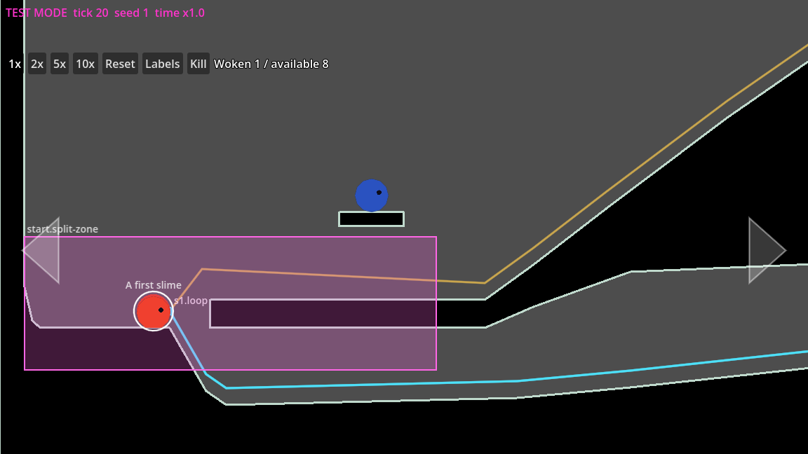

# 00 Concepts: what a level is made of

A **level** is a whole world with its own loop, sections and save file. In
the project it is one Godot scene, `levels/<id>/level.tscn`, built only from
the components in `src/components/`. There is no script in a level (D6):
a level is content, not code. v1 ships one level, and the player never
chooses a level (choosing one is for test mode and the tools only).

The words below are the game's (the Terminology table in
[`specs/concept.md`](../../specs/concept.md)); the rules they must meet are
in [`specs/level-design.md`](../../specs/level-design.md).

## The loop

- The **loop** is the route the train follows, from the start to the
  frontier gate. It must be travelled with no input at all (rule 1) by a
  slime of any size (rule 2), with no dead ends (rule 3).
- In the scene it is a `Loop` node holding `LoopSegment` curves, in loop
  order. Per section: an **outgoing** segment (`s1.loop`) running left to
  right along the ground, then that section's **return route** (`s1.slide`),
  which takes the flow from the section's unopened frontier gate back to the
  start (rule 13).
- When a gate opens, the loop **grows**: that section's return route is
  retired and the next section's segments join.

## The start

- The **start basin** is where the loop begins: a **pocket** behind the
  loop's start (where the first slime wakes, and where every return route
  comes home, behind the train: rule 22), a **ramp** up to the **loop's
  start**, and a **terrace** carrying the loop's first stretch.
- The **split zone** (`start.split-zone`) covers the loop's start (rule 4):
  it splits every slime inside it back into base slimes.
- The **first slime** (`start.first-slime`) is the one awake slime of a new
  game; the **first sleeper** sits close to it (rule 18).

*The scaffolded start basin: the split zone (pink box), the first slime
(red, in the pocket), the first sleeper (blue) on its ledge, the loop (orange
line) and the return routes' shared tail (blue line) under the terrace.*

## Sections and frontier sets

- A **section** is the part of a level opened by one gate. Section 1 has 3
  species, each later section adds one (rule 11), of the game's 6: so at
  most 4 sections.
- Each section ends with a **frontier set** (rule 12): a **signpost** (rule
  6), a **switch** on the loop whose **trapdoor** drops slimes into the
  **basket** below while the switch is flipped, and the **gate**, which the
  basket opens when its quota of weight is in. The gate's **lid** shuts the
  old return route's entrance once it is open.
- The **frontier gate** is the first unopened gate: where the loop currently
  ends. Once open, a frontier set is inert for good (rule 15).
- The last section's set has no gate: its basket's target is the
  level-complete celebration.

## Off the loop

- A **sleeper** is a slime asleep and not yet in the train. It never sits on
  the loop (rule 17); a free slime wakes it by touching it, on screen.
- An **exploration branch** is a place off the loop worth a call; each has
  its own **route back** to the loop (rules 3, 7, 8), and a hint of it must
  be visible from the loop (rule 9).
- A **framing zone** sets the camera's zoom and position where a wider view
  is needed (rule 19).
- **Terrain** is the solid ground; **decoration** is scenery that never
  collides and never takes a tap.

## Stable IDs

Everything a save needs to find has a stable ID, `<place>.<kind>.<name>`:
`start.split-zone`, `s1.sleeper.01`, `s1.switch`, `s2.branch.cave`,
`s2.route-back.cave`, `s1.frame.tree`. Sleepers are numbered from `.01`,
left to right, per section. Terrain and decoration have no ID. Once a level
is released its IDs never change (rule 20). The full convention is in
[`specs/levels/test/README.md`](../../specs/levels/test/README.md), "Stable IDs".

## Population and units

- At most **200 base slimes** per level (rule 16), the first slime and every
  sleeper counted; every sleeper is size 1.
- **1 screen = 1152 px**, the width of the view at normal zoom. The design
  documents give x in screens; the scene holds pixels. **y grows downward**
  (negative y is up). The loop and the routes ride 24 px above the ground
  (a size-1 slime's centre).

## What a level can't do in v1

Only the existing components can be placed. A new kind of interactive
object is v2 scope: it needs a decision in the spec
first (spec-writer), then code. Filters (a fork by species or size) are v2
too (rule 2).
