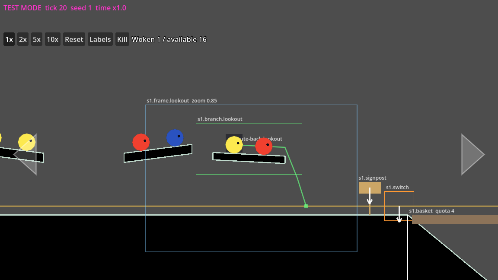

# 05 Exploration branches and routes back

An exploration branch is a place off the loop worth a call: sleepers on a
ledge, a platform, a cave. It needs three things: a way up by calls alone,
a hint visible from the loop, and its own route back.

## The pieces

| Component | Fields | What it is |
|---|---|---|
| `ExplorationBranch` (`s1.branch.lookout`) | `size` | the box a free slime in the branch can be in; its sleepers inside |
| `RouteBack` (`s1.route-back.lookout`), a `Path2D` | an open curve, `serves` (the branch's ID), `show_route` | the route from inside the branch down to a point **on the loop**; off screen, a slime heading back follows it |
| `Terrain` | the outline | the ledge or platform itself |
| `Sleeper`s | `species` | numbered with the rest of the section, left to right |
| `FramingZone` (`s1.frame.lookout`), if needed | `size`, `zoom`, `offset` | widens the view while the camera's rail point is inside its box, so the hint shows (rules 9, 19) |

## The rules it must meet

- **3 No dead ends, 8 its own route back:** the route back starts inside
  the branch's box and ends on the loop in use.
- **7 Gravity leads back:** from every spot a free slime can reach, the
  ground leads back toward the loop. The checker tries both ends of every
  **row** of sleepers (sleepers less than 80 px apart, centre to centre,
  make one row; farther apart, each is its own row); tilt ledges toward
  their open end.
- **9 Hints visible from the loop:** the sleepers (or the route back's top)
  peek into the settled rail view; add a framing zone if not.
- **10 Tilt is never needed:** reach it by calls alone.
- **17:** sleepers more than 48 px from the loop.
- **22 No called ledge over the loop:** see below.
- **Left alone, then lost:** a free slime off screen for 10 s is left alone,
  and lost 60 s later. The level report gives the route back's time for a
  size-1 slime; keep it well under that.

## Reach, and rule 22

A called hop rises at most 133 px for a size 1, 168 for a size 2, 208 for a
size 3 (the level report prints them). A ledge a called base slime can
reach that overhangs the loop lower than a size 3's hop (130 px) would stop
the bigger slimes passing under it. So a ledge with sleepers over the
loop's path, outside the split zone, is either:

- **out of a base slime's reach**, its underside at least 130 px over the
  loop's ground (then a size 2 or 3 reaches it: a place for fused slimes);
- or reached by **a climb** that isn't over the loop, like the test level's
  tree (`s1.branch.tree`: a slope a size 1 hops up, to a platform high
  above the loop);
- or **inside the split zone's reach**, where only base slimes pass (the
  first sleeper's ledge, in the start basin);
- or **off the loop's path**: a hollow hanging over a dip, 110 px above
  its rim and too high to hop up to from the slope below, which a called
  base slime reaches by hopping across from the rim (the skeleton's
  hollows, the test level's `DipHollow`). The report's reach takes off
  from the loop's point least below the sleeper within a hop's reach
  sideways, so it shows these as a size 1's.

## Worked example: a lookout

On `zz-tutorial` (as first scaffolded, before chunk LD3 put a dip there),
a ledge over the flat ground before frontier set 1, 100 px up, with two
sleepers, its branch box and route back. The fast check:

```
rule 22  FAIL    Slimes come home behind the loop's start; no called ledge overhangs the loop
         - s1.sleeper.06 (x 3.08): it rests on Section1/Lookout/Ledge, which overhangs the loop from x 3.03 to 3.20 only 80 px over the loop's ground (a size-3 train slime's hop reaches 130 px), its top 100 px up, within a called base slime's reach (133 px): move the ledge off the loop's path or out of reach, or extend the split zone over it
```

Raised 60 px (its underside 140 px over the ground, out of a base slime's
reach), with a framing zone (`zoom` 0.85, `offset` (0, -60)), the full
checker passes, and the level report lists it, with its reach:

```
s1.branch.lookout: x 2.99 to 3.24, y -350 to -210 px; 2 sleepers; route back s1.route-back.lookout 0.29 screens, 5.0 s for a size-1 slime off screen: within left alone (10 s; lost 60 s later)
row 1.6: rise 167 px: reachable by a called size 2 hop from the loop
row 1.7: rise 163 px: reachable by a called size 2 hop from the loop
```

(The two sleepers are 81 px apart, so each is its own row.)

167 px is within a size 2's 168 by a hair: the report's reach is a static
estimate, so play it to be sure. A place for size 2 needs a pair of one
species awake by then: the report's progress section says whether the
train has one ([10](10-the-level-report.md)).

Look at it from the loop:

```sh
godot --path . -- --test-mode --level=zz-tutorial --seed=1 --at=s1.branch.lookout
```



*The lookout: its framing zone (blue box), the branch box (green), its two
sleepers on the tilted ledge, the route back (green line) ending on the
loop (orange line), then frontier set 1's signpost, switch and basket.*

The checker can't tell whether a hint reads as something to explore, or
whether ground holding no sleeper leads back: those are MANUAL items to
play and look at ([09](09-check-the-rules.md)).
